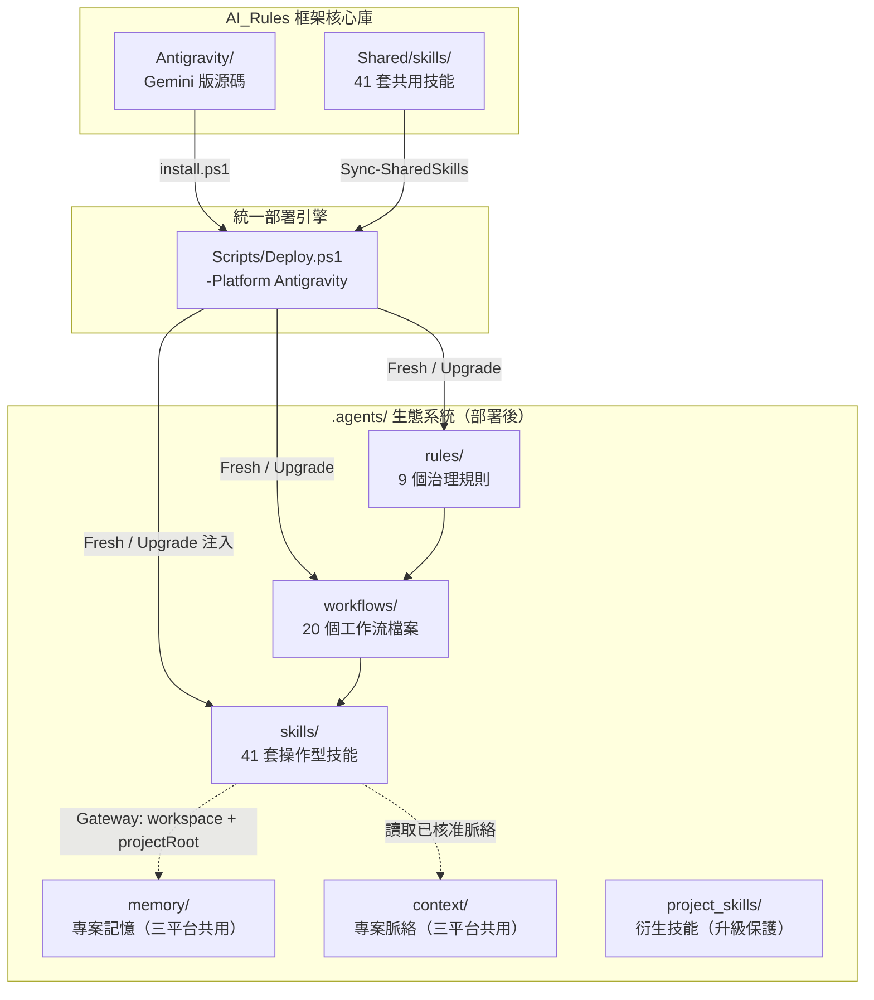
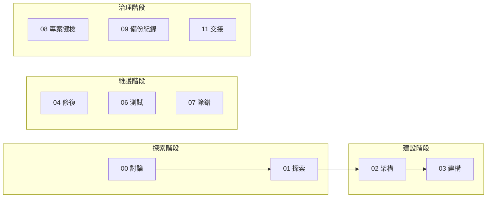
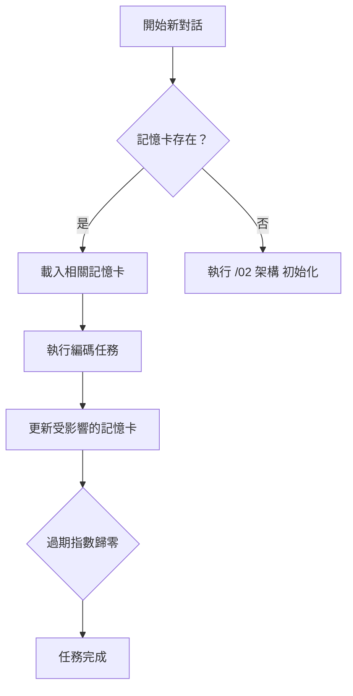

# Antigravity — AI 代理人治理框架（Gemini 版）

> **讓 AI 編碼助手不再失憶、不再無紀律** — 受治理部署的治理框架，為 Gemini IDE 提供工作流程、持久記憶系統與標準作業規範。

[](#版本管理)
[](#)
[](#)

---

## 📌 這解決什麼問題？

AI 編碼助手天生有幾個致命弱點，Antigravity 逐一對治：

1. **跨對話失憶** — 每開新對話就忘記之前做過的架構決策 → 透過 `.agents/memory/` 記憶卡系統持久保存
2. **無紀律執行** — 寫碼前不規劃、寫完不測試 → 20 個工作流檔案強制四拍子節奏
3. **角色權限模糊** — 子代理人隨意改檔案 → 由 Delegation Gate 統一判斷 evidence branch，子代理人只能唯讀提供證據包
4. **知識碎片化** — 技能散落各處，Token 暴增 → 41 套按需載入的操作型技能，不用時零開銷
5. **語言不友善** — 工程術語充斥 → 三層語言架構（指令層英文、介面層繁中、橋接層雙語）
6. **框架升級斷裂** — 升級怕覆蓋記憶或脈絡 → D06 安全網 + SHA256 差異比對 + 知識資產永久保護
7. **工具碎片化** — MCP 工具散亂 → 透過 Multi-MCP Gateway 統一探索 schema，並用 `gateway__call_tool` 真實呼叫下游工具
8. **偏好與記憶混雜** — 設計 DNA、產品偏好與驗收口味不再放入原始碼記憶，改由 `.agents/context/` 專案脈絡層保存

---

## 🚀 快速安裝

> 支援 **Windows PowerShell 5.1+** 與 **PowerShell 7**。公開指令會以 UTF-8 解碼遠端腳本，並用 UTF-8 BOM 寫入暫存檔，避免舊版中文 Windows PowerShell 解析失敗。

```powershell
# 🆕 全新安裝（在 IDE 終端機直接執行，自動安裝到當前目錄）
[Net.ServicePointManager]::SecurityProtocol = [Net.SecurityProtocolType]::Tls12; $u='https://raw.githubusercontent.com/Kunshao1117/AI_Rules/main/Antigravity/install.ps1'; $f="$env:TEMP\ag_install.ps1"; $wc=New-Object Net.WebClient; $bytes=$wc.DownloadData($u); $text=[Text.Encoding]::UTF8.GetString($bytes); $text=$text.TrimStart([char]0xFEFF); [IO.File]::WriteAllText($f,$text,(New-Object Text.UTF8Encoding $true)); & $f; Remove-Item $f
```

```powershell
# ⬆️ 升級現有安裝
[Net.ServicePointManager]::SecurityProtocol = [Net.SecurityProtocolType]::Tls12; $u='https://raw.githubusercontent.com/Kunshao1117/AI_Rules/main/Antigravity/install.ps1'; $f="$env:TEMP\ag_install.ps1"; $wc=New-Object Net.WebClient; $bytes=$wc.DownloadData($u); $text=[Text.Encoding]::UTF8.GetString($bytes); $text=$text.TrimStart([char]0xFEFF); [IO.File]::WriteAllText($f,$text,(New-Object Text.UTF8Encoding $true)); & $f -Mode Upgrade; Remove-Item $f
```

```cmd
powershell.exe -NoProfile -ExecutionPolicy Bypass -EncodedCommand WwBOAGUAdAAuAFMAZQByAHYAaQBjAGUAUABvAGkAbgB0AE0AYQBuAGEAZwBlAHIAXQA6ADoAUwBlAGMAdQByAGkAdAB5AFAAcgBvAHQAbwBjAG8AbAAgAD0AIABbAE4AZQB0AC4AUwBlAGMAdQByAGkAdAB5AFAAcgBvAHQAbwBjAG8AbABUAHkAcABlAF0AOgA6AFQAbABzADEAMgAKACQAdQAgAD0AIAAnAGgAdAB0AHAAcwA6AC8ALwByAGEAdwAuAGcAaQB0AGgAdQBiAHUAcwBlAHIAYwBvAG4AdABlAG4AdAAuAGMAbwBtAC8ASwB1AG4AcwBoAGEAbwAxADEAMQA3AC8AQQBJAF8AUgB1AGwAZQBzAC8AbQBhAGkAbgAvAEEAbgB0AGkAZwByAGEAdgBpAHQAeQAvAGkAbgBzAHQAYQBsAGwALgBwAHMAMQAnAAoAJABmACAAPQAgAEoAbwBpAG4ALQBQAGEAdABoACAAJABlAG4AdgA6AFQARQBNAFAAIAAnAGEAZwBfAGkAbgBzAHQAYQBsAGwALgBwAHMAMQAnAAoAJAB3AGMAIAA9ACAATgBlAHcALQBPAGIAagBlAGMAdAAgAE4AZQB0AC4AVwBlAGIAQwBsAGkAZQBuAHQACgAkAGIAeQB0AGUAcwAgAD0AIAAkAHcAYwAuAEQAbwB3AG4AbABvAGEAZABEAGEAdABhACgAJAB1ACkACgAkAHQAZQB4AHQAIAA9ACAAWwBUAGUAeAB0AC4ARQBuAGMAbwBkAGkAbgBnAF0AOgA6AFUAVABGADgALgBHAGUAdABTAHQAcgBpAG4AZwAoACQAYgB5AHQAZQBzACkACgAkAHQAZQB4AHQAIAA9ACAAJAB0AGUAeAB0AC4AVAByAGkAbQBTAHQAYQByAHQAKABbAGMAaABhAHIAXQAwAHgARgBFAEYARgApAAoAWwBJAE8ALgBGAGkAbABlAF0AOgA6AFcAcgBpAHQAZQBBAGwAbABUAGUAeAB0ACgAJABmACwAIAAkAHQAZQB4AHQALAAgACgATgBlAHcALQBPAGIAagBlAGMAdAAgAFQAZQB4AHQALgBVAFQARgA4AEUAbgBjAG8AZABpAG4AZwAgACQAdAByAHUAZQApACkACgAmACAAJABmACAALQBNAG8AZABlACAATQBlAG4AdQAKAFIAZQBtAG8AdgBlAC0ASQB0AGUAbQAgACQAZgA=
```

> 💡 **跨目錄安裝**：加上 `-Target "D:\你的專案路徑"` 即可安裝到其他位置。
>
> **原理**：啟動器從 GitHub 下載 ZIP（走 CDN，無 API 速率限制），解壓後執行部署腳本，完成後自動清理暫存。

---

## 📖 目錄

- [核心設計理念](#-核心設計理念)
- [系統架構總覽](#-系統架構總覽)
- [模組詳解](#-模組詳解)
  - [部署引擎](#-部署引擎)
  - [規則系統](#-規則系統)
  - [工作流程管線](#-工作流程管線)
  - [技能系統](#-技能系統)
  - [專案記憶系統](#-專案記憶系統)
- [版本管理](#-版本管理)
- [專案結構](#-專案結構)

---

## 🧠 核心設計理念

| 原則 | 說明 |
|------|------|
| **受治理安裝** | 使用者可手動貼上一行指令安裝；全域 GEMINI bootstrapper 只輸出安裝/升級命令並等待 `GO INSTALL` / `GO UPGRADE` |
| **跨對話持久記憶** | 透過 `.agents/memory/` 記憶卡，AI 在新對話中也能回憶過去的架構決策與教訓 |
| **專案脈絡分層** | 透過 `.agents/context/` 保存設計 DNA、產品偏好、技術偏好與驗收偏好 |
| **按需載入** | 技能僅在需要時載入，減少 AI 的認知負擔和 Token 消耗 |
| **需求對齊與反證** | 架構藍圖與建構計畫必須先回放需求、列出非目標與成功標準，再做中立反證、決策紀錄、驗收追蹤與偏移稽核 |
| **繁體中文特化** | 三層語言架構：指令層（英文）、介面層（繁體中文）、橋接層（雙語） |
| **最小權限治理** | 角色分層（讀取者 / 工作者 / 寫入者），子代理政策由部署後 `.agents/shared/policies/` 與框架來源 `Shared/policies/` 同源轉譯，且子代理只能唯讀 |
| **三位一體治理** | 靜默異常中斷（閘門攔截時才中斷）+ 特權覆寫（`[SUDO]`）+ 雙軌沙盒（生產 / 草圖） |

---

## 🏗️ 系統架構總覽



---

## 📦 模組詳解

### ⚙️ 部署引擎

**腳本**: `Scripts/Deploy.ps1 -Platform Antigravity`（統一部署引擎，核心邏輯位於 `Scripts/modules/Platform-Antigravity.psm1`）

負責將整套 `.agents/` 生態系統移植到任何目標專案。所有 PowerShell 程式碼均配備完整的繁體中文行內說明，三個平台部署能力完全對等，適合非英語使用者直接閱讀和維護。

#### 兩種部署模式

| 模式 | 觸發條件 | 行為 |
|------|---------|------|
| **Fresh** | 專案無 `.agents/` 目錄 | D06 安全網備份記憶 → 完整複製 → 建立基礎設施目錄 → 寫入版本檔 → 還原記憶 |
| **Upgrade** | 專案已有 `.agents/` 目錄 | 逐檔差異比對 → 彩色報告 → 顯示 CHANGELOG 更新說明 → 確認閘門 → 套用變更 |

#### 差異比對策略

比對**不是**依據版本號，而是逐檔雙層檢查：

1. **快速路徑** — 比修改時間（`LastWriteTime`），相同即跳過
2. **精確路徑** — 時間不同時計算 SHA256 雜湊，比對實際內容

#### 安全防護

| 防護機制 | 說明 |
|----------|---------|
| **D06 安全防線** | Fresh 模式下以 `try/finally` 備份記憶卡到暫存目錄，部署中斷也不會損失資料 |
| **知識資產保護** | `memory/`、`project_skills/` 和 `context/` 在升級時絕對不覆蓋 |
| **確認閘門** | Upgrade 模式產出分類顏色差異報告，需使用者確認才套用 |
| **Shared policy drift** | Doctor 檢查 Antigravity / Gemini adapter marker block 是否仍由框架來源 `Shared/policies/subagent-invocation.md` 生成，並確認下游 `.agents/shared/policies/subagent-invocation.md` 已部署 |
| **Subagent vocabulary drift** | Doctor 檢查 Shared 技能是否誤把平台工具名寫成共用語義，避免 Antigravity、Claude、Codex 的委派語彙互相污染 |
| **孤兒偵測** | 偵測源碼已刪除但目標仍存在的「孤兒檔案」，標記為 `ORPHAN` 提醒 |
| **衍生技能補建** | 每次部署自動掃描 `project_skills/`，補建缺少的符號連結 |

---

### 📜 規則系統

**目錄**: `.agents/rules/`

| 檔案 | 定位 | 啟動模式 |
|------|------|----------|
| `AGENTS.md` | 哨兵檔 — 存在即代表專案已初始化 | Always On |
| `00_core_identity.md` | 核心身份 — 代理人分工、生命週期、語言溝通 | Always On |
| `01_cross_lingual_guard.md` | 跨語系防護 — 冷啟動強制讀檔、實體武裝檢核 (Phase 2)、安全觸發器 | Always On |
| `02_code_quality_security.md` | 品質與安全合約 — 機密隔離、驗證器鐵律、橫切品質約束 | Model Decision |
| `03_memory_skill_contract.md` | 記憶與技能合約 — 記憶卡操作、技能載入、新建歸卡閘門 | Model Decision |
| `04_forbidden_vocab.md` | 禁用詞彙規範 — 面向總監輸出的商業層級詞彙對照 | Model Decision |
| `05_project_skill_contract.md` | 衍生技能合約 — 衍生技能建立、生命週期、鍛造流程 | Model Decision |
| `06_memory_push.md` | 記憶主動推播 — 對話啟動時三路徑探測、Pull→Push 模型轉換 | Model Decision |
| `07_mcp_guardrails.md` | MCP 外部工具防護 — 高風險狀態修改的 HITL 攔截 | Model Decision |

#### 分層治理架構

底層規範依啟動模式分為三層：

**`00_core_identity.md`** — Always On（每次對話必載）
1. **專職化分工** — 主代理人直接執行；下游 `.agents/shared/policies/subagent-invocation.md` 與框架來源 `Shared/policies/subagent-invocation.md` 只定義 Delegation Gate；Antigravity / Gemini adapter 才轉成 Gemini CLI、`@` 指派、browser-capable agent 或 plugin adapter
2. **多代理人視圖透明度** — 子代理人的修改必須回傳主代理人在介面呈現
3. **生命週期強制** — 規劃 → 驗證閘門 → 執行 → 記憶更新
4. **禁止終端機文書處理** — 靜默閘門式攔截（`[PRE-FLIGHT GATE]`），支援 `[SUDO]` 覆寫與 `/03-1_experiment` 豁免
5. **繁體中文特化** — 三層語言架構（指令層、介面層、橋接層）

**`01_cross_lingual_guard.md`** — Always On（每次對話必載）
6. **跨語系思維紀律** — 三層快取策略（冷啟動強制讀檔 / 暖快取記憶輸出 / 漂移防護）
7. **實體武裝檢核 (Phase 2)** — 強制映射實體操作工具或技能，杜絕零樣本幻覺盲猜
8. **安全觸發器** — 高風險場景強制透明輸出
9. **模板即透明機制** — 永遠輸出 `<details>` 供總監審閱，不依賴 AI 自評信心

**`03_memory_skill_contract.md`** — Model Decision（AI 判斷需要時載入）
1. **專案記憶系統** — `.agents/memory/` 記憶卡的讀寫規範，含 `[EXIT HOLD GATE]` 離場條件鎖（含新建檔案歸卡分支）；v4.0 新增幽靈偵測警告（非阻塞）與全幽靈卡匣汰除建議
2. **受控串聯** — `// turbo` 自動銜接機制
3. **技能系統契約** — 按需載入、漸進式揭露、三目錄架構（衍生技能詳見 `05_project_skill_contract.md`）

**`02_code_quality_security.md`** — Model Decision（寫程式碼時載入）
1. **機密隔離** — `[SEC SILENT GATE]` 靜默掃描，支援 `[SUDO]` 與 `/03-1_experiment` 豁免
2. **驗證器鐵律** — `[LINTER GATE]` 最多 3 次自動修復，超限硬性中斷
3. **橫切品質約束** — 安全/品質/介面/測試的核心原則

#### 雙受眾語言設計（§7 詳解）

框架中所有文件依讀者分為三層：

| 層級 | 讀者 | 語言 | 具體內容 |
|------|------|------|----------|
| **指令層** | AI 執行者 | 英文 | 技能步驟、決策樹、工作流程指令 |
| **介面層** | 總監 | 繁體中文 | 報告輸出、確認訊息、括號內註解 |
| **橋接層** | 兩者共用 | 雙語 | 記憶卡 description、小節標題 |

技能中的文字格式：
- 主體指令：`English instruction text`
- 括號內註解：`（中文補充說明）` — 給總監閱讀
- frontmatter `Use when`：繁體中文（IDE 觸發匹配用）
- 小節標題：`## English Title (中文標題)`

#### 總監可讀輸出與位置索引

Antigravity 版正式計畫、完成報告、巡檢報告可用短名稱維持可讀性，但同一份輸出必須提供「位置索引」，把「核心規範、工作流入口、文件說明、巡檢規則、記憶卡」這類短名稱對應到具體檔案、章節、工具狀態或目錄範圍。若使用表格，欄位仍固定為「事項、位置、影響、狀態」，且「位置」欄要先用白話位置，再以括號補具體定位。

#### 中立誠實協作與知識新鮮度

Antigravity 版核心規則要求 AI 保持中立誠實協作。AI 不以討好、附和或迎合總監為目標，也不得為了顯得有批判性而刻意反對。AI 先承接目標，再用實際檔案、工具輸出、官方文件或可靠主要來源確認事實；若證據衝突，必須用「我看到的事實／可能問題／建議做法」短格式提出修正方向與可行替代做法。

記憶卡與模型內建知識都可能過時。外部框架、API、套件版本、平台規則、價格、法規、安全建議、近期狀態或任何不確定資訊，必須以版本與目前日期作為錨點查最新或官方來源；無法查證時要明說，不得把舊記憶當成最新事實。

#### 需求對齊與偏移稽核

Antigravity 版架構與建構入口會載入需求對齊閘門。架構藍圖必須包含需求理解回放、中立反證檢查、架構決策表、需求到驗收追蹤表、建構交接合約、未驗證與阻塞清單；建構計畫必須包含沿用藍圖狀態、需求到任務追蹤表、任務驗收矩陣、偏移稽核規則與完成前回查。若實際變更偏離核准藍圖，必須標記為符合、合理偏離、未授權偏離或未驗證。

#### 跨專案真實驗證契約

Antigravity 版正式建構、修復、測試與健檢都套用「可驗必驗」原則，也必須先判定變更意圖，並區分緊急修補、根因修復、局部修整與結構重構。緊急修補只能止血並留下未解風險，根因修復必須說明症狀、原因與回歸路徑，局部修整必須證明行為不變，結構重構必須說明依賴影響與遷移/相容路徑。同一症狀、同一檔案區域或同一操作者路徑重複修補時，必須升級為根因修復或結構重構，不能繼續堆疊補丁。

只要 AI 能啟動應用、操作介面、呼叫服務、執行命令、查詢資料、讀取日誌、截圖或觀察副作用，就必須實際驗證。視覺驗證不能只看整頁大方向，必須檢查文字截斷、長字串、按鈕對齊、間距、邊框破損、遮擋、焦點狀態、禁用狀態、載入、空狀態與錯誤狀態；視覺證據也應優先使用真實資訊頁面、真實資料、實際帳號狀態、目前回應或日誌。mock、fixture、假資料、靜態截圖或局部單元測試只能作為局部證據或備援證據，且必須標記使用原因、差異風險與不可宣稱的完成範圍。缺少真實執行證據時，結果必須是不通過或阻塞，不能包裝成完成。允許阻塞的條件限於缺少外部授權、憑證、實體設備、不可安全執行的破壞性動作、第三方服務不可用、MFA/CAPTCHA、法規或安全限制。

Antigravity 健檢入口採深層證據式架構：先選擇快速、標準、深度或鑑識模式，再偵測網站、後端、命令列、桌面、外掛、函式庫、基礎設施、資料管線、AI 功能、文件治理庫或混合專案，並建立功能、端點、命令、任務、介面、資料流、效能與風險盤點。Antigravity 版優先使用代理管理、瀏覽器子代理、截圖、錄影與視覺產物採證；中繼證據只允許寫入健檢日誌，不授權修改原始碼、記憶卡或外部狀態。

08 以外的工作流共用外部接地矩陣：每個入口都對應任務型態、官方或標準依據、最低證據狀態、阻塞條件與下一流程路由。Antigravity 版只把矩陣轉譯成瀏覽器、視覺產物、IDE 可見結果與終端證據，不把 Claude 鉤子或 Codex 原生子代理規則硬寫成 Antigravity 指令。

若驗證入口沒有第一時間找到，或瀏覽器、桌面操作、命令列、外掛宿主、API、資料庫、日誌、preview / sandbox 等路徑短暫不可用，AI 必須先搜尋、確認服務就緒、重試或改用等價真實路徑。短暫失敗不能成為捨棄真實驗證的理由；最終阻塞時必須列出已搜尋入口、嘗試工具、重試狀態、替代路徑與最小缺失條件。

---

### 🔄 工作流程管線

**目錄**: `.agents/workflows/`

20 個工作流檔案涵蓋軟體開發的完整生命週期：



| 編號 | 指令名稱 | 功能 | 角色權限 |
|------|---------|------|---------|
| 00 | 討論 | 純對話、腦力激盪、程式碼問答 | Reader |
| 01 | 探索 | 可行性研究，雙狀態魔鬼代言人（純搜索 / 深度分析） | Reader |
| 02 | 架構 | 需求轉化為技術藍圖與記憶系統初始化 | Writer/SRE |
| 03 | 建構計畫 | Stage 1：記憶載入 → Diff 規劃 → 等待 GO（含沙盒快速路徑） | Writer/SRE |
| 03-1 | 實驗 | 沙盒快速實驗（所有閘門停用） | Experiment Worker |
| 03-2 | 建構執行 | Stage 2：實體寫入 → 新建歸卡 → 記憶更新 → 單元測試 → 真實執行驗證 | Writer/SRE |
| 05 | 濃縮 | 專案濃縮初始化（掃描 → 萃取 → 審閱 → 寫入） | Writer/SRE |
| 04-1 | 修復計畫 | Bug 診斷 → 產出修復計畫（唯讀，等待 GO） | Reader |
| 04-2 | 修復執行 | 實體修復 → 記憶更新 → 真實失敗路徑回歸測試 | Writer/SRE |
| 06 | 測試 | 依介面與真實操作面收集視覺、命令、資料、日誌或執行證據 | Reader |
| 07 | 除錯 | 堆疊追蹤分析、錯誤翻譯 | Reader |
| 08 | 專案健檢 | 健檢深度、專案型態、平台能力、盤點分母、動態掛載模組與證據式健康報告 | Reader/Logs |
| 09-1 | 紀錄掃描 | 倉庫衛生 + 記憶過期偵測（唯讀掃描） | Reader |
| 09-2 | 授權備份 | 文件更新 + Git 提交 + 遠端推播 | Writer/SRE |
| 10 | 巡檢 | automation-safe 例行巡檢：技能品質、文件數字、記憶過期、MCP 設定健康 | Reader |
| 11 | 交接 | 產出交接文件給下一個 AI 對話（含前置檢查） | Reader/Memory |
| 12 | 技能鍛造 | 從工作實踐中提煉可複用技能 | Worker |

#### 共用閘門

| 閘門 | 功能 |
|------|------|
| `_completion_gate.md` | 靜默化完成閘門（7 項檢查）：記憶同步、歸卡驗證、檔案歸屬、語言合規、粒度、技能萃取、文件同步 (🔴 紅燈硬閘) |
| `_security_footer.md` | 角色鎖定閘門（`[ROLE LOCK GATE]`）、瀏覽器閘門、安全合規聲明 |

---

### 🎯 技能系統

**目錄**: `.agents/skills/`

技能是**按需載入的知識手冊**。IDE 在對話開始時僅注入技能名稱與描述，完整內容在需要時才讀取，實現漸進式揭露。

#### 技能分類與語言風格

| 類別 | 技能 | 用途 | 語言風格 | 對接 MCP |
|------|------|------|----------|----------|
| **核心操作** | `memory-ops` | 記憶卡讀寫操作指引；補入 Gateway 顯式路徑、唯讀治理工具與 `memory_commit` 高風險邊界 | 英文指令 | Gateway → cartridge-system |
| **生命週期** | `tech-stack-protocol` | 技術堆疊偵測與鎖定 | 英文指令 | — |
| | `delegation-strategy` | 任務委派管道選擇 | 英文指令 | — |
| **品質約束** | `code-quality` | SOLID 原則、動態行數閾值 | 英文指令（擴展 §11） | — |
| | `security-sre` | 零信任驗證、機密隔離、日誌標準 | 英文指令（擴展 §11） | — |
| | `ui-ux-standards` | 介面設計、工程術語隔離 | 英文指令（擴展 §11） | — |
| **測試與品質保障** | `test-patterns` | 單元測試決策樹、異常場景清單、契約驗證 | 英文指令 | — |
| | `impact-test-strategy` | 變更影響分析 (含公共文件)、測試範圍決策、回歸防護 | 英文指令 | — |
| | `test-automation-strategy` | DOM 互動規範、自動修復 | 英文指令 | — |
| | `browser-testing` | E2E 視覺測試 | 並行雙語 | — |
| | `a11y-testing` | 無障礙掃描、WCAG 驗證、修復建議 | 英文指令（中文註解） | a11y |
| **CLI 委派** | `code-audit` | 程式碼品質與安全掃描 | 英文指令（中文註解） | — |
| | `code-diagnosis` | 大範圍原始碼故障調查 | 英文指令（中文註解） | — |
| **MCP 操作食譜** | `cloudflare-ops` | KV/D1/R2/Workers/容器管理 | 英文指令（中文註解） | cloudflare-* |
| | `github-ops` | 倉庫管理、Issue/PR 操作 | 英文指令（中文註解） | github |
| | `trunk-ops` | CI 測試框架偵測與修復 (主腦直連限定) | 英文指令（中文註解） | trunk |
| | `supabase-ops` | 資料庫管理、SQL 操作、遷移驗證 | 英文指令（中文註解） | supabase |
| | `sentry-ops` | 錯誤追蹤與效能監控 | 英文指令（中文註解） | sentry |
| **輔助工具** | `structured-reasoning` | 架構決策深度推理 | 並行雙語 | sequentialthinking |
| | `maps-assist` | Google Maps API 開發輔助 | 並行雙語 | — |
| | `stitch-design` | UI 設計稿生成與規範擷取 | 並行雙語 | stitch |
| | `excel-ops` | 審計報告匯出、資料分析、圖表生成 | 英文指令（中文註解） | excel |
| | `pr-review-ops` | PR 自動審查與合併決策 | 英文指令（中文註解） | github |
| | `performance-audit` | Lighthouse 效能掃描與 Web Vitals 測量 | 英文指令（中文註解） | playwright |
| | `context7-docs` | 即時框架文件查詢 | 英文指令（中文註解） | context7 |
| **代碼知識圖譜** | `gitnexus-guide` | GitNexus 工具清單與知識圖譜用法 | 英文指令（中文註解） | gitnexus |
| | `gitnexus-cli` | 索引倉庫、分析代碼庫、生成 Wiki | 英文指令（中文註解） | gitnexus |
| | `gitnexus-exploring` | 探索代碼架構、執行流程、理解陌生模組 | 英文指令（中文註解） | gitnexus |
| | `gitnexus-debugging` | 偵錯、追蹤錯誤來源 | 英文指令（中文註解） | gitnexus |
| | `gitnexus-impact-analysis` | 評估變更安全性、找出依賴鏈 | 英文指令（中文註解） | gitnexus |
| | `gitnexus-refactoring` | 安全重構（改名、抽取、移動代碼） | 英文指令（中文註解） | gitnexus |
| **記憶與架構** | `memory-arch` | 記憶卡架構拓樸、層級拆分規則 | 英文指令 | cartridge-system |
| | `skill-factory` | 從工作實踐中提煉可複用衍生技能 | 英文指令 | — |
| | `audit-engine` | 深層健檢語義引擎（深度模式、專案型態、盤點分母、證據包、覆蓋率、燈號規則、安全/API/資料流與相容性） | 英文指令（中文註解） | — |
| **資料庫專精** | `supabase` | Supabase 完整功能整合指引 | 英文指令 | supabase |
| | `supabase-postgres-best-practices` | Postgres 效能最佳化與索引設計 | 英文指令 | supabase |

---

### 🧠 專案記憶系統

**目錄**: `.agents/memory/`

解決 AI「每次開新對話就失憶」的核心問題。

#### 運作原理



#### 記憶卡結構

每張記憶卡是一個作用中記憶主檔；目標標準主檔是 `MEMORY.md`，既有專案在相容期可能仍保留舊 `SKILL.md`：

- **現行真相** — 目前仍有效的英文短句摘要
- **當前限制** — 仍需遵守的施工硬限制
- **週期事件** — 本輪最多 30 筆的短事件紀錄
- **歷史索引** — 指向歸檔分卷，不把長文貼在主卡
- **中文摘要** — 最多五條，供總監快速判讀
- **追蹤的檔案清單** — 這個模組負責哪些原始碼檔案

內容品質標準要求新建或受控標準化後的現役主卡標記內容品質版本、記憶類型、驗證狀態、最後驗證時間與有效範圍，並提供證據基礎、讀取契約、衝突與取代段落。設計 DNA、產品偏好、驗收口味與一次性觀察不寫入來源記憶；這些內容應留在專案脈絡、任務報告或待審清單。本專案目前尚未執行現役主卡內容標準化遷移。

#### 樹狀巢狀

記憶卡支援最多 **4 層**深度的父子關係：

```
.agents/memory/
├── api/                          ← 第 1 層（功能域）
│   ├── MEMORY.md                 ← 共用 API 架構決策
│   ├── auth/                     ← 第 2 層
│   │   └── MEMORY.md             ← 認證模組特定決策
│   └── manage/                   ← 第 2 層
│       └── MEMORY.md             ← 管理功能模組
└── frontend/                     ← 第 1 層（獨立功能域）
    └── MEMORY.md
```

#### 粒度原則

- 單張記憶卡追蹤不超過 **8 個檔案**
- 超過時系統主動提示拆分建議
- 一張記憶卡 = 一個獨立變更單元
- 主卡不超過 **16 KB / 120 行**，週期事件不超過 **30 筆**
- 歸檔卷不超過 **32 KB / 200 行**，超過時開下一卷
- 記憶卡不是可執行技能；目標主檔是 `MEMORY.md`，舊 `SKILL.md` 僅作相容期來源
- 記憶主檔遷移由部署後專案本地工具乾跑盤點、檢查雙主檔衝突與舊路徑引用；找不到 `.agents/tools/Memory-Migration.ps1` 時必須先重新同步，不得手動批次搬檔
- 下游乾跑入口：`powershell -NoProfile -ExecutionPolicy Bypass -File .\.agents\tools\Memory-Migration.ps1`；正式套用需另行授權並加上 `-Apply -ConfirmApply`
- 舊格式記憶卡相容期可讀；現役主卡要透過盤點、歸檔、萃取有效事實與品質欄位重建逐步升級
- 巡檢會提示缺少品質欄位、證據段落、讀取契約或衝突狀態的現役主卡；初期列提醒，不等同已完成遷移
- 透過 Multi-MCP Gateway 呼叫 cartridge-system 時，每次真實呼叫都必須顯式帶 `workspace`，下游參數必須帶 `projectRoot`
- `workspace_brief`、`memory_audit`、`commit_preflight` 是唯讀診斷工具；`memory_commit` 會寫入檔案與索引，只能在歸卡階段呼叫
- **v4.0**：`memory_list` 回傳 `ghostFilesCount` 自動標記幽靈檔案；`indirectStaleness` 追蹤上游依賴過期；`memory_deps()` 查詢卡匣依賴圖
- **v5.5**：`memory_list` / `memory_audit` / `workspace_brief` / `commit_preflight` 顯示大小、語言比例、事件數、舊格式與建議動作

#### 更新模式

| 模式 | 適用場景 |
|------|---------|
| `write_to_file` + `memory_commit` | ✅ 推薦：原生工具寫入完整內容後，於歸卡階段呼叫高風險寫入工具同步後設資料 |
| `replace`（備援） | 結構性修改，傳入完整內容整張替換 |

---

## 📋 版本管理

| 檔案 | 用途 |
|------|------|
| `VERSION` | 單行版本號（例如 `4.1.0`） |
| `RELEASE_NOTES.md` | 每個版本的更新摘要，依版本號倒序排列 |
| `CHANGELOG.md` | 完整的商業價值導向決策紀錄 |

升級時部署引擎會讀取 `RELEASE_NOTES.md`，自動擷取並顯示從目標版本到源碼版本之間的所有更新說明。

---

## 📂 專案結構

```
Antigravity/
├── VERSION                       ← 框架版本號
├── RELEASE_NOTES.md              ← 版本更新摘要
├── CHANGELOG.md                  ← 商業價值決策紀錄
├── README.md                     ← 本文件
├── install.ps1                   ← 一鍵安裝啟動器（呼叫 Scripts/Deploy.ps1）
├── global/
│   └── GEMINI.md                 ← 全局觸發器版控（→ ~/.gemini/GEMINI.md）
└── .agents/                      ← 可移植的 AI 治理生態系統
    ├── rules/                    ← 治理規則（分層啟動）
    │   ├── AGENTS.md             ← 哨兵檔（存在 = 已初始化）
    │   ├── 00_core_identity.md   ← 核心身份（Always On）
    │   ├── 01_cross_lingual_guard.md ← 跨語系防護（Always On）
    │   ├── 02_code_quality_security.md  ← 品質與安全合約（Model Decision）
    │   ├── 03_memory_skill_contract.md  ← 記憶與技能合約（Model Decision）
    │   ├── 04_forbidden_vocab.md        ← 禁用詞彙規範（Model Decision）
    │   ├── 05_project_skill_contract.md ← 衍生技能合約（Model Decision）
    │   ├── 06_memory_push.md            ← 記憶主動推播（Model Decision）
    │   └── 07_mcp_guardrails.md         ← MCP 外部工具防護（Model Decision）
    ├── workflows/                ← 20 個工作流檔案
    │   ├── 00_chat ~ 12_skill_forge ← 主要工作流程（含建構/修復/提交分階段與例行巡檢）
    │   ├── _completion_gate.md   ← 共用完成閘門
    │   └── _security_footer.md   ← 共用安全閘門
    ├── skills/                   ← 41 套操作型技能（部署時從 Shared/ 注入）
    │   ├── _index.md             ← 核心技能路由表
    │   ├── project-xxx -> ../project_skills/xxx ← 專案衍生技能符號連結
    │   ├── memory-ops/           ← 記憶操作指引
    │   └── ... (41 套)
    ├── memory/                   ← 專案記憶（專案特有，升級時受保護）
    │   └── (由 AI 執行 /02 架構 初始化)
    ├── context/                  ← 專案脈絡（設計 DNA 與長期偏好，升級時受保護）
    │   └── _map/CONTEXT.md       ← 專案脈絡索引
    ├── project_skills/           ← 專案衍生技能（專案特有，升級時受保護）
    │   └── _index.md             ← 專案衍生技能路由表
    └── logs/                     ← 暫存日誌（不進版控）
```
