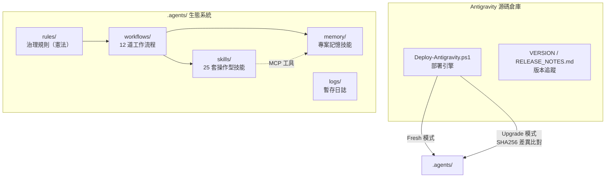
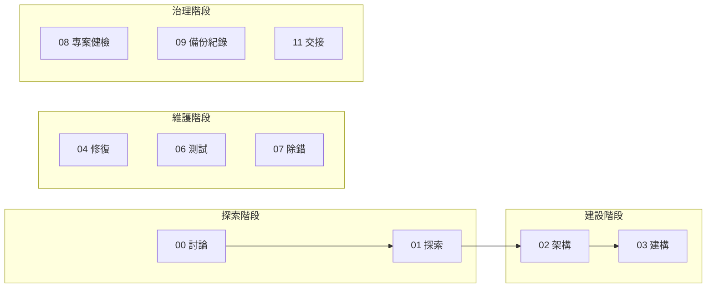
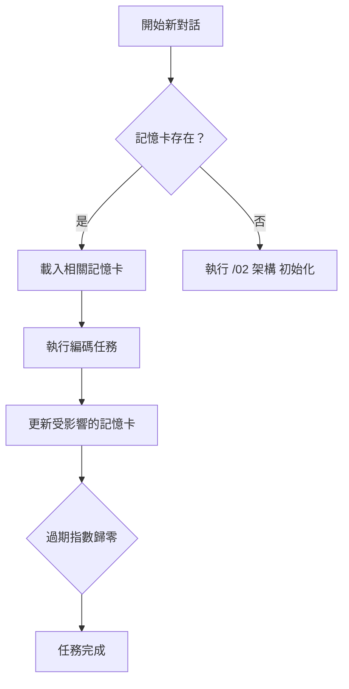

# Antigravity — AI 代理人治理框架

> **版本**: v7.0.0 | **語言**: 繁體中文 (zh-TW) | **平台**: Windows (PowerShell)

Antigravity 是一套**零接觸自動部署**的 AI 編碼代理人治理框架。它為 AI 助手提供統一的工作流程、持久記憶系統與標準作業規範，讓 AI 在任何專案中都能像一個有紀律、有記憶的工程團隊來運作。

---

## 🚀 快速安裝（終端機一行指令）

> 支援 **PowerShell 5.1+** 原生環境。倉庫為 Public，無需 GitHub 帳號。

```powershell
# 🆕 全新安裝到指定專案目錄
[Net.ServicePointManager]::SecurityProtocol = [Net.SecurityProtocolType]::Tls12; $f="$env:TEMP\ag_install.ps1"; irm 'https://raw.githubusercontent.com/Kunshao1117/AI_Rules/main/Antigravity/install.ps1' -OutFile $f; & $f -Target "D:\你的專案路徑"; Remove-Item $f
```

```powershell
# ⬆️ 升級現有安裝
[Net.ServicePointManager]::SecurityProtocol = [Net.SecurityProtocolType]::Tls12; $f="$env:TEMP\ag_install.ps1"; irm 'https://raw.githubusercontent.com/Kunshao1117/AI_Rules/main/Antigravity/install.ps1' -OutFile $f; & $f -Target "D:\你的專案路徑" -Mode Upgrade; Remove-Item $f
```

> **原理**：啟動器從 GitHub 下載 ZIP（走 CDN，無 API 速率限制），解壓後執行部署腳本，完成後自動清理暫存。

---


- [核心設計理念](#核心設計理念)
- [系統架構總覽](#系統架構總覽)
- [模組詳解](#模組詳解)
  - [部署引擎](#部署引擎)
  - [規則系統](#規則系統)
  - [工作流程管線](#工作流程管線)
  - [技能系統](#技能系統)
  - [專案記憶系統](#專案記憶系統)
- [版本管理](#版本管理)
- [專案結構](#專案結構)

---

## 核心設計理念

| 原則 | 說明 |
|------|------|
| **零接觸部署** | AI 進入未初始化專案時，自動靜默部署整套框架，無需人工介入 |
| **跨對話持久記憶** | 透過 `.agents/memory/` 記憶卡，AI 在新對話中也能回憶過去的架構決策與教訓 |
| **按需載入** | 技能僅在需要時載入，減少 AI 的認知負擔和 Token 消耗 |
| **繁體中文特化** | 三層語言架構：指令層（英文）、介面層（繁體中文）、橋接層（雙語） |
| **最小權限治理** | 角色分層（讀取者 / 工作者 / 寫入者），子代理人只能唯讀 |
| **三位一體治理** | 靜默異常中斷（閘門攔截時才中斷）+ 特權覆寫（`[SUDO]`）+ 雙軌沙盒（生產 / 草圖） |

---

## 系統架構總覽



---

## 模組詳解

### 部署引擎

**檔案**: `.agents/scripts/Deploy-Antigravity.ps1`

負責將整套 `.agents/` 生態系統移植到任何目標專案。

#### 兩種部署模式

| 模式 | 觸發條件 | 行為 |
|------|---------|------|
| **Fresh** | 專案無 `.agents/` 目錄 | 完整複製 → 清除示範記憶卡 → 清除舊版卡帶目錄 → 寫入版本檔 |
| **Upgrade** | 專案已有 `.agents/` 目錄 | 逐檔差異比對 → 彩色報告 → 顯示更新說明 → 確認後套用 |

#### 差異比對策略

比對**不是**依據版本號，而是逐檔雙層檢查：

1. **快速路徑** — 比修改時間（`LastWriteTime`），相同即跳過
2. **精確路徑** — 時間不同時計算 SHA256 雜湊，比對實際內容

#### 安全防護

- `memory/` 專案記憶在升級時**永遠受保護**，不會被覆蓋
- 偵測舊版 `skills/mem-*/` 時自動遷移到 `memory/` 目錄
- 偵測源碼中已刪除但目標仍存在的「孤兒檔案」，標記為 `ORPHAN` 提醒手動處理

---

### 規則系統

**目錄**: `.agents/rules/`

| 檔案 | 定位 | 啟動模式 |
|------|------|----------|
| `AGENTS.md` | 哨兵檔 — 存在即代表專案已初始化 | Always On |
| `00_core_identity.md` | 核心身份 — 代理人分工、生命週期、語言溝通 | Always On |
| `01_cross_lingual_guard.md` | 跨語系防護 — 冷啟動強制讀檔、實體武裝檢核 (Phase 2)、安全觸發器 | Always On |
| `02_code_quality_security.md` | 品質與安全合約 — 機密隔離、驗證器鐵律、橫切品質約束 | Model Decision |
| `03_memory_skill_contract.md` | 記憶與技能合約 — 記憶卡操作、技能載入、新建歸卡閘門 | Model Decision |
| `04_forbidden_vocab.md` | 禁用詞彙規範 — 面向總監輸出的商業層級詞彙對照 | Model Decision |
| `05_project_skill_contract.md` | 衍生技能合約 — 衍生技能建立、生命週期、鍛造流程 | Model Decision |
| `06_memory_push.md` | 記憶主動推播 — 對話啟動時三路徑探測、Pull→Push 模型轉換 | Model Decision |
| `07_mcp_guardrails.md` | MCP 外部工具防護 — 高風險狀態修改的 HITL 攔截 | Model Decision |

#### 分層治理架構

底層規範依啟動模式分為三層：

**`00_core_identity.md`** — Always On（每次對話必載）
1. **專職化分工** — 主代理人直接執行，子代理人只能唯讀分析
2. **多代理人視圖透明度** — 子代理人的修改必須回傳主代理人在介面呈現
3. **生命週期強制** — 規劃 → 驗證閘門 → 執行 → 記憶更新
4. **禁止終端機文書處理** — 靜默閘門式攔截（`[PRE-FLIGHT GATE]`），支援 `[SUDO]` 覆寫與 `/03-1_experiment` 豁免
5. **繁體中文特化** — 三層語言架構（指令層、介面層、橋接層）

**`01_cross_lingual_guard.md`** — Always On（每次對話必載）
6. **跨語系思維紀律** — 三層快取策略（冷啟動強制讀檔 / 暖快取記憶輸出 / 漂移防護）
7. **實體武裝檢核 (Phase 2)** — 強制映射實體操作工具或技能，杜絕零樣本幻覺盲猜
8. **安全觸發器** — 高風險場景強制透明輸出
9. **模板即透明機制** — 永遠輸出 `<details>` 供總監審閱，不依賴 AI 自評信心

**`03_memory_skill_contract.md`** — Model Decision（AI 判斷需要時載入）
1. **專案記憶系統** — `.agents/memory/` 記憶卡的讀寫規範，含 `[EXIT HOLD GATE]` 離場條件鎖（含新建檔案歸卡分支）
2. **受控串聯** — `// turbo` 自動銜接機制
3. **技能系統契約** — 按需載入、漸進式揭露、三目錄架構（衍生技能詳見 `05_project_skill_contract.md`）

**`02_code_quality_security.md`** — Model Decision（寫程式碼時載入）
1. **機密隔離** — `[SEC SILENT GATE]` 靜默掃描，支援 `[SUDO]` 與 `/03-1_experiment` 豁免
2. **驗證器鐵律** — `[LINTER GATE]` 最多 3 次自動修復，超限硬性中斷
3. **橫切品質約束** — 安全/品質/介面/測試的核心原則

#### 雙受眾語言設計（§7 詳解）

框架中所有文件依讀者分為三層：

| 層級 | 讀者 | 語言 | 具體內容 |
|------|------|------|----------|
| **指令層** | AI 執行者 | 英文 | 技能步驟、決策樹、工作流程指令 |
| **介面層** | 總監 | 繁體中文 | 報告輸出、確認訊息、括號內註解 |
| **橋接層** | 兩者共用 | 雙語 | 記憶卡 description、小節標題 |

技能中的文字格式：
- 主體指令：`English instruction text`
- 括號內註解：`（中文補充說明）` — 給總監閱讀
- frontmatter `Use when`：繁體中文（IDE 觸發匹配用）
- 小節標題：`## English Title (中文標題)`

---

### 工作流程管線

**目錄**: `.agents/workflows/`

17 道工作流程涵蓋軟體開發的完整生命週期：



| 編號 | 指令名稱 | 功能 | 角色權限 |
|------|---------|------|---------|
| 00 | 討論 | 純對話、腦力激盪、程式碼問答 | Reader |
| 01 | 探索 | 可行性研究，雙狀態魔鬼代言人（純搜索 / 深度分析） | Reader |
| 02 | 架構 | 需求轉化為技術藍圖與記憶系統初始化 | Writer/SRE |
| 03 | 建構計畫 | Stage 1：記憶載入 → Diff 規劃 → 等待 GO（含沙盒快速路徑） | Writer/SRE |
| 03-1 | 實驗 | 沙盒快速實驗（所有閘門停用） | Experiment Worker |
| 03-2 | 建構執行 | Stage 2：實體寫入 → 新建歸卡 → 記憶更新 → 單元測試 | Writer/SRE |
| 04-1 | 修復計畫 | Bug 診斷 → 產出修復計畫（唯讀，等待 GO） | Reader |
| 04-2 | 修復執行 | 實體修復 → 記憶更新 → 回歸測試 | Writer/SRE |
| 06 | 測試 | 瀏覽器自動化視覺測試（靜默化輸出） | Reader |
| 07 | 除錯 | 堆疊追蹤分析、錯誤翻譯 | Reader |
| 08 | 專案健檢 | 全方位健康審計（含陣列遍歷強制） | Writer/SRE |
| 09-1 | 紀錄掃描 | 倉庫衛生 + 記憶過期偵測（唯讀掃描） | Reader |
| 09-2 | 授權備份 | 文件更新 + Git 提交 + 遠端推播 | Writer/SRE |
| 11 | 交接 | 產出交接文件給下一個 AI 對話（含前置檢查） | Reader/Memory |
| 12 | 技能鍛造 | 從工作實踐中提煉可複用技能 | Worker |

#### 共用閘門

| 閘門 | 功能 |
|------|------|
| `_completion_gate.md` | 靜默化完成閘門（7 項檢查）：記憶同步、歸卡驗證、檔案歸屬、語言合規、粒度、技能萃取、文件同步 (🔴 紅燈硬閘) |
| `_security_footer.md` | 角色鎖定閘門（`[ROLE LOCK GATE]`）、瀏覽器閘門、安全合規聲明 |

---

### 技能系統

**目錄**: `.agents/skills/`

技能是**按需載入的知識手冊**。IDE 在對話開始時僅注入技能名稱與描述，完整內容在需要時才讀取，實現漸進式揭露。

#### 技能分類與語言風格

| 類別 | 技能 | 用途 | 語言風格 | 對接 MCP |
|------|------|------|----------|----------|
| **核心操作** | `memory-ops` | 記憶卡讀寫操作指引（含 MCP 備援降級路徑） | 英文指令 | cartridge-system *(可選)* |
| **生命週期** | `tech-stack-protocol` | 技術堆疊偵測與鎖定 | 英文指令 | — |
| | `delegation-strategy` | 任務委派管道選擇 | 英文指令 | — |
| **品質約束** | `code-quality` | SOLID 原則、動態行數閾值 | 英文指令（擴展 §11） | — |
| | `security-sre` | 零信任驗證、機密隔離、日誌標準 | 英文指令（擴展 §11） | — |
| | `ui-ux-standards` | 介面設計、工程術語隔離 | 英文指令（擴展 §11） | — |
| **測試與品質保障** | `test-patterns` | 單元測試決策樹、異常場景清單、契約驗證 | 英文指令 | — |
| | `impact-test-strategy` | 變更影響分析 (含公共文件)、測試範圍決策、回歸防護 | 英文指令 | — |
| | `test-automation-strategy` | DOM 互動規範、自動修復 | 英文指令 | — |
| | `browser-testing` | E2E 視覺測試 | 並行雙語 | — |
| | `a11y-testing` | 無障礙掃描、WCAG 驗證、修復建議 | 英文指令（中文註解） | a11y |
| **CLI 委派** | `code-audit` | 程式碼品質與安全掃描 | 英文指令（中文註解） | — |
| | `code-diagnosis` | 大範圍原始碼故障調查 | 英文指令（中文註解） | — |
| **MCP 操作食譜** | `cloudflare-ops` | KV/D1/R2/Workers/容器管理 | 英文指令（中文註解） | cloudflare-* |
| | `github-ops` | 倉庫管理、Issue/PR 操作 | 英文指令（中文註解） | github |
| | `trunk-ops` | CI 測試框架偵測與修復 (主腦直連限定) | 英文指令（中文註解） | trunk |
| | `supabase-ops` | 資料庫管理、SQL 操作、遷移驗證 | 英文指令（中文註解） | supabase |
| | `sentry-ops` | 錯誤追蹤與效能監控 | 英文指令（中文註解） | sentry |
| **輔助工具** | `structured-reasoning` | 架構決策深度推理 | 並行雙語 | sequentialthinking |
| | `maps-assist` | Google Maps API 開發輔助 | 並行雙語 | — |
| | `stitch-design` | UI 設計稿生成與規範擷取 | 並行雙語 | stitch |
| | `excel-ops` | 審計報告匯出、資料分析、圖表生成 | 英文指令（中文註解） | excel |
| | `pr-review-ops` | PR 自動審查與合併決策 | 英文指令（中文註解） | github |
| | `performance-audit` | Lighthouse 效能掃描與 Web Vitals 測量 | 英文指令（中文註解） | playwright |
| | `context7-docs` | 即時框架文件查詢 | 英文指令（中文註解） | context7 |

---

### 專案記憶系統

**目錄**: `.agents/memory/`

解決 AI「每次開新對話就失憶」的核心問題。

#### 運作原理



#### 記憶卡結構

每張記憶卡是一個 `SKILL.md` 檔案，包含：

- **追蹤的檔案清單** — 這個模組負責哪些原始碼檔案
- **歷史決策紀錄** — 過去做過什麼架構選擇，以及為什麼
- **已知問題** — 目前存在但尚未處理的問題
- **模組教訓** — 可重複利用的經驗知識
- **模組關聯** — 與其他模組的相依性

#### 樹狀巢狀

記憶卡支援最多 **4 層**深度的父子關係：

```
.agents/memory/
├── api/                          ← 第 1 層（功能域）
│   ├── SKILL.md                  ← 共用 API 架構決策
│   ├── auth/                     ← 第 2 層
│   │   └── SKILL.md              ← 認證模組特定決策
│   └── manage/                   ← 第 2 層
│       └── SKILL.md              ← 管理功能模組
└── frontend/                     ← 第 1 層（獨立功能域）
    └── SKILL.md
```

#### 粒度原則

- 單張記憶卡追蹤不超過 **8 個檔案**
- 超過時系統主動提示拆分建議
- 一張記憶卡 = 一個獨立變更單元

#### 更新模式

| 模式 | 適用場景 |
|------|---------|
| `write_to_file` + `memory_commit` | ✅ 推薦：原生工具寫入完整內容 + MCP 工具歸卡（含 `[SIGNATURE GATE]` 簽章驗證） |
| `replace`（備援） | 結構性修改，傳入完整內容整張替換 |

---

## 版本管理

| 檔案 | 用途 |
|------|------|
| `VERSION` | 單行版本號（例如 `4.1.0`） |
| `RELEASE_NOTES.md` | 每個版本的更新摘要，依版本號倒序排列 |
| `CHANGELOG.md` | 完整的商業價值導向決策紀錄 |

升級時部署引擎會讀取 `RELEASE_NOTES.md`，自動擷取並顯示從目標版本到源碼版本之間的所有更新說明。

---

## 專案結構

```
Antigravity/
├── .agents/scripts/Deploy-Antigravity.ps1 ← 部署引擎（Fresh / Upgrade 雙模式）
├── VERSION                       ← 框架版本號
├── RELEASE_NOTES.md              ← 版本更新摘要
├── CHANGELOG.md                  ← 商業價值決策紀錄
├── README.md                     ← 本文件
│
└── .agents/                      ← 可移植的 AI 治理生態系統
    ├── rules/                    ← 治理規則（分層啟動）
    │   ├── AGENTS.md             ← 哨兵檔（存在 = 已初始化）
    │   ├── 00_core_identity.md   ← 核心身份（Always On）
    │   ├── 01_cross_lingual_guard.md ← 跨語系防護（Always On）
    │   ├── 02_code_quality_security.md  ← 品質與安全合約（Model Decision）
    │   ├── 03_memory_skill_contract.md  ← 記憶與技能合約（Model Decision）
    │   ├── 04_forbidden_vocab.md        ← 禁用詞彙規範（Model Decision）
    │   ├── 05_project_skill_contract.md ← 衍生技能合約（Model Decision）
    │   ├── 06_memory_push.md            ← 記憶主動推播（Model Decision）
    │   └── 07_mcp_guardrails.md         ← MCP 外部工具防護（Model Decision）
    ├── workflows/                ← 17 道生命週期工作流程
    │   ├── 00_chat ~ 12_skill_forge ← 主要工作流程（含雙階段建構/修復/提交系列）
    │   ├── _completion_gate.md   ← 共用完成閘門
    │   └── _security_footer.md   ← 共用安全閘門
    ├── skills/                   ← 操作型技能（框架提供，升級時可覆寫）
    │   ├── _index.md             ← 核心技能路由表
    │   ├── project-xxx -> ../project_skills/xxx ← 專案衍生技能符號連結（IDE 平攤掃描區）
    │   ├── memory-ops/           ← 記憶操作指引
    │   ├── browser-testing/      ← 瀏覽器測試流程
    │   └── ... (25 套)
    ├── scripts/                  ← 框架工具腳本（隨部署攜帶，不進版控）
    │   ├── Measure-SkillQuality.ps1  ← 技能品質掃描
    │   └── Invoke-DocScan.ps1        ← 倉庫狀態掃描（衛生+文件）
    ├── memory/                   ← 專案記憶（專案特有，升級時受保護）
    │   └── (由 AI 執行 /02 架構 初始化)
    ├── project_skills/           ← 專案衍生技能（專案特有，升級時受保護）
    │   └── _index.md             ← 專案衍生技能路由表
    └── logs/                     ← 暫存日誌
```
