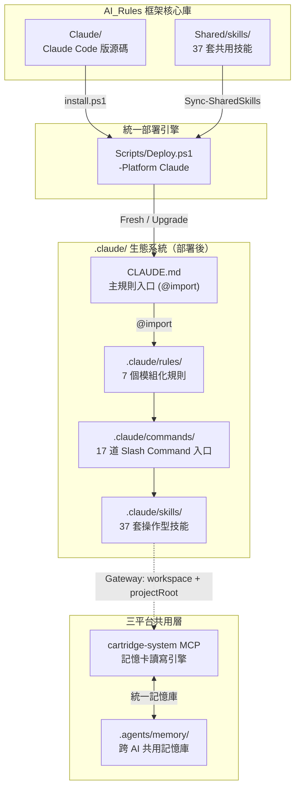
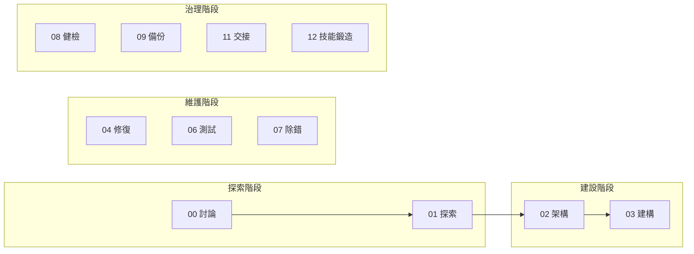
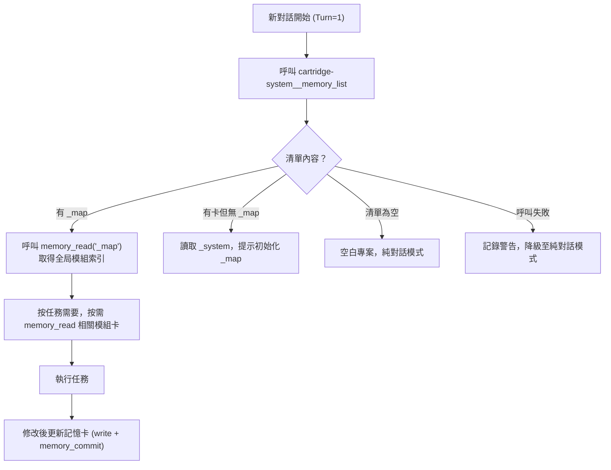

# Antigravity — Claude Code Edition

> **讓 AI 編碼助手不再失憶、不再無紀律** — 針對 Claude Code 原生工具（Write / Edit / Agent / Plan Mode）完整改寫的治理框架，與 Gemini 版共享同一套設計哲學與記憶庫。

[](#版本管理)
[](#)
[](#)

---

## 📌 這解決什麼問題？

Claude Code 原生的 CLAUDE.md + Plan Mode 已經很強，但 Antigravity 在其之上解決了這些問題：

1. **跨對話失憶** — 每開新對話就忘記之前做過的架構決策 → Turn=1 即即探測 `.agents/memory/` 記憶庫
2. **無治理框架** — 沒有統一的工作流程與品質閘門 → 17 道 Slash Command 入口強制生命週期
3. **多 AI 記憶分裂** — Gemini、Claude Code、Codex 各記各的 → `.agents/memory/` 統一記憶庫，三平台共用
4. **技能重複維護** — 兩個 AI 的技能各自維護 → 37 套操作型技能與 Gemini 版完全同步
5. **CLAUDE.md 膨脹** — 規則全寫在一個檔案中 → @import 模組化，CLAUDE.md 保持 < 200 行
6. **語言不友善** — 工程術語充斥 → 三層語言架構（指令層英文、介面層繁中、橋接層雙語）
7. **框架升級風險** — 升級怕覆蓋設定 → D06 安全網 + SHA256 差異比對 + 確認閘門

---

## 🚀 快速安裝

> 支援 **Windows PowerShell 5.1+** 與 **PowerShell 7**。公開指令會以 UTF-8 解碼遠端腳本，並用 UTF-8 BOM 寫入暫存檔，避免舊版中文 Windows PowerShell 解析失敗。

```powershell
# 🆕 全新安裝（在 IDE 終端機直接執行，自動安裝到當前目錄）
[Net.ServicePointManager]::SecurityProtocol = [Net.SecurityProtocolType]::Tls12; $u='https://raw.githubusercontent.com/Kunshao1117/AI_Rules/main/Claude/install.ps1'; $f="$env:TEMP\cc_install.ps1"; $wc=New-Object Net.WebClient; $bytes=$wc.DownloadData($u); $text=[Text.Encoding]::UTF8.GetString($bytes); $text=$text.TrimStart([char]0xFEFF); [IO.File]::WriteAllText($f,$text,(New-Object Text.UTF8Encoding $true)); & $f; Remove-Item $f
```

```powershell
# ⬆️ 升級現有安裝
[Net.ServicePointManager]::SecurityProtocol = [Net.SecurityProtocolType]::Tls12; $u='https://raw.githubusercontent.com/Kunshao1117/AI_Rules/main/Claude/install.ps1'; $f="$env:TEMP\cc_install.ps1"; $wc=New-Object Net.WebClient; $bytes=$wc.DownloadData($u); $text=[Text.Encoding]::UTF8.GetString($bytes); $text=$text.TrimStart([char]0xFEFF); [IO.File]::WriteAllText($f,$text,(New-Object Text.UTF8Encoding $true)); & $f -Mode Upgrade; Remove-Item $f
```

> 💡 **跨目錄安裝**：加上 `-Target "D:\你的專案路徑"` 即可安裝到其他位置。
>
> **原理**：啟動器從 GitHub 下載 ZIP（走 CDN，無 API 速率限制），解壓後執行 `Scripts/Deploy.ps1 -Platform Claude` 部署腳本，完成後自動清理暫存。

---

## 📖 目錄

- [核心設計理念](#-核心設計理念)
- [系統架構總覽](#-系統架構總覽)
- [模組詳解](#-模組詳解)
  - [部署引擎](#-部署引擎)
  - [規則系統](#-規則系統)
  - [工作流清單](#-工作流清單)
  - [技能系統](#-技能系統)
  - [專案記憶系統](#-專案記憶系統)
- [與 Antigravity Gemini 版對比](#-與-antigravity-gemini-版對比)
- [版本管理](#-版本管理)
- [專案結構](#-專案結構)

---

## 🧠 核心設計理念

| 原則 | 說明 |
|------|------|
| **零接觸部署** | 執行一行安裝指令即完成整套治理生態部署，無需人工逐一設定 |
| **三平台共用記憶** | `.agents/memory/` 為唯一記憶庫，Claude Code、Gemini 與 Codex 共用，消除多 AI 記憶分歧 |
| **Turn=1 啟動同步** | 每次新對話強制呼叫 `memory_list`，確保啟動時的記憶狀態永遠最新 |
| **按需載入** | 技能僅在需要時讀取，減少 Token 消耗與認知負擔 |
| **繁體中文特化** | 三層語言架構：指令層（英文）、介面層（繁體中文）、橋接層（雙語） |
| **最小權限治理** | 角色分層（讀取者 / 工作者 / 寫入者），子代理政策由 `Shared/policies/` 轉譯，且 Agent 子代理只能唯讀 |
| **@import 模組化** | `CLAUDE.md` 保持 200 行以內，詳細規則透過 `@import` 按需拉入，避免 Token 膨脹 |

---

## 🏗️ 系統架構總覽



---

## 📦 模組詳解

### ⚙️ 部署引擎

**腳本**: `Scripts/Deploy.ps1 -Platform Claude`（統一部署引擎，核心邏輯位於 `Scripts/modules/Platform-Claude.psm1`）

負責將整套 `.claude/` 生態系統移植到任何目標專案。所有 PowerShell 程式碼均配備完整的繁體中文行內說明，與 Antigravity 版完全對等，適合非英語使用者直接閱讀和維護。

#### 兩種部署模式

| 模式 | 觸發條件 | 行為 |
|------|---------|------|
| **Fresh** | 專案無 `.claude/` 目錄 | D06 安全網備份記憶 → 完整複製框架 → 建立基礎設施目錄 → 寫入版本檔 → 還原記憶 |
| **Upgrade** | 專案已有 `.claude/` 目錄 | SHA256 逐檔差異比對 → 彩色報告 → CHANGELOG 更新說明 → 確認閘門 → 套用變更 |

#### 安全防護

| 防護機制 | 說明 |
|----------|---------|
| **D06 安全防線** | Fresh 模式下以 `try/finally` 備份記憶卡到暫存目錄，部署中斷也不會損失資料 |
| **記憶卡保護** | `.agents/memory/` 和 `.agents/project_skills/` 在升級時絕對不覆蓋 |
| **確認閘門** | Upgrade 模式產出分類顏色差異報告，需使用者確認才套用 |
| **Shared policy drift** | Doctor 檢查 Claude adapter marker block 是否仍由 `Shared/policies/subagent-invocation.md` 生成 |
| **Subagent vocabulary drift** | Doctor 檢查 Shared 技能是否誤把平台工具名寫成共用語義，避免 Claude、Codex、Antigravity 的委派語彙互相污染 |
| **孤兒偵測** | 偵測源碼已刪除但目標仍存在的殘留檔案，加入 `-RemoveOrphans` 可自動清除 |
| **衍生技能補建** | 每次部署自動掃描 `project_skills/`，補建缺少的符號連結 |

---

### 📜 規則系統

**主規則**: `CLAUDE.md`（@import 模組化，< 200 行）
**詳細規則目錄**: `.claude/rules/`

| 檔案 | 定位 | 啟動模式 |
|------|------|----------|
| `core-identity.md` | 核心身份 — 代理人分工、生命週期、語言溝通 | Always On |
| `cross-lingual-guard.md` | 跨語系防護 — 冷啟動強制讀檔、Turn=1 記憶探測、實體足跡收據 | Always On |
| `code-quality.md` | 品質與安全合約 — 機密隔離、驗證器鐵律、SOLID 原則 | 條件載入 |
| `memory-contract.md` | 記憶操作規範 — 統一記憶庫路徑、Exit Hold Gate、操作流程 | 條件載入 |
| `forbidden-vocab.md` | 禁用詞彙規範 — 面向總監的商業層級詞彙對照 | 條件載入 |
| `mcp-guardrails.md` | MCP 外部工具防護 — 高風險操作的 HITL 攔截 | 條件載入 |
| `project-skill-contract.md` | 衍生技能合約 — 衍生技能建立、生命週期、鍛造流程 | 條件載入 |

#### 分層治理架構

**`core-identity.md`** — 核心原則（Always On）
1. **專職化分工** — 主代理人直接執行，`Shared/policies/subagent-invocation.md` 只定義 Delegation Gate；Claude adapter 才轉成 description-driven subagent、`@agent` 或受控 `Agent(...)`
2. **多代理人透明度** — 子代理人的修改必須回傳主代理人在介面呈現
3. **生命週期強制** — Plan Mode → 驗證閘門 → 實體執行 → 記憶更新
4. **禁止終端機文書處理** — 靜默閘門式攔截，支援 `[SUDO]` 覆寫
5. **繁體中文特化** — 三層語言架構（指令層英文、介面層繁中、橋接層雙語）
6. **位置索引式輸出** — 正式輸出可用短名稱，但同一份輸出必須提供位置索引，對應具體檔案、章節、工具狀態或目錄範圍
7. **中立誠實協作** — 不討好、不附和、不刻意反對；若證據衝突，用「我看到的事實／可能問題／建議做法」短格式修正
8. **知識新鮮度查證** — 記憶與模型內建知識視為可能過時，高變動資訊需查最新或官方來源

**`memory-contract.md`** — 記憶操作規範（條件載入）
1. **Turn=1 啟動探測** — 每次新對話強制呼叫 `memory_list` 同步記憶狀態
2. **單軌共用記憶庫** — 絕對路徑 `.agents/memory/`，禁止使用 `.claude/agents/memory/`
3. **Exit Hold Gate** — 修改原始碼後，記憶卡未更新則禁止結案
4. **Gateway 顯式路徑** — 透過 Multi-MCP Gateway 呼叫 cartridge-system 時，每次 `gateway__call_tool` 都帶 `workspace`，下游參數也帶 `projectRoot`
5. **v4.0 幽靈偵測** — 離場閘門新增非阻塞幽靈警告；全幽靈卡匣自動提議汰除

#### 雙受眾語言設計

框架中所有文件依讀者分為三層：

| 層級 | 讀者 | 語言 | 具體內容 |
|------|------|------|----------|
| **指令層** | AI 執行者 | 英文 | 技能步驟、決策樹、工作流程指令 |
| **介面層** | 總監 | 繁體中文 | 報告輸出、確認訊息、括號內註解 |
| **橋接層** | 兩者共用 | 雙語 | 記憶卡 description、小節標題 |

---

### 🔄 工作流清單

**目錄**: `.claude/commands/`（Claude Code 原生 Slash Commands）



| 指令 | 功能 | 角色權限 |
|------|------|---------|
| `/00_chat` | 純對話、腦力激盪、程式碼問答 | Reader |
| `/01_explore` | 可行性研究：網路研究 + 雙狀態魔鬼代言人分析 | Reader |
| `/02_blueprint` | 需求轉化為技術藍圖，同步初始化記憶系統 | Writer/SRE |
| `/03_build` | 兩階段建構：Plan Mode 計畫 → GO → 實體寫入 → 記憶歸卡 | Writer/SRE |
| `/03-1_experiment` | 沙盒快速實驗（所有閘門停用） | Experiment Worker |
| `/04_fix` | 兩階段修復：診斷計畫 → GO → 實體修復 → 記憶更新 | Writer/SRE |
| `/05_condense` | 專案濃縮初始化（掃描 → 萃取 → 審閱 → 寫入） | Writer/SRE |
| `/06_test` | 瀏覽器自動化視覺與功能測試 | Reader |
| `/07_debug` | 堆疊追蹤分析、錯誤翻譯為商業語言 | Reader |
| `/08_audit` | 全方位專案健康審計 | Writer/SRE |
| `/09_commit` | 授權備份：掃描 → CHANGELOG 草稿 → GO → 更新 CHANGELOG + 明確清單 commit/push | Writer/SRE |
| `/10_routine` | automation-safe 例行巡檢：技能品質、文件數字、記憶過期、MCP 設定健康 | Reader |
| `/11_handoff` | 掃描記憶卡，產出結構化交接文件 | Reader/Memory |
| `/12_skill_forge` | 從工作實踐中提煉可複用技能 | Worker |

---

### 🎯 技能系統

**目錄**: `.claude/skills/`

技能是**按需載入的知識手冊**。Claude Code 在對話開始時僅注入技能名稱與描述（見 `_index.md`），完整內容在需要時才讀取，實現漸進式揭露。

| 類別 | 技能 | 用途 | 對接 MCP |
|------|------|------|----------|
| **記憶與架構** | `memory-ops` | 記憶卡讀寫操作指引；含 Gateway 顯式路徑、唯讀治理工具與 `memory_commit` 高風險邊界 | Gateway → cartridge-system |
| | `memory-arch` | 記憶卡架構拓樸、層級拆分規則 | cartridge-system |
| | `skill-factory` | 從工作實踐中提煉可複用衍生技能 | — |
| | `audit-engine` | 健檢語義推理引擎（S1–S5 安全架構） | — |
| **生命週期** | `tech-stack-protocol` | 技術堆疊偵測與鎖定 | — |
| | `delegation-strategy` | 任務委派管道選擇（直接 / native subagent / browser subagent / CLI 分析代理 / MCP 工具） | — |
| **品質約束** | `code-quality` | SOLID 原則、動態行數閾值 | — |
| | `security-sre` | 零信任驗證、機密隔離、日誌標準 | — |
| | `ui-ux-standards` | 介面設計、工程術語隔離 | — |
| **測試與品保** | `test-patterns` | 單元測試決策樹、異常場景清單、契約驗證 | — |
| | `impact-test-strategy` | 變更影響分析、測試範圍決策、回歸防護 | — |
| | `test-automation-strategy` | DOM 互動規範、自動修復迴圈 | — |
| | `browser-testing` | E2E 視覺測試委派 SOP | — |
| | `a11y-testing` | 無障礙掃描、WCAG 驗證、修復建議 | a11y |
| | `performance-audit` | Lighthouse 效能掃描與 Web Vitals 測量 | playwright |
| **CLI 委派** | `code-audit` | 程式碼品質與安全掃描 | — |
| | `code-diagnosis` | 大範圍原始碼故障調查 | — |
| **MCP 操作食譜** | `cloudflare-ops` | KV/D1/R2/Workers/容器管理 | cloudflare-* |
| | `github-ops` | 倉庫管理、Issue/PR 操作 | github |
| | `pr-review-ops` | PR 自動審查與合併決策 | github |
| | `supabase-ops` | 資料庫管理、SQL 操作、遷移驗證 | supabase |
| | `sentry-ops` | 錯誤追蹤與效能監控 | sentry |
| | `excel-ops` | 審計報告匯出、資料分析、圖表生成 | excel |
| | `trunk-ops` | CI 測試框架偵測與修復 | trunk |
| | `context7-docs` | 即時框架文件查詢 | context7 |
| | `maps-assist` | Google Maps API 開發輔助 | — |
| | `stitch-design` | UI 設計稿生成與規範擷取 | stitch |
| **代碼知識圖譜** | `gitnexus-guide` | GitNexus 工具清單與知識圖譜用法 | gitnexus |
| | `gitnexus-cli` | 索引倉庫、分析代碼庫、生成 Wiki | gitnexus |
| | `gitnexus-exploring` | 探索代碼架構、執行流程 | gitnexus |
| | `gitnexus-debugging` | 偵錯、追蹤錯誤來源 | gitnexus |
| | `gitnexus-impact-analysis` | 評估變更安全性、找出依賴鏈 | gitnexus |
| | `gitnexus-refactoring` | 安全重構（改名、抽取、移動代碼） | gitnexus |
| **資料庫專精** | `supabase` | Supabase 完整功能整合指引 | supabase |
| | `supabase-postgres-best-practices` | Postgres 效能最佳化與索引設計 | supabase |
| **推理輔助** | `structured-reasoning` | 架構決策深度推理（Sequential Thinking） | sequentialthinking |

---

### 🧠 專案記憶系統

**目錄**: `.agents/memory/`（與 Antigravity Gemini 版及 Codex Edition **三平台共用**）

解決 AI「每次開新對話就失憶」的核心問題。

#### Turn=1 啟動探測流程



#### 記憶卡結構

每張記憶卡是一個 `SKILL.md` 檔案，包含：

- **追蹤的檔案清單** — 這個模組負責哪些原始碼檔案
- **歷史決策紀錄** — 過去做過什麼架構選擇，以及為什麼
- **已知問題** — 目前存在但尚未處理的問題
- **模組教訓** — 可重複利用的經驗知識
- **模組關聯** — 與其他模組的相依性

#### 粒度原則

- 單張記憶卡追蹤不超過 **8 個檔案**
- 支援最多 **4 層**深度的父子巢狀結構
- 超過時系統主動提示拆分（load `memory-arch` skill）
- `workspace_brief`、`memory_audit`、`commit_preflight` 是唯讀診斷工具；`memory_commit` 會寫入檔案與索引，只能在歸卡階段呼叫
- 透過 Gateway 呼叫 cartridge-system 時，每次真實呼叫都必須顯式帶 `workspace` 與 `projectRoot`
- **v4.0**：`memory_list` 回傳 `ghostFilesCount` 標記幽靈檔案；`indirectStaleness` 追蹤上游依賴過期；新建卡匣時應評估 `dependencies` 欄位宣告

#### 更新模式

| 模式 | 適用場景 |
|------|---------|
| `Write` + `memory_commit` | ✅ 推薦：原生工具寫入完整內容後，於歸卡階段呼叫高風險寫入工具同步後設資料 |
| `replace`（備援） | MCP 不可用時的降級路徑 |

---

## 🔀 與 Antigravity Gemini 版對比

| 功能 | Antigravity (Gemini) | Claude Edition |
|------|---------------------|----------------|
| **主規則載入** | `.agents/rules/` (IDE 自動注入) | `CLAUDE.md` @import 模組化 |
| **計畫模式** | `task_boundary` 呼叫 | Claude Code 原生 `Plan Mode` |
| **檔案寫入** | `write_to_file` / `replace_file_content` | `Write` / `Edit` 工具 |
| **子代理人** | Delegation Gate → Gemini CLI / `@` 指派 / browser-capable agent / Antigravity plugin adapter | Delegation Gate → description-driven subagent / `@agent` / governed `Agent(...)` |
| **任務追蹤** | `.gemini` scratchpad Artifact | `TodoWrite` 清單 |
| **工作流觸發** | `.agents/workflows/` (IDE 注入) | `.claude/commands/` (Slash Command) |
| **記憶啟動** | D7 Push 三路徑探測 | Turn=1 啟動探測協議 |
| **記憶存放** | `.agents/memory/` | `.agents/memory/`（**共用**） |
| **操作型技能** | `.agents/skills/` (36 個) | `.claude/skills/` (36 個) |
| **規則數量** | 9 個（含 AGENTS.md 哨兵） | 7 個模組（@import） |
| **工作流數量** | 20 個檔案 | 17 道 |

---

## 📋 版本管理

| 檔案 | 用途 |
|------|------|
| `VERSION` | 單行版本號（例如 `1.1.0`） |
| `CLAUDE.md` | 版本號顯示於文件標頭 |

升級時部署引擎採用 **SHA256 差異比對**策略，確保只更新真正有變化的檔案。`CLAUDE.md` 與 `.agents/memory/` 在升級時永遠受到保護。

---

## 📂 專案結構

```
Claude/
├── VERSION                      ← 框架版本號
├── install.ps1                  ← 一鍵安裝啟動器（呼叫 Scripts/Deploy.ps1）
├── README.md                    ← 本文件
├── global/
│   └── CLAUDE.md                ← 全局觸發器版控（→ ~/.claude/CLAUDE.md）
└── .claude/
    ├── CLAUDE.md                ← 主規則入口（@import 模組化，< 200 行）
    ├── rules/                   ← 詳細規則（被 CLAUDE.md @import）
    │   ├── core-identity.md     ← 核心身份（Always On）
    │   ├── cross-lingual-guard.md ← 跨語系防護（Always On）
    │   ├── code-quality.md      ← 品質與安全合約（條件載入）
    │   ├── memory-contract.md   ← 記憶操作規範（條件載入）
    │   ├── forbidden-vocab.md   ← 禁用詞彙規範（條件載入）
    │   ├── mcp-guardrails.md    ← MCP 外部工具防護（條件載入）
    │   └── project-skill-contract.md ← 衍生技能合約（條件載入）
    ├── commands/                ← Slash Command 入口（17 道）
    │   ├── 00_chat(討論)/
    │   ├── 01_explore(搜索)/
    │   ├── 02_blueprint(架構)/
    │   ├── 03_build(建構)/
    │   ├── 03-1_experiment/
    │   ├── 04_fix(修復)/
    │   ├── 05_condense（濃縮）/
    │   ├── 06_test(測試)/
    │   ├── 07_debug(除錯)/
    │   ├── 08_audit(健檢)/
    │   ├── 09_commit(紀錄)/
    │   ├── 10_routine(巡檢)/
    │   ├── 11_handoff(交接)/
    │   ├── 12_skill_forge(技能鍛造)/
    │   └── _shared/             ← 共用閘門（完成閘門 + 安全閘門）
    ├── skills/                  ← 操作型知識庫（36 個，部署時從 Shared/ 注入）
    │   ├── _index.md            ← 技能索引
    │   ├── memory-ops/
    │   ├── memory-arch/
    │   ├── code-quality/
    │   ├── github-ops/
    │   ├── gitnexus-*/          ← 代碼知識圖譜（6 個）
    │   └── ...                  ← 其餘 27 個技能
    └── agents/                  ← 官方子代理人設定槽位（保留；啟用政策仍由 Delegation Gate 轉譯）

.agents/memory/                  ← 專案記憶（與 Gemini 版共用，升級時受保護）
    └── (由 AI 執行 /02_blueprint 初始化)
```
