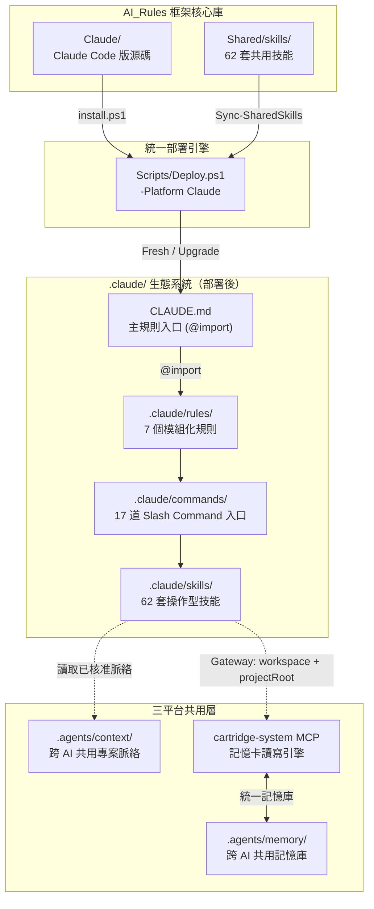
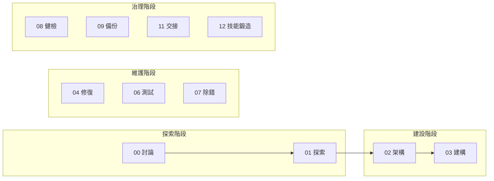
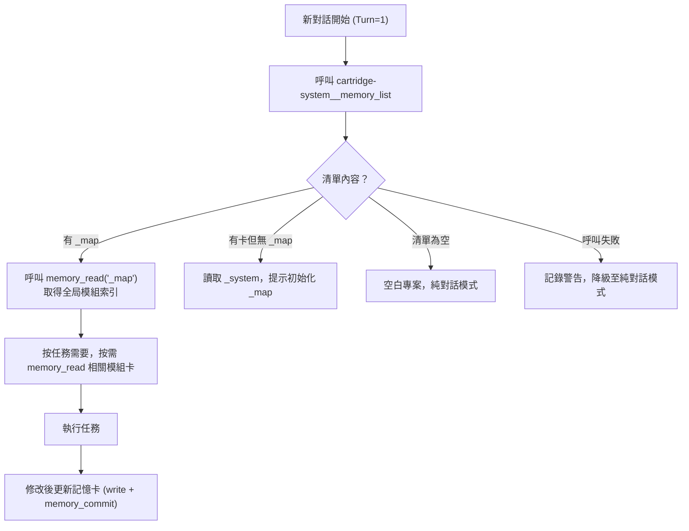

# Antigravity — Claude Code Edition

> **讓 AI 編碼助手不再失憶、不再無紀律** — 針對 Claude Code 原生工具（Write / Edit / Agent / Plan Mode）完整改寫的治理框架，與 Gemini 版共享同一套設計哲學與記憶庫。

[](#版本管理)
[](#)
[](#)

---

## 📌 這解決什麼問題？

Claude Code 原生的 CLAUDE.md + Plan Mode 已經很強，但 Antigravity 在其之上解決了這些問題：

1. **跨對話失憶** — 每開新對話就忘記之前做過的架構決策 → Turn=1 即即探測 `.agents/memory/` 記憶庫
2. **無治理框架** — 沒有統一的工作流程與品質閘門 → 17 道 Slash Command 入口強制生命週期
3. **多 AI 記憶分裂** — Gemini、Claude Code、Codex 各記各的 → `.agents/memory/` 統一記憶庫，三平台共用
4. **技能重複維護** — 兩個 AI 的技能各自維護 → 62 套操作型技能與 Gemini 版完全同步
5. **CLAUDE.md 膨脹** — 規則全寫在一個檔案中 → @import 模組化，CLAUDE.md 保持 < 200 行
6. **語言不友善** — 工程術語充斥 → 三層語言架構（指令層英文、介面層繁中、橋接層雙語）
7. **框架升級風險** — 升級怕覆蓋設定 → D06 安全網 + SHA256 差異比對 + 確認閘門
8. **偏好與記憶混雜** — 設計 DNA、產品偏好與驗收口味不再放入原始碼記憶，改由 `.agents/context/` 專案脈絡層保存

---

## 🚀 快速安裝

> 支援 **Windows PowerShell 5.1+** 與 **PowerShell 7**。公開指令會以 UTF-8 解碼遠端腳本，並用 UTF-8 BOM 寫入暫存檔，避免舊版中文 Windows PowerShell 解析失敗。

```powershell
# 🆕 全新安裝（在 IDE 終端機直接執行，自動安裝到當前目錄）
[Net.ServicePointManager]::SecurityProtocol = [Net.SecurityProtocolType]::Tls12; $u='https://raw.githubusercontent.com/Kunshao1117/AI_Rules/main/Claude/install.ps1'; $f="$env:TEMP\cc_install.ps1"; $wc=New-Object Net.WebClient; $bytes=$wc.DownloadData($u); $text=[Text.Encoding]::UTF8.GetString($bytes); $text=$text.TrimStart([char]0xFEFF); [IO.File]::WriteAllText($f,$text,(New-Object Text.UTF8Encoding $true)); & $f; Remove-Item $f
```

```powershell
# ⬆️ 升級現有安裝
[Net.ServicePointManager]::SecurityProtocol = [Net.SecurityProtocolType]::Tls12; $u='https://raw.githubusercontent.com/Kunshao1117/AI_Rules/main/Claude/install.ps1'; $f="$env:TEMP\cc_install.ps1"; $wc=New-Object Net.WebClient; $bytes=$wc.DownloadData($u); $text=[Text.Encoding]::UTF8.GetString($bytes); $text=$text.TrimStart([char]0xFEFF); [IO.File]::WriteAllText($f,$text,(New-Object Text.UTF8Encoding $true)); & $f -Mode Upgrade; Remove-Item $f
```

> 💡 **跨目錄安裝**：加上 `-Target "D:\你的專案路徑"` 即可安裝到其他位置。
>
> **原理**：啟動器從 GitHub 下載 ZIP（走 CDN，無 API 速率限制），解壓後執行 `Scripts/Deploy.ps1 -Platform Claude` 部署腳本，完成後自動清理暫存。

---

## 📖 目錄

- [核心設計理念](#-核心設計理念)
- [系統架構總覽](#-系統架構總覽)
- [模組詳解](#-模組詳解)
  - [部署引擎](#-部署引擎)
  - [規則系統](#-規則系統)
  - [工作流清單](#-工作流清單)
  - [技能系統](#-技能系統)
  - [專案記憶系統](#-專案記憶系統)
- [與 Antigravity Gemini 版對比](#-與-antigravity-gemini-版對比)
- [版本管理](#-版本管理)
- [專案結構](#-專案結構)

---

## 🧠 核心設計理念

| 原則 | 說明 |
|------|------|
| **零接觸部署** | 執行一行安裝指令即完成整套治理生態部署，無需人工逐一設定 |
| **三平台共用記憶** | `.agents/memory/` 為唯一記憶庫，Claude Code、Gemini 與 Codex 共用，消除多 AI 記憶分歧 |
| **三平台共用脈絡** | `.agents/context/` 保存設計 DNA、產品偏好、技術偏好與驗收偏好，不參與原始碼記憶 stale |
| **Turn=1 啟動同步** | 每次新對話強制呼叫 `memory_list`，確保啟動時的記憶狀態永遠最新 |
| **按需載入** | 技能僅在需要時讀取，減少 Token 消耗與認知負擔 |
| **需求對齊與反證** | 架構藍圖與建構計畫必須先回放需求、列出非目標與成功標準，再做中立反證、決策紀錄、驗收追蹤與偏移稽核 |
| **繁體中文特化** | 三層語言架構：指令層（英文）、介面層（繁體中文）、橋接層（雙語） |
| **Team-Native Core 團隊原生核心** | Team-Native 由使用者要求受治理工作觸發：governance、workflow、fix、build、debug、test、audit、skill、memory/docs、commit、handoff、source、public-contract，或要求團隊、隊員、subagent、delegation、Team-Native。使用者不需要固定口令。純對話、小型穩定問答與無 source/governance/evidence 影響的工作可維持 direct；Team mode 啟動不等於寫入授權。Team mode 啟動後，下一個合法狀態必須是隊長任務板、適用站點、隊員派工包與通道狀態；唯讀工作使用正式唯讀板，寫入工作使用已解析範圍的正式寫入板。主工作區實作的 primary 路徑是具名 station-owned main-worktree `change-delivery` 站點，需 `implementation-change-delivery`、精確 allowlist、dirty diff read 與禁止 protected actions；若只能 fork-only 或 text-only，必須如此標示，不得宣稱主工作區已改。`change-application` 只作 returned isolated/text artifact、explicit integration task 或 assigned generated/deployed sync 的 fallback。Claude 可把站點路由到原生或外掛子代理、hooks、檢查點、權限包絡與命令證據；若通道不可用，必須回報 unavailable、blocked、unverified、not-authorized 或 standby，不得默默降級成隊長主線直做。正式團隊完成必須回收 implementation change delivery、memory delivery、review、validation 四類交付件與 Team-Native trace；隊長只接收交付、維持任務板、彙整狀態、處理阻塞與授權邊界，不能先自行讀完、實作、審查或驗證再事後補團隊軌跡 |
| **範圍式授權解析** | Claude permission prompt、Plan Mode 同意、Slash Command、GO 與工具確認都必須收斂到目前明示的計畫、站點、命令、工具或檔案集合；Slash Command 只做工作流路由，介面同意可作為該提示範圍的授權證據，但不是無範圍寫入或記憶/git/release 授權 |
| **輸出與接地雙閘門** | Claude core 只保留總監輸出繁中語義先行與高變動/外部事實接地查證的最小契約；細節引用 `Shared/policies/language-governance.md` 與 `Shared/policies/grounding-governance.md`。source/deployed sync 以 `Claude/.claude/rules/core-identity.md` 與 `.claude/rules/core-identity.md` 雜湊一致為準 |
| **@import 模組化** | `CLAUDE.md` 保持 200 行以內，詳細規則透過 `@import` 按需拉入，避免 Token 膨脹 |

---

## 🏗️ 系統架構總覽



---

## 📦 模組詳解

### ⚙️ 部署引擎

**腳本**: `Scripts/Deploy.ps1 -Platform Claude`（統一部署引擎，核心邏輯位於 `Scripts/modules/Platform-Claude.psm1`）

負責將整套 `.claude/` 生態系統移植到任何目標專案。所有 PowerShell 程式碼均配備完整的繁體中文行內說明，與 Antigravity 版完全對等，適合非英語使用者直接閱讀和維護。

#### 兩種部署模式

| 模式 | 觸發條件 | 行為 |
|------|---------|------|
| **Fresh** | 專案無 `.claude/` 目錄 | D06 安全網備份記憶 → 完整複製框架 → 建立基礎設施目錄 → 寫入版本檔 → 還原記憶 |
| **Upgrade** | 專案已有 `.claude/` 目錄 | SHA256 逐檔差異比對 → 彩色報告 → CHANGELOG 更新說明 → 確認閘門 → 套用變更 |

#### 安全防護

| 防護機制 | 說明 |
|----------|---------|
| **D06 安全防線** | Fresh 模式下以 `try/finally` 備份記憶卡到暫存目錄，部署中斷也不會損失資料 |
| **知識資產保護** | `.agents/memory/`、`.agents/project_skills/` 和 `.agents/context/` 在升級時絕對不覆蓋 |
| **確認閘門** | Upgrade 模式產出分類顏色差異報告，需使用者確認才套用 |
| **Shared policy drift** | Doctor 檢查 Claude adapter marker block 是否仍由框架來源 `Shared/policies/subagent-invocation.md` 生成，並確認下游 `.agents/shared/policies/subagent-invocation.md` 已部署 |
| **Subagent vocabulary drift** | Doctor 檢查 Shared 技能是否誤把平台工具名寫成共用語義，避免 Claude、Codex、Antigravity 的委派語彙互相污染 |
| **Review governance coverage** | Doctor 檢查審查治理共用技能、工作流矩陣、子代理政策與 02/03/04/08/09/10 入口是否保留審查狀態與 evidence branch 邊界 |
| **Captain-led programming governance coverage** | Doctor 檢查受治理請求觸發、隊長制編程治理共用技能、團隊任務板模板、角色邊界、station-owned main-worktree `change-delivery` primary、isolated/text fallback、fallback `change-application`、證據負責人、主線直做例外、全主線假團隊防線、Claude command 接入與部署後 shared skill / shared reference hash 是否一致；也會檢查未啟動 Team mode 時不套用 captain/team-board、draft-to-formal board lifecycle、dispatch wave、previous-wave input、next-wave start condition、formal evidence eligibility，並攔截草案板派工、草案證據冒充正式驗收與一次開全部隊員 |
| **Team-Native Core coverage** | Doctor 檢查 Team-Native Core 政策、任務軌跡契約、conditional 平台路由、Team-Native trace 驗收與部署後共用參考；嚴格模式可要求任務軌跡 |
| **孤兒偵測** | 偵測源碼已刪除但目標仍存在的殘留檔案，加入 `-RemoveOrphans` 可自動清除 |
| **衍生技能補建** | 每次部署自動掃描 `project_skills/`，補建缺少的符號連結 |

---

### 📜 規則系統

**主規則**: `CLAUDE.md`（@import 模組化，< 200 行）
**詳細規則目錄**: `.claude/rules/`

| 檔案 | 定位 | 啟動模式 |
|------|------|----------|
| `core-identity.md` | 核心身份 — 代理人分工、生命週期、語言溝通 | Always On |
| `cross-lingual-guard.md` | 跨語系防護 — 冷啟動強制讀檔、Turn=1 記憶探測、實體足跡收據 | Always On |
| `code-quality.md` | 品質與安全合約 — 機密隔離、驗證器鐵律、SOLID 原則 | 條件載入 |
| `memory-contract.md` | 記憶操作規範 — 統一記憶庫路徑、Exit Hold Gate、操作流程 | 條件載入 |
| `forbidden-vocab.md` | 禁用詞彙規範 — 面向總監的商業層級詞彙對照 | 條件載入 |
| `mcp-guardrails.md` | MCP 外部工具防護 — 高風險操作的 HITL 攔截 | 條件載入 |
| `project-skill-contract.md` | 衍生技能合約 — 衍生技能建立、生命週期、鍛造流程 | 條件載入 |

#### 分層治理架構

**`core-identity.md`** — 核心原則（Always On）
1. **專職化分工** — 未啟動 Team mode 時，純聊天、小型穩定問答與無 source/governance/evidence 影響工作依一般生命週期、範圍式授權與 read-before-write 處理，不套用 captain/team-board 限制。使用者要求編程、修復、測試、健檢、技能、source 或治理等受治理工作時，Team mode 由該請求觸發；啟動後隊長任務只限總監溝通、授權解析、建板、派工、監督、接收站點交付、更新任務板、彙整狀態、處理阻塞/衝突/授權與回報；正式驗證、審查、記憶判讀由站點交付，授權變更由變更站套用，不把一般站點直接執行視為完整團隊完成；下游 `.agents/shared/policies/subagent-invocation.md` 與框架來源 `Shared/policies/subagent-invocation.md` 只定義 Delegation Gate、角色互斥、station-owned main-worktree change delivery、fallback change-application、假團隊防線與主線直做例外；Claude adapter 把證據型站點轉成 description-driven subagent、`@agent` 或受控 `Agent(...)`，主工作區實作的 primary 路徑是具名 station-owned `change-delivery`，需 formal-write、精確 allowlist、dirty diff read 與 no protected actions；isolated/text-only 只作無法直接主工作區委派時的 fallback，`change-application` 只處理 returned isolated/text artifact、explicit integration task 或 assigned generated/deployed sync，不能自我審查；不可用時標記未驗證、阻塞或總監風險關閉但非完整
2. **多代理人透明度** — 子代理人的修改必須回傳主代理人在介面呈現
3. **生命週期強制** — Plan Mode → 驗證閘門 → 實體執行 → 記憶更新
4. **禁止終端機文書處理** — 靜默閘門式攔截，`[SUDO]` 只留下風險關閉請求或覆寫請求紀錄；不得跳過 scoped authorization、Team-Native、validation、review、protected gates，也不得支援 `complete` 宣稱
5. **繁體中文特化** — 三層語言架構（指令層英文、介面層繁中、橋接層雙語）
6. **位置索引式輸出** — 正式輸出可用短名稱，但同一份輸出必須提供位置索引，對應具體檔案、章節、工具狀態或目錄範圍
7. **中立誠實協作** — 不討好、不附和、不刻意反對；若證據衝突，用「我看到的事實／可能問題／建議做法」短格式修正
8. **知識新鮮度查證** — 記憶與模型內建知識視為可能過時，高變動資訊需查最新或官方來源

**`memory-contract.md`** — 記憶操作規範（條件載入）
1. **Turn=1 啟動探測** — 每次新對話強制呼叫 `memory_list` 同步記憶狀態
2. **單軌共用記憶庫** — 絕對路徑 `.agents/memory/`，禁止使用 `.claude/agents/memory/`
3. **Exit Hold Gate** — 修改原始碼後，記憶卡未更新則禁止結案
4. **Gateway 顯式路徑** — 透過 Multi-MCP Gateway 呼叫 cartridge-system 時，每次 `gateway__call_tool` 都帶 `workspace`，下游參數也帶 `projectRoot`
5. **v4.0 幽靈偵測** — 離場閘門新增非阻塞幽靈警告；全幽靈卡匣自動提議汰除

#### 雙受眾語言設計

框架中所有文件依讀者分為三層：

| 層級 | 讀者 | 語言 | 具體內容 |
|------|------|------|----------|
| **指令層** | AI 執行者 | 英文 | 技能步驟、決策樹、工作流程指令 |
| **介面層** | 總監 | 繁體中文 | 報告輸出、確認訊息、括號內註解 |
| **橋接層** | 兩者共用 | 雙語 | 記憶卡 description、小節標題 |

---

### 🔄 工作流清單

**目錄**: `.claude/commands/`（Claude Code 原生 Slash Commands）



| 指令 | 功能 | 角色權限 |
|------|------|---------|
| `/00_chat` | 純對話、腦力激盪、無外部證據依賴的輕量問答；未啟動 Team mode 時，涉及檔案、截圖、記憶、規則、代理行為或治理影響仍依一般唯讀/授權流程處理；Team mode 因受治理請求或團隊派工啟動後改走正式唯讀團隊站點 | Reader |
| `/01_explore` | 可行性研究：網路研究 + 雙狀態魔鬼代言人分析 | Reader |
| `/02_blueprint` | 需求轉化為技術藍圖，同步初始化記憶系統 | Writer/SRE |
| `/03_build` | 兩階段建構：Plan Mode 計畫 → 範圍綁定的意圖訊號經授權解析綁定 → 正式派工板 → 第 1 波變更交付件 → 回收證據 → 達到下一波啟動條件後再派審查/驗證交付件 → 授權變更套用站點處理合格交付件 → 記憶歸卡與真實執行驗證 | Captain/SRE |
| `/03-1_experiment` | 沙盒快速實驗（受治理 workflow；要求 03-1/experiment/sandbox prototype 會啟動 Team mode，使用 reduced/minimal experiment station/board；sandbox 寫入與 promotion 仍需 scope-bound authorization，且不宣稱 production complete） | Experiment Worker |
| `/04_fix` | 兩階段修復：診斷計畫 → 範圍綁定的意圖訊號經授權解析綁定 → 正式派工板 → 第 1 波修復變更交付件 → 回收證據 → 達到下一波啟動條件後再派審查/回歸驗證交付件 → 授權變更套用站點處理合格交付件 → 記憶更新與真實失敗路徑回歸 | Captain/SRE |
| `/05_condense` | 專案濃縮初始化（掃描 → 萃取 → 隊長任務板 → 審閱 → 寫入） | Writer/SRE |
| `/06_test` | 依介面與真實操作面收集視覺、命令、資料、日誌或執行證據 | Reader |
| `/07_debug` | 堆疊追蹤分析、錯誤翻譯為商業語言 | Reader |
| `/08_audit` | 健檢深度、專案型態、平台能力、盤點分母、動態掛載模組與證據式健康報告 | Reader/Logs |
| `/09_commit` | 授權備份：掃描 → CHANGELOG 草稿 → 範圍綁定的意圖訊號經授權解析綁定 → 正式派工板 → 審查/收尾證據交付件分波回收 → 隊長更新變更紀錄 + 明確清單遠端備份 | Captain/SRE |
| `/10_routine` | automation-safe 例行巡檢：技能品質、文件數字、記憶過期、MCP 設定健康 | Reader |
| `/11_handoff` | 掃描記憶卡，產出結構化交接文件 | Reader/Memory |
| `/12_skill_forge` | 從工作實踐中提煉可複用技能 | Worker |

---

### 🎯 技能系統

Claude Edition 同步套用跨專案真實驗證契約：能啟動、操作、呼叫、查詢、截圖、讀日誌或觀察副作用時，AI 必須實測。正式建構、修復、測試與健檢都必須先判定變更意圖，並區分緊急修補、根因修復、局部修整與結構重構；同一症狀、同一檔案區域或同一操作者路徑重複修補時，必須升級為根因修復或結構重構，而不是繼續累積補丁。

視覺驗證不能只看整頁大方向，必須檢查文字截斷、長字串、按鈕對齊、間距、邊框破損、遮擋、焦點狀態、禁用狀態、載入、空狀態與錯誤狀態。視覺證據應優先使用真實資訊頁面、真實資料、實際帳號狀態、目前回應或日誌；mock、fixture、假資料、靜態截圖或局部單元測試只能作為局部證據或備援證據，且必須標記使用原因、差異風險與不可宣稱的完成範圍。若功能依賴真實資料、執行期狀態、持久化、外部整合、命令輸出、自動化、雲端服務或操作者可見行為，缺少真實執行證據即不得宣稱完成。Claude 可用瀏覽器、桌面操作、終端、MCP、外掛宿主或 preview/deployment 工具時，必須先搜尋可用入口、確認就緒、重試短暫失敗，或改用等價真實路徑；不能因一次工具不可用就放棄該驗證方式。

架構與建構入口會載入需求對齊閘門。架構藍圖必須包含需求理解回放、中立反證檢查、架構決策表、需求到驗收追蹤表、建構交接合約、未驗證與阻塞清單；建構計畫必須包含沿用藍圖狀態、需求到任務追蹤表、任務驗收矩陣、偏移稽核規則與完成前回查。若實際變更偏離核准藍圖，必須標記為符合、合理偏離、未授權偏離或未驗證。

Claude 健檢入口採深層證據式架構：先選擇快速、標準、深度或鑑識模式，再偵測網站、後端、命令列、桌面、外掛、函式庫、基礎設施、資料管線、AI 功能、文件治理庫或混合專案，並建立功能、端點、命令、任務、介面、資料流、效能與風險盤點。Claude 版優先使用站點要求的唯讀子代理、鉤子、權限模式、檢查點、批次讀取與非互動命令採證；中繼證據只允許寫入健檢日誌，不授權修改原始碼、記憶卡或外部狀態。

08 以外的工作流共用外部接地矩陣：每個 Slash Command 都對應任務型態、官方或標準依據、最低證據狀態、阻塞條件與下一流程路由。Claude 版可把矩陣轉譯成計畫模式、子代理、權限、鉤子、檢查點與批次命令證據，但 Slash Command 與權限提示只在明示範圍內提供路由或授權證據，不得讓這些能力取代主代理的範圍綁定授權解析閘門與最終狀態彙整責任；必要證據分支或任務板不可用時必須標記未驗證、阻塞或總監風險關閉但非完整。

**目錄**: `.claude/skills/`

技能是**按需載入的知識手冊**。Claude Code 在對話開始時僅注入技能名稱與描述（見 `_index.md`），完整內容在需要時才讀取，實現漸進式揭露。新版共用技能總數為 62 套，其中新增專家角色母技能、十個專家子技能，並保留既有團隊交付技能；專家分類、變更交付、記憶交付、驗證、審查與完成閘門由隊員分工交付。

| 類別 | 技能 | 用途 | 對接 MCP |
|------|------|------|----------|
| **記憶與架構** | `memory-ops` | 記憶卡讀寫操作指引；含 Gateway 顯式路徑、唯讀治理工具與 `memory_commit` 高風險邊界 | Gateway → cartridge-system |
| | `memory-arch` | 記憶卡架構拓樸、層級拆分規則 | cartridge-system |
| | `skill-factory` | 從工作實踐中提煉可複用衍生技能 | — |
| | `audit-engine` | 深層健檢語義引擎（深度模式、專案型態、盤點分母、證據交付件、覆蓋率、燈號規則、安全/API/資料流與相容性） | — |
| **生命週期** | `tech-stack-protocol` | 技術堆疊偵測與鎖定 | — |
| | `delegation-strategy` | 任務委派管道選擇（直接 / native subagent / browser subagent / CLI 分析代理 / MCP 工具） | — |
| **品質約束** | `code-quality` | SOLID 原則、動態行數閾值 | — |
| | `security-sre` | 零信任驗證、機密隔離、日誌標準 | — |
| | `ui-ux-standards` | 介面設計、工程術語隔離 | — |
| **測試與品保** | `test-patterns` | 單元測試決策樹、異常場景清單、契約驗證 | — |
| | `impact-test-strategy` | 變更影響分析、測試範圍決策、回歸防護 | — |
| | `test-automation-strategy` | DOM 互動規範、自動修復迴圈 | — |
| | `browser-testing` | E2E 視覺測試委派 SOP | — |
| | `a11y-testing` | 無障礙掃描、WCAG 驗證、修復建議 | a11y |
| | `performance-audit` | Lighthouse 效能掃描與 Web Vitals 測量 | playwright |
| **CLI 委派** | `code-audit` | 程式碼品質與安全掃描 | — |
| | `code-diagnosis` | 大範圍原始碼故障調查 | — |
| **MCP 操作食譜** | `cloudflare-ops` | KV/D1/R2/Workers/容器管理 | cloudflare-* |
| | `github-ops` | 倉庫管理、Issue/PR 操作 | github |
| | `pr-review-ops` | PR 自動審查與合併決策 | github |
| | `supabase-ops` | 資料庫管理、SQL 操作、遷移驗證 | supabase |
| | `sentry-ops` | 錯誤追蹤與效能監控 | sentry |
| | `excel-ops` | 審計報告匯出、資料分析、圖表生成 | excel |
| | `trunk-ops` | CI 測試框架偵測與修復 | trunk |
| | `context7-docs` | 即時框架文件查詢 | context7 |
| | `maps-assist` | Google Maps API 開發輔助 | — |
| | `stitch-design` | UI 設計稿生成與規範擷取 | stitch |
| **代碼知識圖譜** | `gitnexus-guide` | GitNexus 工具清單與知識圖譜用法 | gitnexus |
| | `gitnexus-cli` | 索引倉庫、分析代碼庫、生成 Wiki | gitnexus |
| | `gitnexus-exploring` | 探索代碼架構、執行流程 | gitnexus |
| | `gitnexus-debugging` | 偵錯、追蹤錯誤來源 | gitnexus |
| | `gitnexus-impact-analysis` | 評估變更安全性、找出依賴鏈 | gitnexus |
| | `gitnexus-refactoring` | 安全重構（改名、抽取、移動代碼） | gitnexus |
| **資料庫專精** | `supabase` | Supabase 完整功能整合指引 | supabase |
| | `supabase-postgres-best-practices` | Postgres 效能最佳化與索引設計 | supabase |
| **推理輔助** | `structured-reasoning` | 架構決策深度推理（Sequential Thinking） | sequentialthinking |

---

### 🧠 專案記憶系統

**目錄**: `.agents/memory/`（與 Antigravity Gemini 版及 Codex Edition **三平台共用**）

解決 AI「每次開新對話就失憶」的核心問題。

#### Turn=1 啟動探測流程



#### 記憶卡結構

每張記憶卡是一個作用中記憶主檔；目標標準主檔是 `MEMORY.md`，既有專案在相容期可能仍保留舊 `SKILL.md`：

- **現行真相** — 目前仍有效的英文短句摘要
- **當前限制** — 仍需遵守的施工硬限制
- **週期事件** — 本輪最多 30 筆的短事件紀錄
- **歷史索引** — 指向歸檔分卷，不把長文貼在主卡
- **中文摘要** — 最多五條，供總監快速判讀
- **追蹤的檔案清單** — 這個模組負責哪些原始碼檔案

內容品質標準要求新建或受控標準化後的現役主卡標記內容品質版本、記憶類型、驗證狀態、最後驗證時間與有效範圍，並提供證據基礎、讀取契約、衝突與取代段落。設計 DNA、產品偏好、驗收口味與一次性觀察不寫入來源記憶；這些內容應留在專案脈絡、任務報告或待審清單。本專案目前尚未執行現役主卡內容標準化遷移。

#### 粒度原則

- 單張記憶卡追蹤不超過 **8 個檔案**
- 支援最多 **4 層**深度的父子巢狀結構
- 超過時系統主動提示拆分（load `memory-arch` skill）
- 主卡不超過 **16 KB / 120 行**，週期事件不超過 **30 筆**
- 歸檔卷不超過 **32 KB / 200 行**，超過時開下一卷
- 記憶卡不是可執行技能；目標主檔是 `MEMORY.md`，舊 `SKILL.md` 僅作相容期來源
- 記憶主檔遷移由部署後專案本地工具乾跑盤點、檢查雙主檔衝突與舊路徑引用；找不到 `.agents/tools/Memory-Migration.ps1` 時必須先重新同步，不得手動批次搬檔
- 下游乾跑入口：`powershell -NoProfile -ExecutionPolicy Bypass -File .\.agents\tools\Memory-Migration.ps1`；正式套用需另行授權並加上 `-Apply -ConfirmApply`
- 舊格式記憶卡相容期可讀；現役主卡要透過盤點、歸檔、萃取有效事實與品質欄位重建逐步升級
- 巡檢會提示缺少品質欄位、證據段落、讀取契約或衝突狀態的現役主卡；初期列提醒，不等同已完成遷移
- `workspace_brief`、`memory_audit`、`commit_preflight` 是唯讀診斷工具；`memory_commit` 會寫入檔案與索引，只能在歸卡階段呼叫
- 透過 Gateway 呼叫 cartridge-system 時，每次真實呼叫都必須顯式帶 `workspace` 與 `projectRoot`
- **v4.0**：`memory_list` 回傳 `ghostFilesCount` 標記幽靈檔案；`indirectStaleness` 追蹤上游依賴過期；新建卡匣時應評估 `dependencies` 欄位宣告
- **v5.5**：`memory_list` / `memory_audit` / `workspace_brief` / `commit_preflight` 顯示大小、語言比例、事件數、舊格式與建議動作

#### 更新模式

| 模式 | 適用場景 |
|------|---------|
| `Write` + `memory_commit` | ✅ 推薦：原生工具寫入完整內容後，於歸卡階段呼叫高風險寫入工具同步後設資料 |
| `replace`（備援） | MCP 不可用時的降級路徑 |

---

## 🔀 與 Antigravity Gemini 版對比

| 功能 | Antigravity (Gemini) | Claude Edition |
|------|---------------------|----------------|
| **主規則載入** | `.agents/rules/` (IDE 自動注入) | `CLAUDE.md` @import 模組化 |
| **計畫模式** | `task_boundary` 呼叫 | Claude Code 原生 `Plan Mode` |
| **檔案寫入** | `write_to_file` / `replace_file_content` | `Write` / `Edit` 工具 |
| **子代理人** | 隊長任務板建立後 → Gemini CLI / `@` 指派 / browser-capable agent / Antigravity plugin adapter / 受治理隔離變更交付 | 隊長任務板建立後 → description-driven subagent / `@agent` / governed `Agent(...)` / 受治理隔離變更交付；Director 要求只會強制建板派工，不允許先開代理；不可用時標記未驗證、阻塞或總監風險關閉但非完整 |
| **任務追蹤** | `.gemini` scratchpad Artifact | `TodoWrite` 清單 |
| **工作流觸發** | `.agents/workflows/` (IDE 注入) | `.claude/commands/` (Slash Command) |
| **記憶啟動** | D7 Push 三路徑探測 | Turn=1 啟動探測協議 |
| **記憶存放** | `.agents/memory/` | `.agents/memory/`（**共用**） |
| **操作型技能** | `.agents/skills/` (62 個) | `.claude/skills/` (62 個) |
| **規則數量** | 9 個（含 AGENTS.md 哨兵） | 7 個模組（@import） |
| **工作流數量** | 20 個檔案 | 17 道 |

---

## 📋 版本管理

| 檔案 | 用途 |
|------|------|
| `VERSION` | 單行版本號（例如 `1.1.0`） |
| `CLAUDE.md` | 版本號顯示於文件標頭 |

升級時部署引擎採用 **SHA256 差異比對**策略，確保只更新真正有變化的檔案。`CLAUDE.md`、`.agents/memory/` 與 `.agents/context/` 在升級時永遠受到保護。

---

## 📂 專案結構

```
Claude/
├── VERSION                      ← 框架版本號
├── install.ps1                  ← 一鍵安裝啟動器（呼叫 Scripts/Deploy.ps1）
├── README.md                    ← 本文件
├── global/
│   └── CLAUDE.md                ← 全局觸發器版控（→ ~/.claude/CLAUDE.md）
└── .claude/
    ├── CLAUDE.md                ← 主規則入口（@import 模組化，< 200 行）
    ├── rules/                   ← 詳細規則（被 CLAUDE.md @import）
    │   ├── core-identity.md     ← 核心身份（Always On）
    │   ├── cross-lingual-guard.md ← 跨語系防護（Always On）
    │   ├── code-quality.md      ← 品質與安全合約（條件載入）
    │   ├── memory-contract.md   ← 記憶操作規範（條件載入）
    │   ├── forbidden-vocab.md   ← 禁用詞彙規範（條件載入）
    │   ├── mcp-guardrails.md    ← MCP 外部工具防護（條件載入）
    │   └── project-skill-contract.md ← 衍生技能合約（條件載入）
    ├── commands/                ← Slash Command 入口（17 道）
    │   ├── 00_chat(討論)/
    │   ├── 01_explore(搜索)/
    │   ├── 02_blueprint(架構)/
    │   ├── 03_build(建構)/
    │   ├── 03-1_experiment/
    │   ├── 04_fix(修復)/
    │   ├── 05_condense（濃縮）/
    │   ├── 06_test(測試)/
    │   ├── 07_debug(除錯)/
    │   ├── 08_audit(健檢)/
    │   ├── 09_commit(紀錄)/
    │   ├── 10_routine(巡檢)/
    │   ├── 11_handoff(交接)/
    │   ├── 12_skill_forge(技能鍛造)/
    │   └── _shared/             ← 共用閘門（完成閘門 + 安全閘門）
    ├── skills/                  ← 操作型知識庫（62 個，部署時從 Shared/ 注入）
    │   ├── _index.md            ← 技能索引
    │   ├── memory-ops/
    │   ├── memory-arch/
    │   ├── code-quality/
    │   ├── github-ops/
    │   ├── gitnexus-*/          ← 代碼知識圖譜（6 個）
    │   └── ...                  ← 其餘 33 個技能
    └── agents/                  ← 官方子代理人設定槽位（保留；啟用政策仍由 Delegation Gate 轉譯）

.agents/memory/                  ← 專案記憶（與 Gemini 版共用，升級時受保護）
    └── (由 AI 執行 /02_blueprint 初始化)
.agents/context/                 ← 專案脈絡（設計 DNA 與長期偏好，升級時受保護）
    └── _map/CONTEXT.md           ← 專案脈絡索引
```
