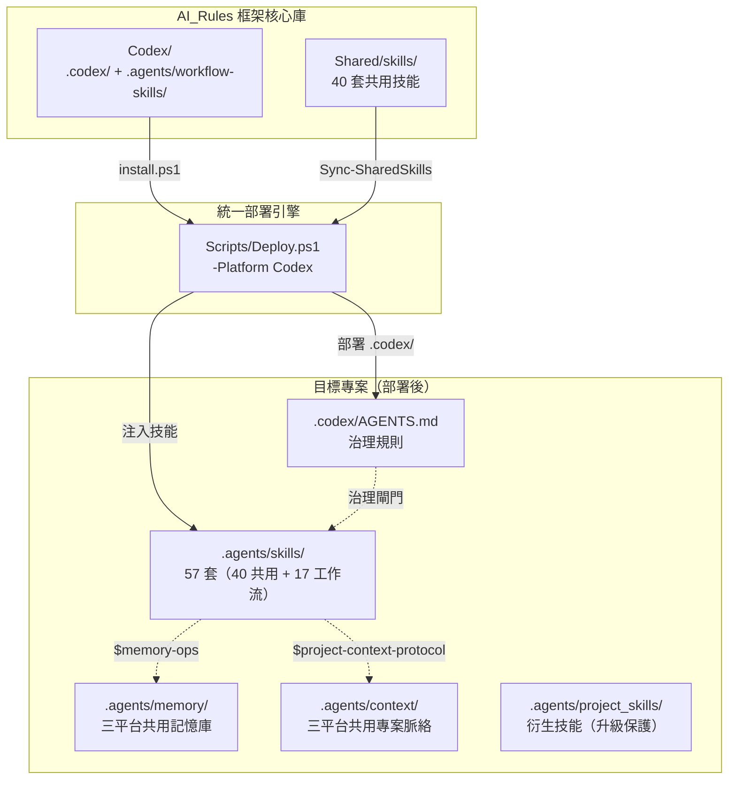
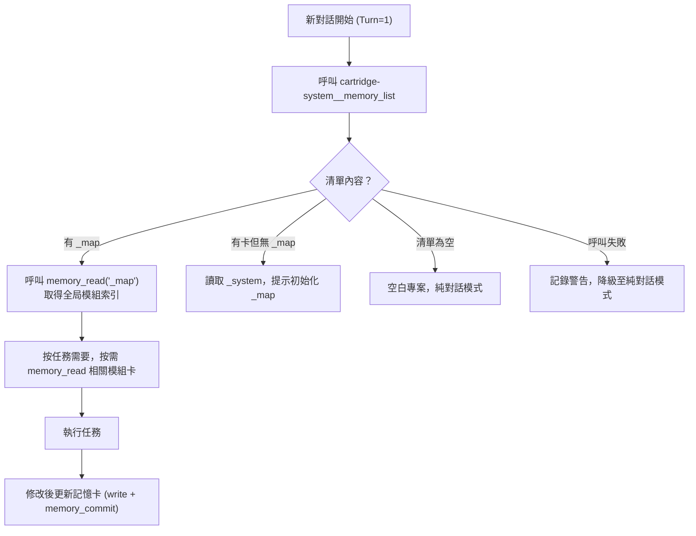

# Antigravity Codex Edition v0.1.3

> **讓 AI 編碼助手不再失憶、不再無紀律** — 針對 OpenAI Codex（agentskills.io）設計的 Antigravity 治理框架適配層，與 Gemini 版和 Claude Edition 共享同一套設計哲學與記憶庫。

[](#版本管理)
[](#)
[](#)

---

## 📌 這解決什麼問題？

OpenAI Codex 透過 `.agents/skills/` 目錄原生掃描操作型技能，Antigravity Codex Edition 在其之上解決了這些問題：

1. **跨對話失憶** — 每開新對話就忘記之前做過的架構決策 → Turn=1 即探測 `.agents/memory/` 記憶庫
2. **技能孤島** — 每個 Codex 專案各自維護技能 → 40 套共用操作型技能一次部署，統一真實來源
3. **工作流缺失** — Codex 原生無內建工作流程 → 17 套工作流技能整合至 `.agents/skills/`，無縫觸發
4. **記憶庫與 Gemini/Claude 分裂** — 三個 AI 各記各的 → `.agents/memory/` 統一記憶庫，三平台共用
5. **治理規則模板缺失** → `.codex/AGENTS.md` 提供包含閘門、記憶協議、工作流的完整治理規範
6. **框架升級風險** — 升級怕覆蓋設定 → D06 安全網 + SHA256 差異比對 + PROJECT IDENTITY 保護
7. **偏好與記憶混雜** — 設計 DNA、產品偏好與驗收口味不再放入原始碼記憶，改由 `.agents/context/` 專案脈絡層保存

---

## 🚀 快速安裝

> 支援 **Windows PowerShell 5.1+** 與 **PowerShell 7**。公開指令會以 UTF-8 解碼遠端腳本，並用 UTF-8 BOM 寫入暫存檔，避免舊版中文 Windows PowerShell 解析失敗。

```powershell
# 🆕 全新安裝（在 IDE 終端機直接執行，自動安裝到當前目錄）
[Net.ServicePointManager]::SecurityProtocol = [Net.SecurityProtocolType]::Tls12; $u='https://raw.githubusercontent.com/Kunshao1117/AI_Rules/main/Codex/install.ps1'; $f="$env:TEMP\ag_codex_install.ps1"; $wc=New-Object Net.WebClient; $bytes=$wc.DownloadData($u); $text=[Text.Encoding]::UTF8.GetString($bytes); $text=$text.TrimStart([char]0xFEFF); [IO.File]::WriteAllText($f,$text,(New-Object Text.UTF8Encoding $true)); & $f; Remove-Item $f
```

```powershell
# ⬆️ 升級現有安裝
[Net.ServicePointManager]::SecurityProtocol = [Net.SecurityProtocolType]::Tls12; $u='https://raw.githubusercontent.com/Kunshao1117/AI_Rules/main/Codex/install.ps1'; $f="$env:TEMP\ag_codex_install.ps1"; $wc=New-Object Net.WebClient; $bytes=$wc.DownloadData($u); $text=[Text.Encoding]::UTF8.GetString($bytes); $text=$text.TrimStart([char]0xFEFF); [IO.File]::WriteAllText($f,$text,(New-Object Text.UTF8Encoding $true)); & $f -Mode Upgrade; Remove-Item $f
```

> 💡 **跨目錄安裝**：加上 `-Target "D:\你的專案路徑"` 即可安裝到其他位置。
>
> **原理**：啟動器從 GitHub 下載 ZIP（走 CDN，無 API 速率限制），解壓後執行 `Scripts/Deploy.ps1 -Platform Codex`，完成後自動清理暫存。

---

## 📖 目錄

- [核心設計理念](#-核心設計理念)
- [系統架構總覽](#-系統架構總覽)
- [模組詳解](#-模組詳解)
  - [部署引擎](#-部署引擎)
  - [治理規則系統](#-治理規則系統)
  - [技能系統（57 套）](#-技能系統57-套)
  - [專案記憶系統](#-專案記憶系統)
- [與其他版本對比](#-與其他版本對比)
- [版本管理](#-版本管理)
- [部署後的專案結構](#-部署後的專案結構)

---

## 🧠 核心設計理念

| 原則 | 說明 |
|------|------|
| **零接觸部署** | 執行一行安裝指令即完成整套治理生態部署，無需人工逐一設定 |
| **技能原生整合** | 工作流技能與共用技能合併至 `.agents/skills/`，符合 agentskills.io 標準路徑 |
| **三平台共用記憶** | `.agents/memory/` 為唯一記憶庫，Codex / Gemini / Claude Code 三者共用 |
| **三平台共用脈絡** | `.agents/context/` 保存設計 DNA、產品偏好、技術偏好與驗收偏好，不參與原始碼記憶 stale |
| **輕量治理規則** | 所有治理規範收錄於單一 `.codex/AGENTS.md`，無需多檔案載入機制 |
| **技能即工作流** | Codex 透過技能觸發 `$skill-name`，工作流與操作型技能統一在同一目錄 |
| **子代理治理模型** | `Shared/policies/subagent-invocation.md` 提供 Delegation Gate 與 evidence branch 語義；Codex adapter 只在使用者明確要求、workflow gate 或 `.codex/agents/*.toml` 設定時啟動 native subagents |
| **升級保護** | PROJECT IDENTITY 保護機制：升級後自動還原使用者自訂的專案身份區段 |

---

## 🏗️ 系統架構總覽



---

## 📦 模組詳解

### ⚙️ 部署引擎

**腳本**: `Scripts/Deploy.ps1 -Platform Codex`（統一部署引擎，核心邏輯位於 `Scripts/modules/Platform-Codex.psm1`）

負責將 `.codex/` 治理規則與 57 套技能部署到目標專案。所有 PowerShell 程式碼均配備完整的繁體中文行內說明，三個平台部署能力完全對等。

#### 兩種部署模式

| 模式 | 觸發條件 | 行為 |
|------|---------|------|
| **Fresh** | 專案無 `.codex/` 目錄 | D06 安全網備份記憶 → 部署 `.codex/` 治理規則 → 注入 40 套共用技能 → 合併 17 套工作流技能 → 建立基礎設施 → 寫入版本檔 → 還原記憶 |
| **Upgrade** | 專案已有 `.codex/` 目錄 | 掃描 `.codex/` 差異 → 彩色報告 → 顯示 CHANGELOG → 確認閘門 → 套用 `.codex/` 變更 → 差異注入技能更新 |

#### 技能部署兩步驟

```
Step 1: Shared/skills/ → .agents/skills/    （40 套共用技能）
Step 2: workflow-skills/ → .agents/skills/  （17 套工作流技能）
合計部署：57 套技能
```

#### 安全防護

| 防護機制 | 說明 |
|----------|---------|
| **D06 安全防線** | Fresh 模式下以 `try/finally` 備份記憶卡到暫存目錄，部署中斷也不會損失資料 |
| **知識資產保護** | `.agents/memory/`、`.agents/project_skills/` 和 `.agents/context/` 在升級時絕對不覆蓋 |
| **確認閘門** | Upgrade 模式產出分類顏色差異報告，需使用者確認才套用 |
| **PROJECT IDENTITY 保護** | 升級時自動偵測 `.codex/AGENTS.md` 中使用者自訂的 `## [PROJECT IDENTITY]` 區段，升級後自動還原 |
| **Shared policy drift** | Doctor 檢查 Codex 子代理 marker block 是否仍由 `Shared/policies/subagent-invocation.md` 生成 |
| **Subagent vocabulary drift** | Doctor 攔截 Codex workflow 殘留的 Claude 舊式 Agent subagent_type 語法，並要求 Shared 技能使用 evidence branch / platform adapter 語彙 |
| **孤兒偵測** | 加入 `-RemoveOrphans` 可自動清除源碼已刪除的殘留技能 |

---

### 📜 治理規則系統

**主規則**: `.codex/AGENTS.md`（專案層治理規則，哨兵檔）
**全局觸發器**: `~/.codex/AGENTS.md`（全局層，所有 Codex 專案共用）

Codex Edition 採用單一規則檔設計，所有治理規範集中於 `AGENTS.md`：

| 區段 | 內容 |
|------|------|
| **Core Identity** | 代理人分工、生命週期骨幹、語言溝通規範 |
| **Neutral Honest Collaboration** | 不討好、不附和、不刻意反對；以實際檔案、工具輸出、官方文件或主要來源校正方向 |
| **Knowledge Freshness** | 記憶與內建知識視為可能過時；高變動資訊需查最新或官方來源 |
| **Location Index** | 正式輸出可用短名稱保持可讀，但同一份輸出必須用位置索引對應具體檔案、章節、工具狀態或目錄範圍 |
| **Memory System** | Turn=1 啟動探測、`.agents/memory/` 路徑規範、三路徑判斷、Gateway 顯式路徑 |
| **Skill Protocol** | 技能觸發方式（`$skill-name`）、按需載入原則、工作流清單 |
| **Gate Summary** | 所有治理閘門速覽（PLANNING / SEC / LINTER / EXIT HOLD / MCP HITL） |
| **PROJECT IDENTITY** | 使用者自訂的專案身份區段（升級保護，永遠不被覆蓋） |

> **設計差異**：不同於 Antigravity 的多檔案分層載入（9 個規則檔）或 Claude Edition 的 @import 模組化（6 個規則模組），Codex Edition 採用單一 `AGENTS.md` 收錄，更符合 agentskills.io 的治理規範標準。

---

### 🎯 技能系統（57 套）

**目錄**: `.agents/skills/`（部署後）

技能是**按需載入的知識手冊**，分為兩個來源：

#### 共用技能（40 套）—— 源自 `Shared/skills/`

與 Antigravity 和 Claude Edition 完全同步，涵蓋記憶操作、品質約束、測試策略、MCP 操作食譜、代碼知識圖譜等完整分類。詳見 [Antigravity/README.md](../Antigravity/README.md) 的技能表格。

#### 工作流技能（17 套）—— 源自 `Codex/.agents/workflow-skills/`

| 技能目錄 | 觸發方式 | 功能 |
|---------|---------|------|
| `00-chat-聊天/` | `$00-chat-聊天` | 純對話、腦力激盪、程式碼問答 |
| `01-explore-探索/` | `$01-explore-探索` | 可行性研究：網路研究 + 魔鬼代言人分析 |
| `02-blueprint-架構/` | `$02-blueprint-架構` | 需求轉化為技術藍圖，同步初始化記憶系統 |
| `03-build-建構/` | `$03-build-建構` | 兩階段建構：計畫 → GO → 實體寫入 → 記憶歸卡 |
| `03-1-experiment-實驗/` | `$03-1-experiment-實驗` | 沙盒快速實驗（所有閘門停用） |
| `04-fix-修復/` | `$04-fix-修復` | 兩階段修復：診斷 → GO → 實體修復 → 記憶更新 |
| `05-condense-濃縮/` | `$05-condense-濃縮` | 專案濃縮初始化（掃描 → 萃取 → 審閱 → 寫入） |
| `06-test-測試/` | `$06-test-測試` | 瀏覽器自動化視覺與功能測試 |
| `07-debug-除錯/` | `$07-debug-除錯` | 堆疊追蹤分析、錯誤翻譯為商業語言 |
| `08-audit-健檢/` | `$08-audit-健檢` | 全方位專案健康審計（協調三個子技能） |
| `08-1-infra-基礎盤點/` | `$08-1-infra-基礎盤點` | 基礎設施掃描（ESLint、套件安全、型別檢查） |
| `08-2-logic-深度邏輯/` | `$08-2-logic-深度邏輯` | 語義邏輯審查（安全架構、API 串接比對） |
| `08-3-report-健檢總結/` | `$08-3-report-健檢總結` | 健檢報告生成 |
| `09-commit-紀錄總結/` | `$09-commit-紀錄總結` | 授權備份：掃描 → CHANGELOG 草稿 → GO → 更新 CHANGELOG + 明確清單 commit/push |
| `10-routine-巡檢/` | `$10-routine-巡檢` | automation-safe 例行巡檢：技能品質、文件數字、記憶過期、MCP 設定健康 |
| `11-handoff-交接/` | `$11-handoff-交接` | 掃描記憶卡，產出結構化交接文件 |
| `12-skill-forge-技能鍛造/` | `$12-skill-forge-技能鍛造` | 從工作實踐中提煉可複用技能 |
| `_shared/` | — | 共用閘門（完成閘門 + 安全閘門） |

> **注意**：`08-1-infra-基礎盤點/`、`08-2-logic-深度邏輯/`、`08-3-report-健檢總結/` 為 `08-audit-健檢` 的三個執行階段，與其並列部署（扁平結構）。

---

### 🧠 專案記憶系統

**目錄**: `.agents/memory/`（與 Antigravity Gemini 版及 Claude Edition **三者共用**）

Codex Edition 完整繼承三版共用記憶架構：

#### Turn=1 啟動探測流程



#### 粒度原則與 v4.0 功能

| 機制 | 說明 |
|------|------|
| **每張卡 ≤ 8 個追蹤檔案** | 超過時主動提示拆分（load `$memory-arch`） |
| **最多 4 層深度** | 超過則觸發記憶架構重組 |
| **二步提交流程** | `write_to_file` → `memory_commit`（不可跳過） |
| **Gateway 顯式路徑** | 透過 Multi-MCP Gateway 呼叫 cartridge-system 時，每次 `gateway__call_tool` 都帶 `workspace`，下游參數也帶 `projectRoot` |
| **讀寫工具分級** | `workspace_brief` / `memory_audit` / `commit_preflight` 是唯讀診斷；`memory_commit` 會寫檔，只能在歸卡階段呼叫 |
| **幽靈偵測 (v4.0)** | `memory_list` 回傳 `ghostFilesCount`，自動標記磁碟不存在的追蹤檔案 |
| **依賴過期傳播 (v4.0)** | `indirectStaleness` 追蹤上游卡匣過期，自動通知下游 |

---

## 🔀 與其他版本對比

| 功能 | Antigravity (Gemini) | Claude Edition | **Codex Edition** |
|------|---------------------|----------------|-------------------|
| **規則載入** | `.agents/rules/` 9 個（IDE 注入） | `CLAUDE.md` @import 6 個模組 | `.codex/AGENTS.md` 單一規則檔 |
| **工作流觸發** | `.agents/workflows/` IDE 注入 | `.claude/commands/` Slash Command | `.agents/skills/` `$skill-name` |
| **計畫模式** | `task_boundary` 呼叫 | Claude Code 原生 Plan Mode | 文字描述「進入規劃階段」 |
| **子代理人** | Delegation Gate → Gemini CLI / `@` 指派 / browser-capable agent / Antigravity plugin adapter | Delegation Gate → description-driven subagent / `@agent` / governed `Agent(...)` | Delegation Gate → explicit request、workflow gate 或 `.codex/agents/*.toml` |
| **任務追蹤** | scratchpad Artifact | `TodoWrite` 清單 | 對話中維護任務清單 |
| **記憶啟動** | D7 Push 三路徑探測 | Turn=1 啟動探測協議 | Turn=1 cartridge-system 探測 |
| **記憶位置** | `.agents/memory/` | `.agents/memory/`（共用） | `.agents/memory/`（**三者共用**） |
| **技能來源** | Shared/ 40 套 | Shared/ 40 套 | Shared/ 40 套 + workflow-skills/ 17 套 |
| **技能總數** | 40 套 | 40 套 | **57 套** |

---

## 📋 版本管理

| 檔案 | 用途 |
|------|------|
| `VERSION` | 單行版本號（例如 `0.1.3`） |
| `.codex/VERSION` | 部署到專案後的 Codex live 版本錨點 |

升級時部署引擎採用 **SHA256 差異比對**策略，確保只更新真正有變化的檔案。`.codex/AGENTS.md` 中的 `## [PROJECT IDENTITY]` 區段在升級時永遠受到保護，不會被框架版本覆蓋。

---

## 📂 部署後的專案結構

```
目標專案/
├── .codex/
│   ├── AGENTS.md                  ← Codex 治理規則（哨兵檔 + 完整治理規範）
│   │                                 ↑ 包含 PROJECT IDENTITY 保護區段（使用者自訂，升級保留）
│   ├── config.toml                ← 專案層 Codex 設定（project_doc_fallback_filenames）
│   └── VERSION                    ← Codex live 版本錨點
└── .agents/
    ├── skills/                    ← 57 套技能（40 共用 + 17 工作流，扁平結構）
    │   ├── _index.md              ← 技能路由表
    │   ├── memory-ops/            ← 記憶操作指引
    │   ├── code-quality/          ← 品質約束
    │   ├── 00-chat-聊天/          ← 工作流技能（對話）
    │   ├── 03-build-建構/         ← 工作流技能（建構）
    │   ├── 08-audit-健檢/         ← 工作流技能（健檢主技能）
    │   ├── 08-1-infra-基礎盤點/   ← 健檢子技能（基礎設施）
    │   ├── 08-2-logic-深度邏輯/   ← 健檢子技能（邏輯審查）
    │   ├── 08-3-report-健檢總結/  ← 健檢子技能（報告）
    │   ├── 10-routine-巡檢/       ← automation-safe 例行巡檢
    │   └── ...（共 57 套）
    ├── memory/                    ← 專案記憶卡（跨平台共用，升級受保護）
    │   └── (由 AI 執行 $02-blueprint-架構 初始化)
    ├── context/                   ← 專案脈絡卡（設計 DNA 與長期偏好，升級受保護）
    │   └── _map/CONTEXT.md        ← 專案脈絡索引
    ├── project_skills/            ← 衍生技能（專案特有，升級受保護）
    │   └── _index.md
    └── logs/                      ← 暫存日誌（不進版控）
```

### Codex 源碼結構（框架核心庫）

```
Codex/
├── VERSION                        ← v0.1.3
├── install.ps1                    ← 一鍵安裝啟動器（呼叫 Scripts/Deploy.ps1）
├── README.md                      ← 本文件
├── global/
│   ├── AGENTS.md                  ← 全局觸發器版控（→ ~/.codex/AGENTS.md）
│   └── config.toml                ← 全局 Codex 設定版控（→ ~/.codex/config.toml）
├── .codex/
│   ├── AGENTS.md                  ← 專案層治理規則源碼（哨兵檔）
│   ├── config.toml                ← 專案層 Codex 設定（project_doc_fallback_filenames）
│   └── VERSION                    ← Codex live 版本錨點源碼
└── .agents/
    └── workflow-skills/           ← 17 套工作流技能源碼（扁平結構）
        ├── _shared/
        │   ├── _completion_gate.md
        │   └── _security_footer.md
        ├── 00-chat-聊天/
        ├── 01-explore-探索/
        ├── 02-blueprint-架構/
        ├── 03-build-建構/
        ├── 03-1-experiment-實驗/
        ├── 04-fix-修復/
        ├── 05-condense-濃縮/
        ├── 06-test-測試/
        ├── 07-debug-除錯/
        ├── 08-audit-健檢/
        ├── 08-1-infra-基礎盤點/
        ├── 08-2-logic-深度邏輯/
        ├── 08-3-report-健檢總結/
        ├── 09-commit-紀錄總結/
        ├── 11-handoff-交接/
        └── 12-skill-forge-技能鍛造/
```
