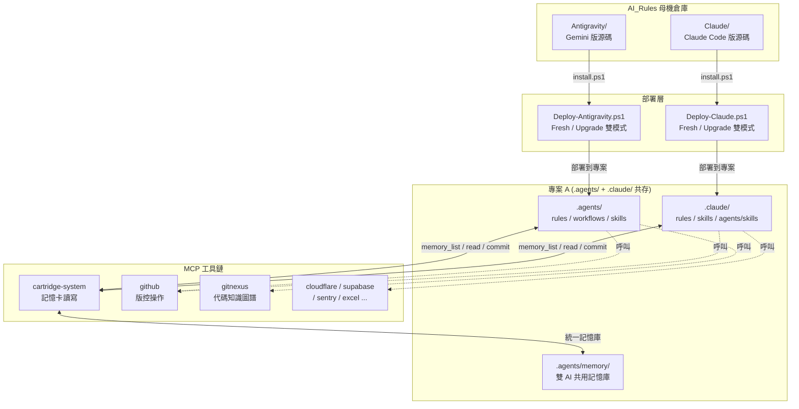
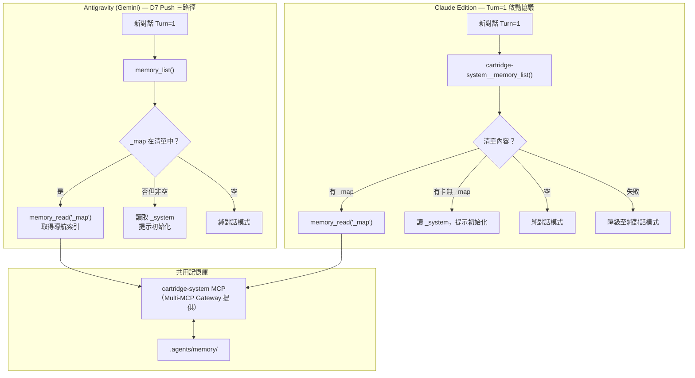
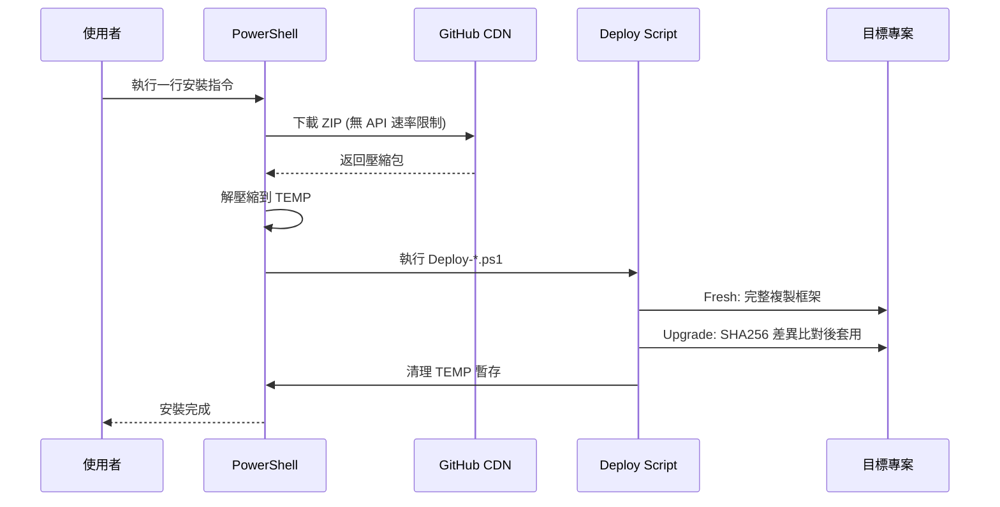

# AI_Rules — Antigravity 治理框架母機

> **倉庫**: [Kunshao1117/AI_Rules](https://github.com/Kunshao1117/AI_Rules) | **語言**: 繁體中文 (zh-TW) | **平台**: Windows

本倉庫是 **Antigravity AI 代理人治理框架**的母機（Source of Truth），同時收容兩個平行版本，分別針對不同的 AI 編碼助手進行最佳化。兩個版本共享同一套設計哲學，但在工具調用、規則載入、工作流觸發等執行層面各自適配其目標平台。

---

## 目錄

- [快速開始](#快速開始)
- [框架版本總覽](#框架版本總覽)
- [核心設計理念](#核心設計理念)
- [整體架構](#整體架構)
- [雙 AI 共用記憶系統](#雙-ai-共用記憶系統)
- [MCP 工具鏈](#mcp-工具鏈)
- [倉庫結構](#倉庫結構)
- [安裝方式](#安裝方式)
- [版本管理策略](#版本管理策略)
- [授權與聲明](#授權與聲明)

---

## 快速開始

選擇你的 AI 編碼助手，在終端機執行一行指令即可安裝：

### Gemini（Antigravity 版）

```powershell
# 🆕 全新安裝
[Net.ServicePointManager]::SecurityProtocol = [Net.SecurityProtocolType]::Tls12; $f="$env:TEMP\ag_install.ps1"; irm 'https://raw.githubusercontent.com/Kunshao1117/AI_Rules/main/Antigravity/install.ps1' -OutFile $f; & $f -Target "D:\你的專案路徑"; Remove-Item $f
```

```powershell
# ⬆️ 升級現有安裝
[Net.ServicePointManager]::SecurityProtocol = [Net.SecurityProtocolType]::Tls12; $f="$env:TEMP\ag_install.ps1"; irm 'https://raw.githubusercontent.com/Kunshao1117/AI_Rules/main/Antigravity/install.ps1' -OutFile $f; & $f -Target "D:\你的專案路徑" -Mode Upgrade; Remove-Item $f
```

### Claude Code（Claude Edition）

```powershell
# 🆕 全新安裝
[Net.ServicePointManager]::SecurityProtocol = [Net.SecurityProtocolType]::Tls12; $f="$env:TEMP\cc_install.ps1"; irm 'https://raw.githubusercontent.com/Kunshao1117/AI_Rules/main/Claude/install.ps1' -OutFile $f; & $f -Target "D:\你的專案路徑"; Remove-Item $f
```

```powershell
# ⬆️ 升級現有安裝
[Net.ServicePointManager]::SecurityProtocol = [Net.SecurityProtocolType]::Tls12; $f="$env:TEMP\cc_install.ps1"; irm 'https://raw.githubusercontent.com/Kunshao1117/AI_Rules/main/Claude/install.ps1' -OutFile $f; & $f -Target "D:\你的專案路徑" -Mode Upgrade; Remove-Item $f
```

> 兩個版本可以安裝到**同一個專案**中共存。Gemini 使用 `.agents/`，Claude Code 使用 `.claude/`，互不衝突，並透過 `.agents/memory/` 共用記憶庫。

---

## 框架版本總覽

| 版本 | 目標平台 | 當前版號 | 規則數 | 工作流 | 操作型技能 | 詳細文件 |
|------|---------|---------|--------|--------|-----------|---------|
| **Antigravity** | Gemini（IDE 插件 + CLI） | v7.0.0 | 9 | 17 | 36 | [Antigravity/README.md](Antigravity/README.md) |
| **Claude Edition** | Claude Code（VS Code 插件） | v1.1.0 | 6 | 12 | 36 | [Claude/README.md](Claude/README.md) |

兩個版本的**操作型技能完全同步**（36 個），共享相同的 MCP 工具鏈（cartridge-system、github、gitnexus 等）。

---

## 核心設計理念

Antigravity 框架的設計目標是讓 AI 編碼助手在任何專案中都能像一個**有紀律、有記憶、有治理的工程團隊**來運作。

| 原則 | 說明 |
|------|------|
| **零接觸部署** | AI 進入未初始化專案時，自動靜默部署整套框架，無需人工介入 |
| **跨對話持久記憶** | 透過 `.agents/memory/` 記憶卡，AI 在新對話中也能回憶過去的架構決策與教訓 |
| **按需載入** | 技能僅在需要時讀取，減少 AI 的認知負擔和 Token 消耗 |
| **繁體中文特化** | 三層語言架構：指令層（英文）、介面層（繁體中文）、橋接層（雙語） |
| **最小權限治理** | 角色分層（讀取者 / 工作者 / 寫入者），子代理人只能唯讀 |
| **三位一體治理** | 靜默異常中斷（閘門攔截時才出聲）+ 特權覆寫（`[SUDO]`）+ 沙盒模式（實驗路徑）|
| **閘門即防護** | 偵測到異常時才輸出中斷訊息，正常通過時零輸出，不干擾開發流程 |
| **雙受眾設計** | AI 看英文指令層、總監看中文介面層，兩者共讀橋接層 |

---

## 整體架構



### 兩版本的核心差異

| 執行層面 | Antigravity (Gemini) | Claude Edition |
|---------|---------------------|----------------|
| **規則載入** | IDE 自動注入 `.agents/rules/` | `CLAUDE.md` @import 按需拉入 |
| **工作流觸發** | IDE 注入 `.agents/workflows/` | `.claude/skills/` Slash Command |
| **計畫模式** | `task_boundary` 呼叫 | Claude Code 原生 Plan Mode |
| **子代理人** | `browser_subagent` / Gemini CLI | `Agent` 工具 |
| **任務追蹤** | `.gemini` scratchpad Artifact | `TodoWrite` 清單 |
| **記憶啟動** | D7 Push 三路徑探測 | Turn=1 啟動探測協議 |
| **記憶存放** | `.agents/memory/` | `.agents/memory/`（**共用**） |

---

## 雙 AI 共用記憶系統

當 Antigravity（Gemini）和 Claude Code 安裝在同一個專案時，兩者共享位於 `.agents/memory/` 的記憶卡，由 `cartridge-system` MCP 作為統一讀寫引擎。



### 記憶卡架構

```
.agents/memory/
├── _map/                         ← 導航索引（Layer 0）
│   └── SKILL.md                  ← 所有 Layer 1 父卡的快速索引
├── _system/                      ← 全域系統設定（Layer 1）
│   └── SKILL.md                  ← 技術堆疊、部署環境、工作流共識
├── api/                          ← 功能域記憶（Layer 1）
│   ├── SKILL.md                  ← 共用 API 架構決策
│   ├── auth/                     ← 子模組（Layer 2）
│   │   └── SKILL.md
│   └── manage/
│       └── SKILL.md
└── frontend/                     ← 獨立功能域（Layer 1）
    └── SKILL.md
```

### 粒度原則與衝突防護

| 機制 | 說明 |
|------|------|
| **每張卡 ≤ 8 個追蹤檔案** | 超過時主動提示拆分 |
| **最多 4 層深度** | 超過則觸發 `memory-arch` 技能 |
| **寫入後立即歸卡** | `write_to_file` → `memory_commit`（二步流程不可跳過） |
| **無並發寫入問題** | 同一時間只有一個 AI 在執行任務 |
| **禁止假設歷史** | 每次新對話必須重新讀取，不可依賴上次對話的記憶內容 |

---

## MCP 工具鏈

兩個版本共享同一套 MCP 工具鏈，透過 **Multi-MCP Gateway** 統一提供：

| MCP 伺服器 | 用途 | 對應技能 |
|-----------|------|---------|
| **cartridge-system** | 記憶卡讀寫引擎（核心） | `memory-ops`, `memory-arch` |
| **github** | 版控：倉庫管理、Issue/PR 操作 | `github-ops`, `pr-review-ops` |
| **gitnexus** | 代碼知識圖譜：索引、探索、重構分析 | `gitnexus-*` (6 個) |
| **cloudflare-bindings** | KV / D1 / R2 資源管理 | `cloudflare-ops` |
| **cloudflare-containers** | Workers 容器管理 | `cloudflare-ops` |
| **cloudflare-observability** | 雲端日誌查詢 | `cloudflare-ops` |
| **supabase** | 資料庫管理、SQL 操作、RLS | `supabase-ops`, `supabase` |
| **sentry** | 錯誤追蹤、效能監控 | `sentry-ops` |
| **excel** | 試算表操作、圖表生成 | `excel-ops` |
| **a11y** | WCAG 無障礙掃描 | `a11y-testing` |
| **context7** | 即時框架文件查詢 | `context7-docs` |
| **stitch** | UI 設計稿生成 | `stitch-design` |
| **sequentialthinking** | 深度推理引擎 | `structured-reasoning` |
| **playwright** | 瀏覽器自動化 | `browser-testing`, `performance-audit` |

---

## 倉庫結構

```
AI_Rules/                              ← 母機根目錄
│
├── README.md                          ← 本文件（母機總覽）
├── .gitignore                         ← 版控忽略規則
│
├── Antigravity/                       ← Gemini 版框架源碼
│   ├── VERSION                        ← v7.0.0
│   ├── README.md                      ← Gemini 版詳細文件
│   ├── CHANGELOG.md                   ← 商業價值決策紀錄（完整歷史）
│   ├── RELEASE_NOTES.md               ← 版本更新摘要（升級時自動展示）
│   ├── install.ps1                    ← 一鍵安裝啟動器
│   └── .agents/                       ← 可移植的 AI 治理生態系統
│       ├── rules/                     ← 9 個治理規則（分層啟動）
│       │   ├── AGENTS.md              ← 哨兵檔（存在 = 已初始化）
│       │   ├── 00_core_identity.md    ← 核心身份（Always On）
│       │   ├── 01_cross_lingual_guard.md ← 跨語系防護（Always On）
│       │   └── 02~07_*.md             ← 條件載入規則
│       ├── workflows/                 ← 17 道工作流程 + 2 個共用閘門
│       ├── skills/                    ← 36 套操作型技能
│       │   ├── _index.md              ← 核心技能路由表
│       │   └── ...                    ← 各技能目錄
│       ├── scripts/                   ← 4 個框架工具腳本
│       │   ├── Deploy-Antigravity.ps1 ← 部署引擎
│       │   ├── Measure-SkillQuality.ps1 ← 技能品質掃描
│       │   ├── Invoke-DocScan.ps1     ← 倉庫狀態掃描
│       │   └── Invoke-HealthAudit.ps1 ← 基礎設施健檢
│       ├── memory/                    ← 專案記憶（部署後由 AI 初始化）
│       ├── project_skills/            ← 專案衍生技能（專案特有，受保護）
│       └── logs/                      ← 暫存日誌（不進版控）
│
├── Claude/                            ← Claude Code 版框架源碼
│   ├── VERSION                        ← v1.1.0
│   ├── CLAUDE.md                      ← 主規則入口（@import 模組化）
│   ├── README.md                      ← Claude 版詳細文件
│   ├── install.ps1                    ← 一鍵安裝啟動器
│   └── .claude/                       ← Claude Code 原生配置結構
│       ├── CLAUDE.md                  ← 主規則入口（@import 模組化）
│       ├── rules/                     ← 6 個模組化規則
│       │   ├── core-identity.md       ← 核心身份（Always On）
│       │   ├── cross-lingual-guard.md ← 跨語系防護（Always On）
│       │   └── *.md                   ← 條件載入規則（4 個）
│       ├── commands/                  ← 12 道 Slash Command 工作流
│       ├── skills/                    ← 36 套操作型技能（與 Gemini 版同步）
│       └── scripts/
│           ├── Deploy-Claude.ps1      ← 部署引擎（try/finally + 彩色差異報告）
│           ├── Invoke-DocScan.ps1     ← 倉庫狀態掃描
│           ├── Invoke-HealthAudit.ps1 ← 基礎設施健檢
│           └── Measure-SkillQuality.ps1 ← 技能品質掃描
│
├── .agents/                           ← 母機自身的治理生態（不推送至遠端）
│   └── memory/                        ← 母機記憶卡
│       ├── _map/                      ← 導航索引
│       ├── _system/                   ← 全域系統設定
│       └── claude-edition-rules/      ← Claude Edition 規範追蹤
│
└── .cartridge/                        ← cartridge-system 本地索引（不推送）
```

### `.gitignore` 策略說明

```
cartridge_index.json     ← 記憶索引（機器生成，不推送）
.vscode/                 ← IDE 設定（本機專屬）
/.agents/                ← 母機自身的治理生態（僅忽略根目錄）
/.claude/                ← 母機自身的 Claude 設定（僅忽略根目錄）
antigravity_export/      ← 框架匯出暫存目錄
```

> **重要**：`.agents/` 前的 `/` 表示只忽略根目錄的 `.agents/`，**不會**影響 `Antigravity/.agents/` 的推送。`Antigravity/.agents/` 是框架源碼的一部分，必須進版控。

---

## 安裝方式

### 安裝原理



### 部署模式比較

| 模式 | 適用時機 | 行為細節 |
|------|---------|---------|
| **Fresh** | 全新專案，尚未安裝 | 完整複製 → 清除示範記憶卡 → 建立空目錄 → 寫入版本檔 |
| **Upgrade** | 已安裝，需更新框架 | SHA256 逐檔比對 → 彩色差異報告 → 顯示版本說明 → 確認後套用 |

### 安全防護機制

| 防護層 | 說明 |
|--------|------|
| **記憶卡永久保護** | `memory/` 和 `project_skills/` 升級時絕對不覆蓋 |
| **主規則保護** | Claude 版的 `CLAUDE.md` 在升級時保留現有版本 |
| **孤兒檔案偵測** | 自動偵測源碼已刪除但目標仍存在的殘留檔案 |
| **孤兒清除選項** | 加入 `-RemoveOrphans` 參數可自動清除，預設僅標記 |

---

## 版本管理策略

### 雙版本獨立週期

兩個版本各自維護獨立的 `VERSION` 檔案和更新週期：

| 版本 | 狀態 | 版號 | 更新週期 |
|------|------|------|---------|
| **Antigravity** | 成熟期 | v7.0.0 | 維護性更新為主，重大功能隨 Gemini IDE 演進 |
| **Claude Edition** | 成長期 | v1.1.0 | 跟隨 Claude Code 插件能力快速迭代 |

### 操作型技能同步原則

36 套操作型技能在兩個版本之間保持同步，確保兩個 AI 擁有相同的操作知識：

```
Antigravity/.agents/skills/     Claude/.claude/skills/
├── memory-ops/              ←→  ├── memory-ops/
├── code-quality/            ←→  ├── code-quality/
├── github-ops/              ←→  ├── github-ops/
├── gitnexus-*/              ←→  ├── gitnexus-*/
└── ...（36 套）             ←→  └── ...（36 套）
```

當其中一個版本的技能更新時，應同步複製到另一個版本，維持知識一致性。

### 母機記憶卡

母機（`d:\AI_Rules`）自身的記憶卡追蹤**框架層級**的架構決策，不隨子專案部署：

| 記憶卡 | 追蹤內容 |
|--------|---------|
| `_map` | 導航索引，記錄所有 Layer 1 記憶卡 |
| `_system` | 母機技術堆疊與部署環境 |
| `claude-edition-rules` | Claude Edition 規範設計決策追蹤 |

---

## 授權與聲明

本框架為個人專案，設計目標是提升 AI 編碼助手的治理品質與工作一致性。

| 項目 | 說明 |
|------|------|
| **架構理念** | Master Agent 直接執行 + 操作型技能分層 + 記憶卡跨對話持久追蹤 |
| **設計語言** | 繁體中文特化，服務零程式碼背景的專案總監（Director） |
| **技術基底** | PowerShell 部署引擎 + MCP 工具鏈 + Markdown 治理規範 |
| **目標受眾** | 個人開發者 / 小型團隊，需要高度一致且可追溯的 AI 協作規範 |
