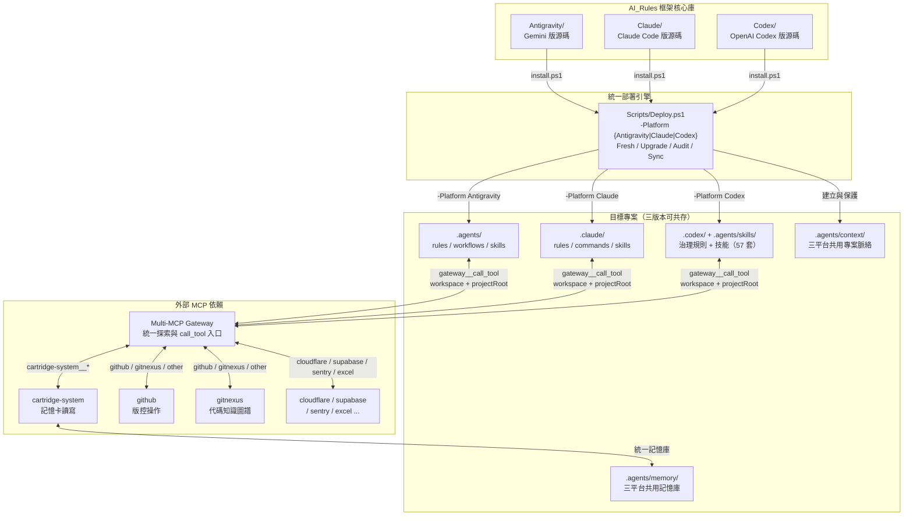
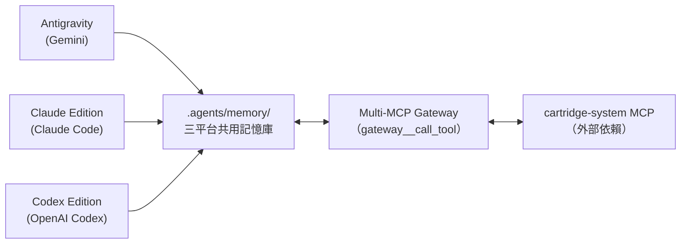
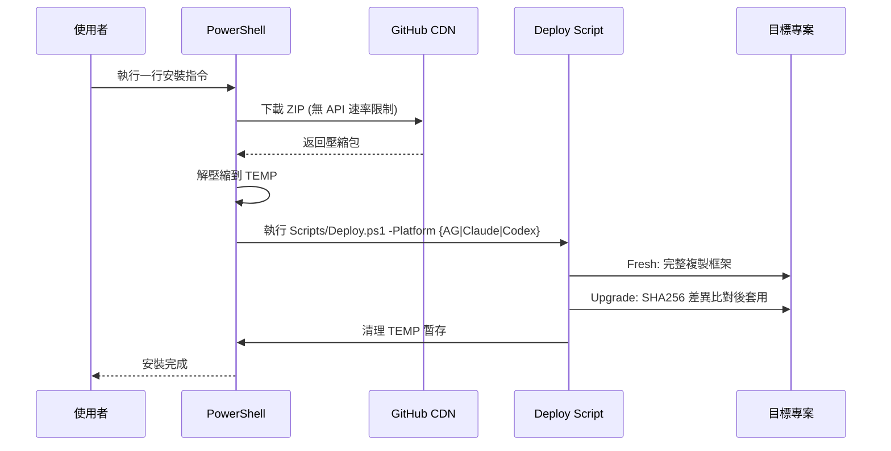

# Antigravity Governance Suite

> AI_Rules — 框架核心庫。**讓 AI 編碼助手不再失憶、不再無紀律** — 為 Gemini、Claude Code 與 OpenAI Codex 提供跨平台 AI 代理人治理能力，涵蓋統一工作流程、持久記憶系統與標準作業規範。

[](Antigravity/README.md)
[](Claude/README.md)
[](Codex/README.md)
[](#)
[](#)

---

## 📌 這解決什麼問題？

AI 編碼助手天生有幾個致命弱點，Antigravity Governance Suite 逐一對治：

1. **跨對話失憶** — 每開新對話就忘記之前的架構決策。→ 透過 `.agents/memory/` 記憶卡系統，AI 在新對話中也能回憶過去的決策與教訓
2. **無紀律執行** — 寫碼前不規劃、寫完不測試、改完不更新文件。→ 20 個工作流檔案強制「規劃→閘門→執行→歸檔」四拍子
3. **角色權限模糊** — 子代理人隨意修改檔案，主代理人無法審閱。→ Delegation Gate 只允許唯讀 evidence branch，所有交付仍由主代理整合
4. **知識碎片化** — 技能散落各處，Token 消耗暴增。→ 40 套按需載入的操作型技能，不用時零開銷
5. **語言不友善** — 工程術語充斥，非技術背景的專案總監看不懂。→ 三層語言架構（指令層英文、介面層繁中、橋接層雙語）
6. **三平台記憶分歧** — Gemini、Claude Code、Codex 各自記各自的。→ `.agents/memory/` 統一記憶庫，三個平台共用同一份記憶
7. **偏好與記憶混雜** — 設計 DNA、產品偏好與驗收口味塞進原始碼記憶。→ `.agents/context/` 專案脈絡層獨立保存長期偏好

---

## 📖 目錄

- [快速開始](#-快速開始)
- [VS Code 延伸模組](#-vs-code-延伸模組)
- [框架版本總覽](#-框架版本總覽)
- [核心設計理念](#-核心設計理念)
- [架構決策脈絡](#️-架構決策脈絡)
- [整體架構](#-整體架構)
- [三平台共用記憶系統](#-三平台共用記憶系統)
- [外部依賴](#-外部依賴)
- [倉庫結構](#-倉庫結構)
- [安裝原理與部署模式](#-安裝原理與部署模式)
- [版本管理策略](#-版本管理策略)

---

## 🚀 快速開始

選擇你的 AI 編碼助手，在專案目錄的終端機中執行一行指令即可安裝：

> 相容性：以下 PowerShell 指令支援 Windows PowerShell 5.1+ 與 PowerShell 7。指令會將 GitHub 下載內容以 UTF-8 解碼，並以 UTF-8 BOM 寫入暫存腳本，避免舊版中文 Windows PowerShell 將腳本誤判為 ANSI/Big5。

### Gemini（Antigravity 版）

```powershell
# 🆕 全新安裝（在 IDE 終端機直接執行，自動安裝到當前目錄）
[Net.ServicePointManager]::SecurityProtocol = [Net.SecurityProtocolType]::Tls12; $u='https://raw.githubusercontent.com/Kunshao1117/AI_Rules/main/Antigravity/install.ps1'; $f="$env:TEMP\ag_install.ps1"; $wc=New-Object Net.WebClient; $bytes=$wc.DownloadData($u); $text=[Text.Encoding]::UTF8.GetString($bytes); $text=$text.TrimStart([char]0xFEFF); [IO.File]::WriteAllText($f,$text,(New-Object Text.UTF8Encoding $true)); & $f; Remove-Item $f
```

```powershell
# ⬆️ 升級現有安裝
[Net.ServicePointManager]::SecurityProtocol = [Net.SecurityProtocolType]::Tls12; $u='https://raw.githubusercontent.com/Kunshao1117/AI_Rules/main/Antigravity/install.ps1'; $f="$env:TEMP\ag_install.ps1"; $wc=New-Object Net.WebClient; $bytes=$wc.DownloadData($u); $text=[Text.Encoding]::UTF8.GetString($bytes); $text=$text.TrimStart([char]0xFEFF); [IO.File]::WriteAllText($f,$text,(New-Object Text.UTF8Encoding $true)); & $f -Mode Upgrade; Remove-Item $f
```

### Claude Code（Claude Edition）

```powershell
# 🆕 全新安裝（在 IDE 終端機直接執行，自動安裝到當前目錄）
[Net.ServicePointManager]::SecurityProtocol = [Net.SecurityProtocolType]::Tls12; $u='https://raw.githubusercontent.com/Kunshao1117/AI_Rules/main/Claude/install.ps1'; $f="$env:TEMP\cc_install.ps1"; $wc=New-Object Net.WebClient; $bytes=$wc.DownloadData($u); $text=[Text.Encoding]::UTF8.GetString($bytes); $text=$text.TrimStart([char]0xFEFF); [IO.File]::WriteAllText($f,$text,(New-Object Text.UTF8Encoding $true)); & $f; Remove-Item $f
```

```powershell
# ⬆️ 升級現有安裝
[Net.ServicePointManager]::SecurityProtocol = [Net.SecurityProtocolType]::Tls12; $u='https://raw.githubusercontent.com/Kunshao1117/AI_Rules/main/Claude/install.ps1'; $f="$env:TEMP\cc_install.ps1"; $wc=New-Object Net.WebClient; $bytes=$wc.DownloadData($u); $text=[Text.Encoding]::UTF8.GetString($bytes); $text=$text.TrimStart([char]0xFEFF); [IO.File]::WriteAllText($f,$text,(New-Object Text.UTF8Encoding $true)); & $f -Mode Upgrade; Remove-Item $f
```

### OpenAI Codex（Codex Edition）

```powershell
# 🆕 全新安裝（在 IDE 終端機直接執行，自動安裝到當前目錄）
[Net.ServicePointManager]::SecurityProtocol = [Net.SecurityProtocolType]::Tls12; $u='https://raw.githubusercontent.com/Kunshao1117/AI_Rules/main/Codex/install.ps1'; $f="$env:TEMP\ag_codex_install.ps1"; $wc=New-Object Net.WebClient; $bytes=$wc.DownloadData($u); $text=[Text.Encoding]::UTF8.GetString($bytes); $text=$text.TrimStart([char]0xFEFF); [IO.File]::WriteAllText($f,$text,(New-Object Text.UTF8Encoding $true)); & $f; Remove-Item $f
```

```powershell
# ⬆️ 升級現有安裝
[Net.ServicePointManager]::SecurityProtocol = [Net.SecurityProtocolType]::Tls12; $u='https://raw.githubusercontent.com/Kunshao1117/AI_Rules/main/Codex/install.ps1'; $f="$env:TEMP\ag_codex_install.ps1"; $wc=New-Object Net.WebClient; $bytes=$wc.DownloadData($u); $text=[Text.Encoding]::UTF8.GetString($bytes); $text=$text.TrimStart([char]0xFEFF); [IO.File]::WriteAllText($f,$text,(New-Object Text.UTF8Encoding $true)); & $f -Mode Upgrade; Remove-Item $f
```

> 💡 **跨目錄安裝**：加上 `-Target "D:\你的專案路徑"` 即可安裝到其他位置。
>
> 三個版本可以安裝到**同一個專案**中共存。Gemini 使用 `.agents/`，Claude Code 使用 `.claude/`，Codex 使用 `.codex/`，互不衝突，並透過 `.agents/memory/` 共用原始碼記憶、透過 `.agents/context/` 共用專案脈絡。

---

## 🎮 框架控制台與日常維護

當您需要執行日常維護任務（如更新全域規則或專案健檢）時，只需複製以下指令並在終端機貼上，即可啟動**互動式管理控制台**：

```powershell
# 🚀 從 README 啟動框架管理控制台 (選單模式)
[Net.ServicePointManager]::SecurityProtocol = [Net.SecurityProtocolType]::Tls12; $u='https://raw.githubusercontent.com/Kunshao1117/AI_Rules/main/Antigravity/install.ps1'; $f="$env:TEMP\ag_install.ps1"; $wc=New-Object Net.WebClient; $bytes=$wc.DownloadData($u); $text=[Text.Encoding]::UTF8.GetString($bytes); $text=$text.TrimStart([char]0xFEFF); [IO.File]::WriteAllText($f,$text,(New-Object Text.UTF8Encoding $true)); & $f -Mode Menu; Remove-Item $f
```

### CMD / 通用 Shell 使用者

若目前終端機是 `cmd.exe`，或不確定外層 Shell 是否會先展開 PowerShell 的 `$` 變數，請貼以下 `-EncodedCommand` 版本；同一行可在 CMD 與 PowerShell 中執行：

```cmd
powershell.exe -NoProfile -ExecutionPolicy Bypass -EncodedCommand WwBOAGUAdAAuAFMAZQByAHYAaQBjAGUAUABvAGkAbgB0AE0AYQBuAGEAZwBlAHIAXQA6ADoAUwBlAGMAdQByAGkAdAB5AFAAcgBvAHQAbwBjAG8AbAAgAD0AIABbAE4AZQB0AC4AUwBlAGMAdQByAGkAdAB5AFAAcgBvAHQAbwBjAG8AbABUAHkAcABlAF0AOgA6AFQAbABzADEAMgAKACQAdQAgAD0AIAAnAGgAdAB0AHAAcwA6AC8ALwByAGEAdwAuAGcAaQB0AGgAdQBiAHUAcwBlAHIAYwBvAG4AdABlAG4AdAAuAGMAbwBtAC8ASwB1AG4AcwBoAGEAbwAxADEAMQA3AC8AQQBJAF8AUgB1AGwAZQBzAC8AbQBhAGkAbgAvAEEAbgB0AGkAZwByAGEAdgBpAHQAeQAvAGkAbgBzAHQAYQBsAGwALgBwAHMAMQAnAAoAJABmACAAPQAgAEoAbwBpAG4ALQBQAGEAdABoACAAJABlAG4AdgA6AFQARQBNAFAAIAAnAGEAZwBfAGkAbgBzAHQAYQBsAGwALgBwAHMAMQAnAAoAJAB3AGMAIAA9ACAATgBlAHcALQBPAGIAagBlAGMAdAAgAE4AZQB0AC4AVwBlAGIAQwBsAGkAZQBuAHQACgAkAGIAeQB0AGUAcwAgAD0AIAAkAHcAYwAuAEQAbwB3AG4AbABvAGEAZABEAGEAdABhACgAJAB1ACkACgAkAHQAZQB4AHQAIAA9ACAAWwBUAGUAeAB0AC4ARQBuAGMAbwBkAGkAbgBnAF0AOgA6AFUAVABGADgALgBHAGUAdABTAHQAcgBpAG4AZwAoACQAYgB5AHQAZQBzACkACgAkAHQAZQB4AHQAIAA9ACAAJAB0AGUAeAB0AC4AVAByAGkAbQBTAHQAYQByAHQAKABbAGMAaABhAHIAXQAwAHgARgBFAEYARgApAAoAWwBJAE8ALgBGAGkAbABlAF0AOgA6AFcAcgBpAHQAZQBBAGwAbABUAGUAeAB0ACgAJABmACwAIAAkAHQAZQB4AHQALAAgACgATgBlAHcALQBPAGIAagBlAGMAdAAgAFQAZQB4AHQALgBVAFQARgA4AEUAbgBjAG8AZABpAG4AZwAgACQAdAByAHUAZQApACkACgAmACAAJABmACAALQBNAG8AZABlACAATQBlAG4AdQAKAFIAZQBtAG8AdgBlAC0ASQB0AGUAbQAgACQAZgA=
```

啟動後，您可以選擇：
- **`[G] Global`**：安裝或更新全域規則安全閘門（~/.gemini/GEMINI.md 等）。
- **`[A] Audit`**：執行平台代理治理巡檢；紅燈會讓 `Deploy.ps1 -Action Audit` 以 exit 1 結束，黃燈只報告不阻斷。
- **`[U] Upgrade`**：差異比對並無損升級框架檔案。
- **`[S] Sync`**：僅同步 `Shared/skills/` 下的操作型技能。

---

## 🧩 VS Code 延伸模組

AI_Rules 也提供本機 VS Code 延伸模組管理器，適合不想記 PowerShell 指令的日常維護場景。第一版以 `.vsix` 本機安裝與 GitHub Release asset 分享為主；未來可再上架 Marketplace。手動安裝 VSIX 不等於 Marketplace 原生自動更新，因此延伸模組啟動時會查 GitHub Release；只有發現新版安裝檔時才通知，沒有新版或暫時無法連線時只寫入 Output Channel，不打擾操作者。

### 使用者會看到什麼

安裝後，VS Code 左側 Activity Bar 會出現 **AI Rules**。側邊欄依用途分區，提供 11 個按鈕：

| 按鈕 | 行為 |
|------|------|
| **檢查來源狀態** | 讀取 AI_Rules 遠端來源狀態；使用者層管理快取會先對齊遠端版本庫，不修改目前專案 |
| **檢查 VSIX 新版** | 手動查詢 GitHub Release；有新版 VSIX 安裝包時提示開啟下載頁，沒有新版時也明確回報已是最新版 |
| **查看來源更新影響** | 說明若對齊 AI_Rules 遠端來源，會執行哪些來源檢查與治理巡檢動作 |
| **對齊 AI_Rules 遠端來源** | 顯示確認視窗後才對齊遠端來源；不安裝 VSIX，也不同步目前專案規則 |
| **治理巡檢 Doctor** | 執行治理巡檢，包含 Shared Skill 品質、workflow metadata、policy marker、子代理語彙、全域規則漂移與 project skill links |
| **同步使用者層規則** | 先預覽差異，預覽成功後才詢問是否寫入 `~/.codex`、`~/.claude`、`~/.gemini` |
| **同步已安裝平台規則** | 先偵測目前專案實際安裝的平台，再預覽；預覽成功後才同步 `.agents` / `.claude` / `.codex` 對應規則、技能與 project skill discovery 連結 |
| **同步 Codex** | 只同步已安裝 Codex 專案的 `.codex/`、Codex 工作流技能與 `.agents/skills/project-*` |
| **同步 Claude** | 只同步已安裝 Claude 專案的 `.claude/rules`、`.claude/commands`、`.claude/skills` 與 `.claude/skills/project-*` |
| **同步 Antigravity** | 只同步已安裝 Antigravity 專案的 `.agents/rules`、`.agents/workflows`、`.agents/skills` 與 `.agents/skills/project-*` |
| **清理孤兒檔案** | 先列出 ORPHAN 清單，確認後才刪除，且不碰 memory / project_skills / context |

### 本機開發與打包

```powershell
cd Extensions/vscode-ai-rules-manager
npm install
npm run compile
npm run package
```

產出的 `.vsix` 可在 VS Code Extensions 視窗使用 **Install from VSIX...** 安裝。若延伸模組找不到本機 AI_Rules repo，請在 VS Code 設定中填入：

```json
{
  "aiRules.repoRoot": "D:\\AI_Rules"
}
```

延伸模組只是操作面板；真正治理邏輯仍由 `Scripts/AI-RulesManager.ps1`、`Scripts/Deploy.ps1` 與 `Scripts/modules/*.psm1` 執行。

在 Antigravity、VS Code 或相容 IDE 中，如果目前 workspace 不是 AI_Rules repo，延伸模組會使用該 IDE `globalStorage` 內的 AI_Rules 管理快取作為來源。這份快取被視為遠端版本庫鏡像：每次執行管理動作前會自動對齊 `aiRules.repoUrl` 的 `main` 分支；若已明確設定 `aiRules.repoRoot`，則該本機來源只檢查狀態，不會被自動重設。使用者層規則檢查以文字內容為準；同一份規則只因 Git/Windows 將換行存成 LF 或 CRLF 時，不會被視為需要同步的漂移。同步目前專案規則時，05 濃縮工作流寫入的 `PROJECT IDENTITY` 區段會被保留，只更新框架管理內容。

`aiRules.repoRoot`、`aiRules.repoUrl` 與 `aiRules.powerShellPath` 只能放在 VS Code 使用者設定，不能放在專案工作區設定。若陌生專案嘗試用工作區設定改寫 AI_Rules 來源或 PowerShell 執行檔，延伸模組會停止，避免用不可信來源同步規則。

### GitHub Release 自動建立與附加 VSIX

推送 tag `v0.1.15` 後，GitHub Actions 會自動建立 GitHub Release，打包 `ai-rules-manager-0.1.15.vsix`，附加到該 release 的 Assets，並從 `CHANGELOG.md` 的對應 `AI Rules Manager v<version>` 段落產生 Release 簡介。Release workflow 使用 Node 24 與支援 Node 24 runtime 的官方 actions，避免 GitHub Actions Node 20 淘汰造成發布風險。若 tag 與 `Extensions/vscode-ai-rules-manager/package.json` 的版本不一致，workflow 會直接失敗，避免放錯插件包。需要補跑時，也可以在 GitHub Actions 頁面手動執行 workflow 並輸入 tag。

---

## 📦 框架版本總覽

| 版本 | 目標平台 | 當前版號 | 規則數 | 工作流 | 操作型技能 | 詳細文件 |
|------|---------|---------|--------|--------|-----------|---------| 
| **Antigravity** | Gemini（IDE 插件 + CLI） | v8.0.3 | 9 | 20 | 40 | [Antigravity/README.md](Antigravity/README.md) |
| **Claude Edition** | Claude Code（VS Code 插件） | v1.2.3 | 7 | 17 | 40 | [Claude/README.md](Claude/README.md) |
| **Codex Edition** | OpenAI Codex（agentskills.io 標準）| v0.1.3 | 1 | 17 | 40 | [Codex/README.md](Codex/README.md) |

三個版本的**操作型技能均源自 `Shared/skills/`**（唯一真實來源，40 個），記憶系統依賴 [cartridge-system](https://github.com/Kunshao1117/cartridge_system)，並透過 [Multi-MCP Gateway](https://github.com/Kunshao1117/Multi-MCP) 統一探索與呼叫下游 MCP 工具（外部依賴）。專案脈絡層使用 `.agents/context/` 保存設計 DNA、產品偏好、技術偏好、溝通偏好與驗收偏好，不走記憶 stale。

---

## 🧠 核心設計理念

Antigravity 框架的設計目標是讓 AI 編碼助手在任何專案中都能像一個**有紀律、有記憶、有治理的工程團隊**來運作。

| 原則 | 說明 |
|------|------|
| **受治理安裝** | 使用者可手動貼上一行指令安裝；AI 全域 bootstrapper 偵測到未初始化專案時，只能輸出安裝/升級計畫並等待 `GO INSTALL` 或 `GO UPGRADE` |
| **跨對話持久記憶** | 透過 `.agents/memory/` 記憶卡，AI 在新對話中也能回憶過去的架構決策與教訓 |
| **專案脈絡分層** | 透過 `.agents/context/` 保存設計 DNA、產品偏好與驗收偏好，避免長期偏好污染原始碼記憶 |
| **按需載入** | 技能僅在需要時讀取，減少 AI 的認知負擔和 Token 消耗 |
| **繁體中文特化** | 三層語言架構：指令層（英文）、介面層（繁體中文）、橋接層（雙語） |
| **最小權限治理** | 角色分層（讀取者 / 工作者 / 寫入者），子代理啟用政策由 `Shared/policies/` 同源轉譯，且子代理只能唯讀 |
| **三位一體治理** | 靜默異常中斷（閘門攔截時才出聲）+ 特權覆寫（`[SUDO]`）+ 沙盒模式（實驗路徑）|
| **閘門即防護** | 偵測到異常時才輸出中斷訊息，正常通過時零輸出，不干擾開發流程 |
| **雙受眾設計** | AI 看英文指令層、總監看中文介面層，兩者共讀橋接層 |

### 總監可讀輸出

AI_Rules 的面向總監輸出採情境式格式：一般討論、狀態回報與簡短判斷可用短段落或短清單；正式計畫、寫入前風險、多檔案變更、完成報告、健檢報告與交接才需要表格或結構化摘要。若使用表格，欄位統一為「事項、位置、影響、狀態」。其中「位置」欄不得只寫概念詞，必須先寫白話位置，再用括號標出具體檔案、區塊、工具狀態或目錄範圍；若不是單一檔案，也要明說它是工作區狀態、工具結果或目錄範圍。

正式輸出若為了可讀性使用「核心規範、工作流入口、文件說明、巡檢規則、記憶卡」這類短名稱，必須在同一份輸出提供「位置索引」，把每個短名稱對應到具體檔案、章節、工具狀態或目錄範圍。技術細節仍可保留，但只在必要時放入「補充技術細節」段落。三平台的工作流與指令入口皆需明示此契約，避免只靠核心規則造成平台落差。

面向總監的文字也套用「技術詞彙翻譯閘門」：函式名稱、變數名稱、欄位名稱、命令參數、內部工具名或檔案路徑不可裸露出現。每一次提到時，都必須先寫白話名稱，再把技術名稱放在括號內，例如「建構流程規則（03-build-建構/SKILL.md）」。技術名稱不得單獨成為句子的主詞、清單項目或表格值；後續再次提到同一項目時，也要維持同一個白話名稱與括號定位。

### 中立誠實協作與知識新鮮度

AI_Rules 要求 AI 保持中立誠實協作。AI 不以討好、附和或迎合操作者為目標，也不得為了顯得有批判性而刻意反對。AI 必須先承接目標，再依實際檔案、工具輸出、官方文件或可靠主要來源檢查提議中的事實、日期、版本、限制與風險假設。提議合理時明確支持；若證據與提議衝突，AI 要用「我看到的事實／可能問題／建議做法」短格式說明，並提出可行替代做法。

記憶卡與 AI 內建知識都視為可能過時。本地檔案與即時工具輸出優先於記憶；官方文件與主要來源優先於模型印象。遇到外部框架、API、套件版本、平台規則、價格、法規、安全建議、近期狀態或 AI 自己不確定的資訊，必須先查最新或官方來源；若無法查證，要明說尚未查證最新狀態，不能把舊記憶當成確定事實。

---

## 🗂️ 架構決策脈絡

> 本框架的關鍵設計選擇與背後原因。

| 決策 | 設計選擇 | 原因 |
|------|---------|------|
| 技能唯一來源 | `Shared/skills/` | 三平台技能內容一致，修改只需改一處 |
| 統一部署引擎 | `Scripts/Deploy.ps1` | 取代三個分散腳本，共用 SHA256 差異比對與確認閘門 |
| Codex 規則發現 | `.codex/config.toml` 的 `project_doc_fallback_filenames` | Codex 原生機制，避免根目錄 `AGENTS.md` 與其他 AI 工具衝突 |
| 工作流技能命名 | `00-chat-聊天` 連字號風格 | 括號在部分 shell 需跳脫，舊格式 `00_chat(討論)` 造成路徑問題 |
| 三平台共用記憶 | `.agents/memory/` 統一位置 | 同一專案多 AI 共讀共寫，無記憶分歧 |
| 專案脈絡層 | `.agents/context/` 平行於記憶與專案技能 | 長期偏好、設計 DNA 與驗收偏好不混入原始碼 stale 系統 |
| 平台能力矩陣 | `Shared/platform-capability-matrix.md` | 用 `native` / `adapter` / `manual` 標記三平台能力，不假設三者完全對等 |
| 子代理治理模型 | `Shared/policies/subagent-invocation.md` | Shared 只定義 Delegation Gate 與 evidence branch 語義；Codex、Claude、Antigravity 各自由 adapter 轉成平台工具 |
| MCP opt-in profile | `Shared/mcp-profiles/` | 只提供設定片段，不在升級時改動使用者全域 MCP 設定 |
| 全局觸發器部署 | `~/.{platform}/` 各自全局設定 | AI 進入未初始化專案時進行唯讀偵測，輸出安裝/升級命令並等待 `GO INSTALL` / `GO UPGRADE` |
| 版本獨立週期 | 三版本各自 `VERSION` 檔 | 三個平台演進速度不同，不應互相鎖定 |

---

## 🏗️ 整體架構



### 三版本的核心差異

| 執行層面 | Antigravity (Gemini) | Claude Edition | Codex Edition |
|---------|---------------------|----------------|---------------|
| **規則載入** | IDE 自動注入 `.agents/rules/` | `CLAUDE.md` @import 按需拉入 | `.codex/AGENTS.md` 單一規則檔 |
| **工作流觸發** | IDE 注入 `.agents/workflows/` | `.claude/commands/` Slash Command | `.agents/skills/` `$skill-name` |
| **計畫模式** | `task_boundary` 呼叫 | Claude Code 原生 Plan Mode | 文字描述「進入規劃階段」 |
| **子代理人** | Delegation Gate → Gemini CLI / `@` 指派 / browser-capable agent / Antigravity plugin adapter | Delegation Gate → description-driven subagent / `@agent` / governed `Agent(...)` | Delegation Gate → explicit request、workflow gate 或 `.codex/agents/*.toml` |
| **任務追蹤** | `.gemini` scratchpad Artifact | `TodoWrite` 清單 | 對話中維護任務清單 |
| **記憶啟動** | D7 Push 三路徑探測 | Turn=1 啟動探測協議 | Turn=1 cartridge-system 探測 |
| **記憶存放** | `.agents/memory/` | `.agents/memory/`（**共用**） | `.agents/memory/`（**三者共用**） |
| **技能總數** | 40 套 | 40 套 | **57 套**（40 共用 + 17 工作流） |

---

## 🔗 三平台共用記憶系統

三個平台安裝在同一個專案時，共享位於 `.agents/memory/` 的原始碼記憶卡，透過外部依賴 [Multi-MCP Gateway](https://github.com/Kunshao1117/Multi-MCP) 呼叫 [cartridge-system](https://github.com/Kunshao1117/cartridge_system) 作為統一讀寫引擎；長期偏好與設計 DNA 則共享於 `.agents/context/`，不經過 `memory_commit`。



### 記憶卡架構

```
.agents/memory/
├── _map/                         ← 導航索引（Layer 0）
│   └── SKILL.md                  ← 所有 Layer 1 父卡的快速索引
├── _system/                      ← 全域系統設定（Layer 1）
│   └── SKILL.md                  ← 技術堆疊、部署環境、工作流共識
├── api/                          ← 功能域記憶（Layer 1）
│   ├── SKILL.md                  ← 共用 API 架構決策
│   ├── auth/                     ← 子模組（Layer 2）
│   │   └── SKILL.md
│   └── manage/
│       └── SKILL.md
└── frontend/                     ← 獨立功能域（Layer 1）
    └── SKILL.md
```

### 專案脈絡層

框架源碼中的共用脈絡模板位於 `Shared/context/`。部署到目標專案時，初始化流程只會在缺少 `.agents/context/_map/CONTEXT.md` 時從模板建立索引；若目標專案已有脈絡卡，Fresh、Upgrade、Sync 與孤兒清理都必須保留，不能覆蓋、合併或刪除。

```
.agents/context/
├── _map/
│   └── CONTEXT.md                  ← 專案脈絡索引
├── design-dna/
│   └── CONTEXT.md                  ← 已核准或候選設計 DNA
└── acceptance/
    └── CONTEXT.md                  ← 驗收偏好與回報偏好
```

脈絡卡狀態包含 `candidate`、`approved`、`deprecated`、`conflict` 與 `review`。工作流只能採用已核准脈絡；候選脈絡只可提醒或列入比較，永久寫入需 `GO CONTEXT`，設計 DNA 可用 `GO DNA` 作為別名。

### 粒度原則與衝突防護

| 機制 | 說明 |
|------|------|
| **每張卡 ≤ 8 個追蹤檔案** | 超過時主動提示拆分 |
| **最多 4 層深度** | 超過則觸發 `memory-arch` 技能 |
| **寫入後立即歸卡** | `write_to_file` → `memory_commit`（二步流程不可跳過） |
| **Gateway 顯式路徑** | 透過 Gateway 呼叫 cartridge-system 時，每次 `gateway__call_tool` 都必須帶 `workspace`，下游參數也必須帶 `projectRoot` |
| **讀寫工具分級** | `workspace_brief` / `memory_audit` / `commit_preflight` 為唯讀診斷；`memory_commit` 會寫檔，僅能在歸卡階段呼叫 |
| **無並發寫入問題** | 同一時間只有一個 AI 在執行任務 |
| **禁止假設歷史** | 每次新對話必須重新讀取，不可依賴上次對話的記憶內容 |
| **幽靈偵測 (v4.0)** | `memory_list` 回傳 `ghostFilesCount`，自動標記已追蹤但磁碟不存在的檔案 |
| **依賴過期傳播 (v4.0)** | `memory_list` 回傳 `indirectStaleness`，上游卡匣過期時自動通知下游；`memory_deps()` 可查詢卡匣依賴圖 |

---

## 🔗 外部依賴

本框架的持久記憶系統依賴以下外部元件，均為獨立倉庫：

| 元件 | 用途 |
|------|------|
| [Multi-MCP Gateway](https://github.com/Kunshao1117/Multi-MCP) | 統一 MCP 閘道；探索工具 schema，並以 `gateway__call_tool` 真實呼叫下游工具 |
| [cartridge-system](https://github.com/Kunshao1117/cartridge_system) | 記憶卡讀寫引擎；提供 `memory_list/read/status/deps/audit`、`workspace_brief`、`commit_preflight`、`memory_commit` |

---

## 📂 倉庫結構

```
AI_Rules/                              ← 框架核心庫根目錄
│
├── README.md                          ← 本文件（框架總覽）
├── .gitignore                         ← 版控忽略規則
│
├── Shared/                            ← 三平台共用治理資產
│   ├── platform-capability-matrix.md  ← native / adapter / manual 能力矩陣
│   ├── policies/                      ← 共用治理政策（子代理啟用同源轉譯）
│   ├── mcp-profiles/                  ← opt-in MCP profile snippets（不自動安裝）
│   ├── context/                       ← 專案脈絡模板來源，部署時只補缺不覆蓋
│   ├── skill-governance.md            ← Skill 放置與觸發契約
│   └── skills/                        ← 40 套操作型技能唯一真實來源，部署時注入各平台
│
├── Scripts/                           ← 統一部署引擎（取代各平台分散腳本）
│   ├── Deploy.ps1                     ← 主入口（選單模式 + 參數模式）
│   ├── AI-RulesManager.ps1            ← VS Code 延伸模組背後的按鈕式管理入口
│   └── modules/
│       ├── Core.psm1                  ← 共用工具（SHA256 比對、彩色報告、確認閘門）
│       ├── Skills-Sync.psm1           ← 技能注入與 shared policy marker 同步（Shared/ → 各平台）
│       ├── Platform-Antigravity.psm1  ← Antigravity 部署邏輯
│       ├── Platform-Claude.psm1       ← Claude Edition 部署邏輯
│       ├── Platform-Codex.psm1        ← Codex Edition 部署邏輯
│       └── Audit.psm1                 ← 整合 DocScan / HealthAudit / SkillQuality / Governance Semantics
│
├── Antigravity/                       ← Gemini 版框架源碼
│   ├── VERSION                        ← v8.0.3
│   ├── README.md                      ← Gemini 版詳細文件
│   ├── CHANGELOG.md                   ← 商業價值決策紀錄（完整歷史）
│   ├── RELEASE_NOTES.md               ← 版本更新摘要（升級時自動展示）
│   ├── install.ps1                    ← 一鍵安裝啟動器（呼叫 Scripts/Deploy.ps1）
│   ├── global/
│   │   └── GEMINI.md                  ← 全局觸發器版控（→ ~/.gemini/GEMINI.md）
│   └── .agents/                       ← 可移植的 AI 治理生態系統
│       ├── rules/                     ← 9 個治理規則（分層啟動）
│       │   ├── AGENTS.md              ← 哨兵檔（存在 = 已初始化）
│       │   ├── 00_core_identity.md    ← 核心身份（Always On）
│       │   ├── 01_cross_lingual_guard.md ← 跨語系防護（Always On）
│       │   └── 02~07_*.md             ← 條件載入規則
│       ├── workflows/                 ← 20 個工作流檔案 + 2 個共用閘門
│       ├── skills/                    ← 40 套操作型技能（部署時從 Shared/ 注入）
│       ├── memory/                    ← 專案記憶（部署後由 AI 初始化）
│       ├── context/                   ← 專案脈絡（設計 DNA 與長期偏好）
│       ├── project_skills/            ← 專案衍生技能（專案特有，受保護）
│       └── logs/                      ← 暫存日誌（不進版控）
│
├── Claude/                            ← Claude Code 版框架源碼
│   ├── VERSION                        ← v1.2.3
│   ├── README.md                      ← Claude 版詳細文件
│   ├── install.ps1                    ← 一鍵安裝啟動器（呼叫 Scripts/Deploy.ps1）
│   ├── global/
│   │   └── CLAUDE.md                  ← 全局觸發器版控（→ ~/.claude/CLAUDE.md）
│   └── .claude/                       ← Claude Code 原生配置結構
│       ├── CLAUDE.md                  ← 主規則入口（@import 模組化）
│       ├── rules/                     ← 6 個模組化規則
│       │   ├── core-identity.md       ← 核心身份（Always On）
│       │   ├── cross-lingual-guard.md ← 跨語系防護（Always On）
│       │   └── *.md                   ← 條件載入規則（4 個）
│       ├── commands/                  ← 17 道 Slash Command 入口
│       └── skills/                    ← 40 套操作型技能（部署時從 Shared/ 注入）
│
├── Codex/                             ← OpenAI Codex 版框架源碼
│   ├── VERSION                        ← v0.1.3
│   ├── README.md                      ← Codex 版詳細文件
│   ├── install.ps1                    ← 一鍵安裝啟動器（呼叫 Scripts/Deploy.ps1）
│   ├── global/
│   │   ├── AGENTS.md                  ← 全局觸發器版控（→ ~/.codex/AGENTS.md）
│   │   └── config.toml                ← 全局 Codex 設定版控（→ ~/.codex/config.toml）
│   ├── .codex/
│   │   ├── AGENTS.md                  ← 專案層治理規則（哨兵檔）
│   │   ├── config.toml                ← 專案層 Codex 設定（project_doc_fallback_filenames）
│   │   └── VERSION                    ← Codex live 版本錨點（避免與 .agents/VERSION 混用）
│   └── .agents/
│       └── workflow-skills/           ← 17 套工作流技能（部署時合併至 .agents/skills/）
│
├── Extensions/
│   └── vscode-ai-rules-manager/       ← VS Code 側邊欄管理器，可打包為 .vsix
│
├── .agents/                           ← 框架核心庫自身的治理生態（不推送至遠端）
│   ├── memory/                        ← 框架核心庫記憶卡
│   │   ├── _map/                      ← 導航索引
│   │   ├── _system/                   ← 全域系統設定
│   │   └── claude-edition-rules/      ← Claude Edition 規範追蹤
│   └── context/                       ← 框架核心庫脈絡卡
│       └── _map/CONTEXT.md            ← 專案脈絡索引
│
└── .cartridge/                        ← cartridge-system 本地索引（不推送）
```

### `.gitignore` 策略說明

本倉庫的 root `.gitignore` 只處理框架核心庫自身的本機狀態與部署後 live 產物：

```
/.codex/                         ← Codex live deployment（不推送）
/.claude/                        ← Claude live deployment（不推送）
/CLAUDE.md                       ← Claude live 入口（不推送）
/antigravity_export/             ← 匯出產物（不推送）
/.agents/*                       ← Antigravity live deployment（不推送）
!/.agents/memory/**              ← 框架核心庫記憶卡仍進版控
!/.agents/context/**             ← 框架核心庫脈絡卡仍進版控
!/.agents/project_skills/**      ← 框架核心庫衍生技能仍進版控
/.agents/logs/                   ← 執行紀錄（不推送）
/.cartridge/                     ← cartridge-system 本地索引（不推送）
Extensions/**/*.vsix             ← VS Code extension 打包產物（不推送）
```

> **重要**：root live deployment 規則只針對倉庫根目錄；`Antigravity/.agents/`、`Claude/.claude/`、`Codex/.codex/` 是框架模板源碼，必須進版控。

部署到其他專案時，`Deploy.ps1` 與 AI Rules Manager 的專案規則同步會補入根目錄錨定的 AI Rules 排除規則：框架部署產物與本地執行狀態不進版控，專案記憶、專案脈絡與專案衍生技能則明確放行。這組預設規則只管理專案根目錄，不處理子資料夾同名目錄。

```
# [啟用][AI Rules 框架] 由框架初始化或升級產生，可重建，不進版控
/.codex/
/.claude/
/CLAUDE.md
/antigravity_export/

# [啟用][代理框架] 代理規則、工作流與共用技能多為部署產物，預設不進版控
/.agents/*

# [保留][專案記憶] 原始碼記憶是專案知識資產，必須允許進版控
!/.agents/memory/
!/.agents/memory/**

# [保留][專案脈絡] 設計 DNA、產品偏好與驗收偏好是專案知識資產，必須允許進版控
!/.agents/context/
!/.agents/context/**

# [保留][專案衍生技能] 專案專屬技能屬於專案能力，必須允許進版控
!/.agents/project_skills/
!/.agents/project_skills/**

# [啟用][執行狀態] 代理日誌與本地索引是執行期產物，不進版控
/.agents/logs/
/.cartridge/
```

初始化、升級與專案同步會補入上方這組繁中註解與精準標準規則：先整理目前版本自己產生的繁中標準註解與完全相同的標準行，再把最新標準規則補到檔案底部。自動流程不處理舊版註解、不使用上下行或區塊範圍，也不會刪除寬鬆相似規則。

AI Rules Manager 另提供「版控排除規則健檢」按鈕：預覽時會列出缺少的根目錄標準規則與需人工確認的相似規則。套用時可選擇只補標準規則，或刪除清單中列出的相似規則後再補標準規則；工具只刪具體列出的相似規則行，不刪註解、上下文或整段區塊。

目標專案的 `.agents/memory/`、`.agents/context/` 與 `.agents/project_skills/` 預設視為專案知識資產，應進版控；若某個專案要私有化這些資產，需由該專案自行加上額外 ignore 規則。

---

## ⚙️ 安裝原理與部署模式

### 安裝原理



### 部署模式比較

| 模式 | 適用時機 | 行為細節 |
|------|---------|---------| 
| **Fresh** | 全新專案，尚未安裝 | D06 安全網備份記憶 → 完整複製框架 → 建立基礎設施目錄 → 寫入版本檔 → 還原記憶 |
| **Upgrade** | 已安裝，需更新框架 | SHA256 逐檔比對 → 彩色差異報告 → 顯示 CHANGELOG 更新說明 → 確認閘門 → 套用變更 |

### 安全防護機制

| 防護層 | 說明 |
|--------|------|
| **D06 安全防線** | Fresh 模式下 `try/finally` 備份記憶卡，部署中斷也不會損失資料 |
| **知識資產永久保護** | `memory/`、`project_skills/` 和 `context/` 升級時絕對不覆蓋 |
| **確認閘門** | Upgrade 模式下產出分類顏色差異報告，需使用者確認才套用 |
| **Governed bootstrap** | 全域觸發器不再自動下載執行；未初始化專案需等待 `GO INSTALL`，升級需等待 `GO UPGRADE` |
| **治理語義審計** | `Deploy.ps1 -Action Audit` 會掃描舊路徑、自動安裝語義、blanket staging、automation-safe 變異與 MCP HITL 邊界；紅燈 exit 1 |
| **總監輸出契約審計** | 治理巡檢 Doctor 會掃描三平台核心規則與 workflow，檢查情境式輸出、技術詞隔離、位置欄精準定位、短名稱位置索引、中立誠實協作與知識新鮮度查證 |
| **Experiment 例外** | `03-1_experiment` 是刻意設計的沙盒例外，允許直接寫檔並停用品質/安全/測試/記憶閘門，但不可標為 automation-safe |
| **孤兒檔案偵測** | 自動偵測源碼已刪除但目標仍存在的殘留檔案 |
| **孤兒清除選項** | 加入 `-RemoveOrphans` 參數可自動清除，預設僅標記 |
| **Runtime drift 巡檢** | 檢查使用者層 `~/.codex/AGENTS.md`、`~/.claude/CLAUDE.md`、`~/.gemini/GEMINI.md` 是否與 repo source 同步；文字規則以內容比對，CRLF/LF 換行差異不算漂移 |
| **Shared policy drift 巡檢** | 檢查三平台核心規則中的子代理 marker block 是否與 `Shared/policies/subagent-invocation.md` 一致 |
| **Subagent vocabulary drift 巡檢** | Shared 技能若殘留未標註平台的子代理工具名會報 Red 阻斷，並攔截 Codex workflow 的 Claude 舊式 Agent subagent_type 語法 |
| **VS Code 管理器** | 將常用治理動作包成側邊欄按鈕；管理快取會先對齊遠端來源，使用者層規則、已安裝平台規則與單平台規則分開同步，寫入、更新、清理都需確認 |
| **分類式專案同步** | `SyncProjectRules` 預設只同步目前專案已安裝的平台；單平台同步遇到未安裝平台只回報 Yellow，不自動建立未使用平台 |
| **衍生技能自動補建** | 每次部署或專案同步自動掃描 `project_skills/`，補建 `.agents/skills/project-*` 與 `.claude/skills/project-*` discovery 連結；實體 `project-*` 目錄會被 Doctor 攔截 |

### 部署腳本可讀性

部署腳本均配備**完整的繁體中文行內說明**，涵蓋參數定義、函式邏輯、效能最佳化原因（時間戳優先比對）、安全防線設計（D06）及各階段流程說明。適合非英語使用者直接閱讀和維護。

---

## 📋 版本管理策略

### 三版本獨立週期

三個版本各自維護獨立的 `VERSION` 檔案和更新週期：

| 版本 | 狀態 | 版號 | 更新週期 |
|------|------|------|---------| 
| **Antigravity** | 成熟期 | v8.0.3 | 維護性更新為主，重大功能隨 Gemini IDE 演進 |
| **Claude Edition** | 成長期 | v1.2.3 | 跟隨 Claude Code 插件能力快速迭代 |
| **Codex Edition** | 初始期 | v0.1.3 | agentskills.io 平台標準對齊，技能與 Shared/ 同源更新 |

部署到專案後，Antigravity 使用 `.agents/VERSION`，Claude 使用 `.claude/VERSION`，Codex 使用 `.codex/VERSION`。`.agents/` 雖同時承載 Codex skills 與三平台共用記憶，但 `.agents/VERSION` 只代表 Antigravity，不代表 Codex。

### 操作型技能同步原則

40 套操作型技能存放於 `Shared/skills/`（唯一真實來源），部署時由 `Scripts/modules/Skills-Sync.psm1` 注入各平台：

```
Shared/skills/                       ← 唯一真實來源
├── memory-ops/
├── code-quality/
├── github-ops/
├── plugin-release-governance/
├── gitnexus-*/
└── ...（40 套）

        ↓ 部署時自動注入

Antigravity/.agents/skills/   Claude/.claude/skills/   Codex（.agents/skills/）
```

更新技能時只需修改 `Shared/skills/` 中的 `SKILL.md`，下次部署（Upgrade 或 Sync 模式）時三個平台自動同步。

`Shared/skill-governance.md` 定義 Skill 放置與觸發契約：核心規則只保留不可漏掉的安全底線，workflow / command 負責入口與階段判斷，Shared Skill 承載可按需載入的操作細節，memory 只記錄原始碼事實與決策，context 承載長期偏好與設計 DNA。Doctor 的技能品質檢查會同步檢查 `description` 觸發品質，要求 Shared Skill 具備中英觸發詞與負向邊界，workflow / command 入口也要描述何時啟動，避免格式正確但 AI 不會自動讀取。

### 專案脈絡模板同步原則

共用脈絡模板存放於 `Shared/context/`，目前提供 `_map/CONTEXT.md` 作為所有目標專案的預設索引卡來源。部署引擎只在目標專案缺少索引卡時複製模板；已存在的 `.agents/context/` 一律視為專案知識資產並保護。治理巡檢會同時檢查共用模板是否存在，以及目標專案脈絡卡格式是否符合協議。

### 框架核心庫記憶卡

框架核心庫（`d:\AI_Rules`）自身的記憶卡追蹤**框架層級**的架構決策，不隨子專案部署：

| 記憶卡 | 追蹤內容 |
|--------|---------|
| `_map` | 導航索引，記錄所有 Layer 1 記憶卡 |
| `_system` | 框架核心庫技術堆疊與部署環境 |
| `claude-edition-rules` | Claude Edition 規範設計決策追蹤 |
| `_codex_core` | Codex Edition 框架規則與工作流追蹤 |
