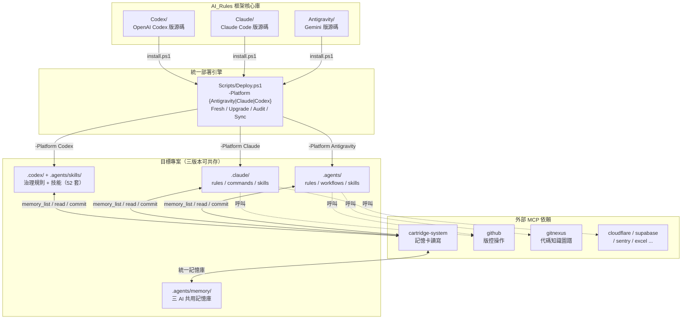
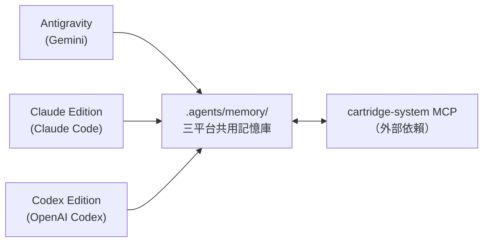
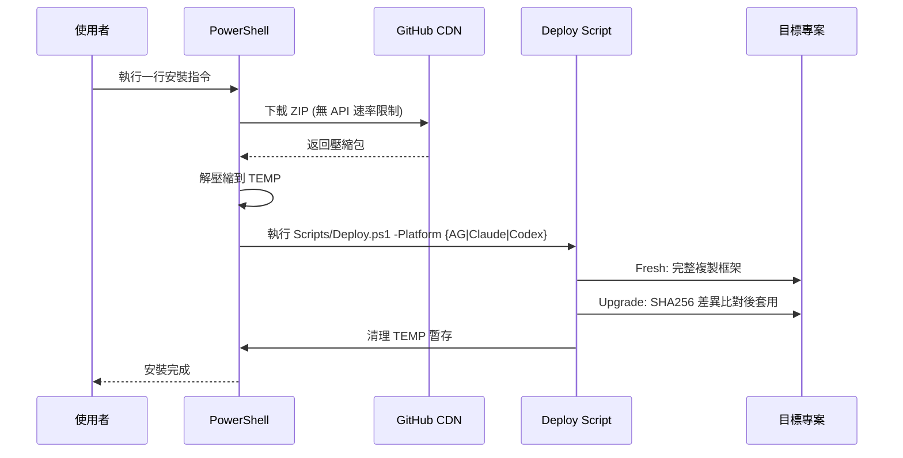

# Antigravity Governance Suite

> AI_Rules — 框架核心庫。**讓 AI 編碼助手不再失憶、不再無紀律** — 為 Gemini、Claude Code 與 OpenAI Codex 提供跨平台 AI 代理人治理能力，涵蓋統一工作流程、持久記憶系統與標準作業規範。

[](Antigravity/README.md)
[](Claude/README.md)
[](Codex/README.md)
[](#)
[](#)

---

## 📌 這解決什麼問題？

AI 編碼助手天生有幾個致命弱點，Antigravity Governance Suite 逐一對治：

1. **跨對話失憶** — 每開新對話就忘記之前的架構決策。→ 透過 `.agents/memory/` 記憶卡系統，AI 在新對話中也能回憶過去的決策與教訓
2. **無紀律執行** — 寫碼前不規劃、寫完不測試、改完不更新文件。→ 18 道生命週期工作流強制「規劃→閘門→執行→歸檔」四拍子
3. **角色權限模糊** — 子代理人隨意修改檔案，主代理人無法審閱。→ 角色分層（讀取者/工作者/寫入者），子代理人只能唯讀
4. **知識碎片化** — 技能散落各處，Token 消耗暴增。→ 36 套按需載入的操作型技能，不用時零開銷
5. **語言不友善** — 工程術語充斥，非技術背景的專案總監看不懂。→ 三層語言架構（指令層英文、介面層繁中、橋接層雙語）
6. **三平台記憶分歧** — Gemini、Claude Code、Codex 各自記各自的。→ `.agents/memory/` 統一記憶庫，三個平台共用同一份記憶

---

## 📖 目錄

- [快速開始](#-快速開始)
- [框架版本總覽](#-框架版本總覽)
- [核心設計理念](#-核心設計理念)
- [架構決策脈絡](#️-架構決策脈絡)
- [整體架構](#-整體架構)
- [三平台共用記憶系統](#-三平台共用記憶系統)
- [外部依賴](#-外部依賴)
- [倉庫結構](#-倉庫結構)
- [安裝原理與部署模式](#-安裝原理與部署模式)
- [版本管理策略](#-版本管理策略)

---

## 🚀 快速開始

選擇你的 AI 編碼助手，在專案目錄的終端機中執行一行指令即可安裝：

### Gemini（Antigravity 版）

```powershell
# 🆕 全新安裝（在 IDE 終端機直接執行，自動安裝到當前目錄）
[Net.ServicePointManager]::SecurityProtocol = [Net.SecurityProtocolType]::Tls12; $f="$env:TEMP\ag_install.ps1"; irm 'https://raw.githubusercontent.com/Kunshao1117/AI_Rules/main/Antigravity/install.ps1' -OutFile $f; & $f; Remove-Item $f
```

```powershell
# ⬆️ 升級現有安裝
[Net.ServicePointManager]::SecurityProtocol = [Net.SecurityProtocolType]::Tls12; $f="$env:TEMP\ag_install.ps1"; irm 'https://raw.githubusercontent.com/Kunshao1117/AI_Rules/main/Antigravity/install.ps1' -OutFile $f; & $f -Mode Upgrade; Remove-Item $f
```

### Claude Code（Claude Edition）

```powershell
# 🆕 全新安裝（在 IDE 終端機直接執行，自動安裝到當前目錄）
[Net.ServicePointManager]::SecurityProtocol = [Net.SecurityProtocolType]::Tls12; $f="$env:TEMP\cc_install.ps1"; irm 'https://raw.githubusercontent.com/Kunshao1117/AI_Rules/main/Claude/install.ps1' -OutFile $f; & $f; Remove-Item $f
```

```powershell
# ⬆️ 升級現有安裝
[Net.ServicePointManager]::SecurityProtocol = [Net.SecurityProtocolType]::Tls12; $f="$env:TEMP\cc_install.ps1"; irm 'https://raw.githubusercontent.com/Kunshao1117/AI_Rules/main/Claude/install.ps1' -OutFile $f; & $f -Mode Upgrade; Remove-Item $f
```

### OpenAI Codex（Codex Edition）

```powershell
# 🆕 全新安裝（在 IDE 終端機直接執行，自動安裝到當前目錄）
[Net.ServicePointManager]::SecurityProtocol = [Net.SecurityProtocolType]::Tls12; $f="$env:TEMP\ag_codex_install.ps1"; irm 'https://raw.githubusercontent.com/Kunshao1117/AI_Rules/main/Codex/install.ps1' -OutFile $f; & $f; Remove-Item $f
```

```powershell
# ⬆️ 升級現有安裝
[Net.ServicePointManager]::SecurityProtocol = [Net.SecurityProtocolType]::Tls12; $f="$env:TEMP\ag_codex_install.ps1"; irm 'https://raw.githubusercontent.com/Kunshao1117/AI_Rules/main/Codex/install.ps1' -OutFile $f; & $f -Mode Upgrade; Remove-Item $f
```

> 💡 **跨目錄安裝**：加上 `-Target "D:\你的專案路徑"` 即可安裝到其他位置。
>
> 三個版本可以安裝到**同一個專案**中共存。Gemini 使用 `.agents/`，Claude Code 使用 `.claude/`，Codex 使用 `.codex/`，互不衝突，並透過 `.agents/memory/` 共用記憶庫。

---

## 🎮 框架控制台與日常維護

當您需要執行日常維護任務（如更新全域規則或專案健檢）時，只需複製以下指令並在終端機貼上，即可啟動**互動式管理控制台**：

```powershell
# 🚀 從 README 啟動框架管理控制台 (選單模式)
[Net.ServicePointManager]::SecurityProtocol = [Net.SecurityProtocolType]::Tls12; $f="$env:TEMP\ag_install.ps1"; irm 'https://raw.githubusercontent.com/Kunshao1117/AI_Rules/main/Antigravity/install.ps1' -OutFile $f; & $f -Mode Menu; Remove-Item $f
```

啟動後，您可以選擇：
- **`[G] Global`**：安裝或更新全域規則安全閘門（~/.gemini/GEMINI.md 等）。
- **`[A] Audit`**：執行全光譜專案健檢，確保記憶卡、技能與代碼同步。
- **`[U] Upgrade`**：差異比對並無損升級框架檔案。
- **`[S] Sync`**：僅同步 `Shared/skills/` 下的操作型技能。

---

## 📦 框架版本總覽

| 版本 | 目標平台 | 當前版號 | 規則數 | 工作流 | 操作型技能 | 詳細文件 |
|------|---------|---------|--------|--------|-----------|---------| 
| **Antigravity** | Gemini（IDE 插件 + CLI） | v8.0.0 | 9 | 18 | 36 | [Antigravity/README.md](Antigravity/README.md) |
| **Claude Edition** | Claude Code（VS Code 插件） | v1.2.0 | 7 | 13 | 36 | [Claude/README.md](Claude/README.md) |
| **Codex Edition** | OpenAI Codex（agentskills.io 標準）| v0.1.0 | 1 | 16 | 36 | [Codex/README.md](Codex/README.md) |

三個版本的**操作型技能均源自 `Shared/skills/`**（唯一真實來源，36 個），記憶系統依賴 [cartridge-system](https://github.com/Kunshao1117/cartridge_system) 與 [Multi-MCP Gateway](https://github.com/Kunshao1117/Multi-MCP)（外部依賴）。

---

## 🧠 核心設計理念

Antigravity 框架的設計目標是讓 AI 編碼助手在任何專案中都能像一個**有紀律、有記憶、有治理的工程團隊**來運作。

| 原則 | 說明 |
|------|------|
| **零接觸部署** | AI 進入未初始化專案時，自動靜默部署整套框架，無需人工介入 |
| **跨對話持久記憶** | 透過 `.agents/memory/` 記憶卡，AI 在新對話中也能回憶過去的架構決策與教訓 |
| **按需載入** | 技能僅在需要時讀取，減少 AI 的認知負擔和 Token 消耗 |
| **繁體中文特化** | 三層語言架構：指令層（英文）、介面層（繁體中文）、橋接層（雙語） |
| **最小權限治理** | 角色分層（讀取者 / 工作者 / 寫入者），子代理人只能唯讀 |
| **三位一體治理** | 靜默異常中斷（閘門攔截時才出聲）+ 特權覆寫（`[SUDO]`）+ 沙盒模式（實驗路徑）|
| **閘門即防護** | 偵測到異常時才輸出中斷訊息，正常通過時零輸出，不干擾開發流程 |
| **雙受眾設計** | AI 看英文指令層、總監看中文介面層，兩者共讀橋接層 |

---

## 🗂️ 架構決策脈絡

> 本框架的關鍵設計選擇與背後原因。

| 決策 | 設計選擇 | 原因 |
|------|---------|------|
| 技能唯一來源 | `Shared/skills/` | 三平台技能內容一致，修改只需改一處 |
| 統一部署引擎 | `Scripts/Deploy.ps1` | 取代三個分散腳本，共用 SHA256 差異比對與確認閘門 |
| Codex 規則發現 | `.codex/config.toml` 的 `project_doc_fallback_filenames` | Codex 原生機制，避免根目錄 `AGENTS.md` 與其他 AI 工具衝突 |
| 工作流技能命名 | `00-chat-聊天` 連字號風格 | 括號在部分 shell 需跳脫，舊格式 `00_chat(討論)` 造成路徑問題 |
| 三平台共用記憶 | `.agents/memory/` 統一位置 | 同一專案多 AI 共讀共寫，無記憶分歧 |
| 全局觸發器部署 | `~/.{platform}/` 各自全局設定 | AI 進入未初始化專案時自動靜默偵測並部署 |
| 版本獨立週期 | 三版本各自 `VERSION` 檔 | 三個平台演進速度不同，不應互相鎖定 |

---

## 🏗️ 整體架構



### 三版本的核心差異

| 執行層面 | Antigravity (Gemini) | Claude Edition | Codex Edition |
|---------|---------------------|----------------|---------------|
| **規則載入** | IDE 自動注入 `.agents/rules/` | `CLAUDE.md` @import 按需拉入 | `.codex/AGENTS.md` 單一規則檔 |
| **工作流觸發** | IDE 注入 `.agents/workflows/` | `.claude/commands/` Slash Command | `.agents/skills/` `$skill-name` |
| **計畫模式** | `task_boundary` 呼叫 | Claude Code 原生 Plan Mode | 文字描述「進入規劃階段」 |
| **子代理人** | `browser_subagent` / Gemini CLI | `Agent` 工具 | N/A（平台原生） |
| **任務追蹤** | `.gemini` scratchpad Artifact | `TodoWrite` 清單 | 對話中維護任務清單 |
| **記憶啟動** | D7 Push 三路徑探測 | Turn=1 啟動探測協議 | Turn=1 cartridge-system 探測 |
| **記憶存放** | `.agents/memory/` | `.agents/memory/`（**共用**） | `.agents/memory/`（**三者共用**） |
| **技能總數** | 36 套 | 36 套 | **52 套**（36 共用 + 16 工作流） |

---

## 🔗 三平台共用記憶系統

三個平台安裝在同一個專案時，共享位於 `.agents/memory/` 的記憶卡，透過外部依賴 [cartridge-system](https://github.com/Kunshao1117/cartridge_system) 作為統一讀寫引擎。



### 記憶卡架構

```
.agents/memory/
├── _map/                         ← 導航索引（Layer 0）
│   └── SKILL.md                  ← 所有 Layer 1 父卡的快速索引
├── _system/                      ← 全域系統設定（Layer 1）
│   └── SKILL.md                  ← 技術堆疊、部署環境、工作流共識
├── api/                          ← 功能域記憶（Layer 1）
│   ├── SKILL.md                  ← 共用 API 架構決策
│   ├── auth/                     ← 子模組（Layer 2）
│   │   └── SKILL.md
│   └── manage/
│       └── SKILL.md
└── frontend/                     ← 獨立功能域（Layer 1）
    └── SKILL.md
```

### 粒度原則與衝突防護

| 機制 | 說明 |
|------|------|
| **每張卡 ≤ 8 個追蹤檔案** | 超過時主動提示拆分 |
| **最多 4 層深度** | 超過則觸發 `memory-arch` 技能 |
| **寫入後立即歸卡** | `write_to_file` → `memory_commit`（二步流程不可跳過） |
| **無並發寫入問題** | 同一時間只有一個 AI 在執行任務 |
| **禁止假設歷史** | 每次新對話必須重新讀取，不可依賴上次對話的記憶內容 |
| **幽靈偵測 (v4.0)** | `memory_list` 回傳 `ghostFilesCount`，自動標記已追蹤但磁碟不存在的檔案 |
| **依賴過期傳播 (v4.0)** | `memory_list` 回傳 `indirectStaleness`，上游卡匣過期時自動通知下游；`memory_deps()` 可查詢卡匣依賴圖 |

---

## 🔗 外部依賴

本框架的持久記憶系統依賴以下外部元件，均為獨立倉庫：

| 元件 | 用途 |
|------|------|
| [cartridge-system](https://github.com/Kunshao1117/cartridge_system) | 記憶卡讀寫引擎（MCP 伺服器） |
| [Multi-MCP Gateway](https://github.com/Kunshao1117/Multi-MCP) | 統一工具鏈入口（MCP 閘道） |

---

## 📂 倉庫結構

```
AI_Rules/                              ← 框架核心庫根目錄
│
├── README.md                          ← 本文件（框架總覽）
├── .gitignore                         ← 版控忽略規則
│
├── Shared/                            ← 36 套操作型技能唯一真實來源
│   └── skills/                        ← 部署時注入各平台（Antigravity/Claude/Codex）
│
├── Scripts/                           ← 統一部署引擎（取代各平台分散腳本）
│   ├── Deploy.ps1                     ← 主入口（選單模式 + 參數模式）
│   └── modules/
│       ├── Core.psm1                  ← 共用工具（SHA256 比對、彩色報告、確認閘門）
│       ├── Skills-Sync.psm1           ← 技能注入（Shared/ → 各平台）
│       ├── Platform-Antigravity.psm1  ← Antigravity 部署邏輯
│       ├── Platform-Claude.psm1       ← Claude Edition 部署邏輯
│       ├── Platform-Codex.psm1        ← Codex Edition 部署邏輯
│       └── Audit.psm1                 ← 整合 DocScan / HealthAudit / SkillQuality
│
├── Antigravity/                       ← Gemini 版框架源碼
│   ├── VERSION                        ← v8.0.0
│   ├── README.md                      ← Gemini 版詳細文件
│   ├── CHANGELOG.md                   ← 商業價值決策紀錄（完整歷史）
│   ├── RELEASE_NOTES.md               ← 版本更新摘要（升級時自動展示）
│   ├── install.ps1                    ← 一鍵安裝啟動器（呼叫 Scripts/Deploy.ps1）
│   ├── global/
│   │   └── GEMINI.md                  ← 全局觸發器版控（→ ~/.gemini/GEMINI.md）
│   └── .agents/                       ← 可移植的 AI 治理生態系統
│       ├── rules/                     ← 9 個治理規則（分層啟動）
│       │   ├── AGENTS.md              ← 哨兵檔（存在 = 已初始化）
│       │   ├── 00_core_identity.md    ← 核心身份（Always On）
│       │   ├── 01_cross_lingual_guard.md ← 跨語系防護（Always On）
│       │   └── 02~07_*.md             ← 條件載入規則
│       ├── workflows/                 ← 18 道工作流程 + 2 個共用閘門
│       ├── skills/                    ← 36 套操作型技能（部署時從 Shared/ 注入）
│       ├── memory/                    ← 專案記憶（部署後由 AI 初始化）
│       ├── project_skills/            ← 專案衍生技能（專案特有，受保護）
│       └── logs/                      ← 暫存日誌（不進版控）
│
├── Claude/                            ← Claude Code 版框架源碼
│   ├── VERSION                        ← v1.2.0
│   ├── README.md                      ← Claude 版詳細文件
│   ├── install.ps1                    ← 一鍵安裝啟動器（呼叫 Scripts/Deploy.ps1）
│   ├── global/
│   │   └── CLAUDE.md                  ← 全局觸發器版控（→ ~/.claude/CLAUDE.md）
│   └── .claude/                       ← Claude Code 原生配置結構
│       ├── CLAUDE.md                  ← 主規則入口（@import 模組化）
│       ├── rules/                     ← 6 個模組化規則
│       │   ├── core-identity.md       ← 核心身份（Always On）
│       │   ├── cross-lingual-guard.md ← 跨語系防護（Always On）
│       │   └── *.md                   ← 條件載入規則（4 個）
│       ├── commands/                  ← 14 道 Slash Command 工作流
│       └── skills/                    ← 36 套操作型技能（部署時從 Shared/ 注入）
│
├── Codex/                             ← OpenAI Codex 版框架源碼
│   ├── VERSION                        ← v0.1.0
│   ├── README.md                      ← Codex 版詳細文件
│   ├── install.ps1                    ← 一鍵安裝啟動器（呼叫 Scripts/Deploy.ps1）
│   ├── global/
│   │   ├── AGENTS.md                  ← 全局觸發器版控（→ ~/.codex/AGENTS.md）
│   │   └── config.toml                ← 全局 Codex 設定版控（→ ~/.codex/config.toml）
│   ├── .codex/
│   │   ├── AGENTS.md                  ← 專案層治理規則（哨兵檔）
│   │   └── config.toml                ← 專案層 Codex 設定（project_doc_fallback_filenames）
│   └── .agents/
│       └── workflow-skills/           ← 16 套工作流技能（部署時合併至 .agents/skills/）
│
├── .agents/                           ← 框架核心庫自身的治理生態（不推送至遠端）
│   └── memory/                        ← 框架核心庫記憶卡
│       ├── _map/                      ← 導航索引
│       ├── _system/                   ← 全域系統設定
│       └── claude-edition-rules/      ← Claude Edition 規範追蹤
│
└── .cartridge/                        ← cartridge-system 本地索引（不推送）
```

### `.gitignore` 策略說明

```
cartridge_index.json     ← 記憶索引（機器生成，不推送）
.vscode/                 ← IDE 設定（本機專屬）
/.agents/                ← 框架核心庫自身的治理生態（僅忽略根目錄）
/.claude/                ← 框架核心庫自身的 Claude 設定（僅忽略根目錄）
antigravity_export/      ← 框架匯出暫存目錄
```

> **重要**：`.agents/` 前的 `/` 表示只忽略根目錄的 `.agents/`，**不會**影響 `Antigravity/.agents/` 的推送。`Antigravity/.agents/` 是框架源碼的一部分，必須進版控。

---

## ⚙️ 安裝原理與部署模式

### 安裝原理



### 部署模式比較

| 模式 | 適用時機 | 行為細節 |
|------|---------|---------| 
| **Fresh** | 全新專案，尚未安裝 | D06 安全網備份記憶 → 完整複製框架 → 建立基礎設施目錄 → 寫入版本檔 → 還原記憶 |
| **Upgrade** | 已安裝，需更新框架 | SHA256 逐檔比對 → 彩色差異報告 → 顯示 CHANGELOG 更新說明 → 確認閘門 → 套用變更 |

### 安全防護機制

| 防護層 | 說明 |
|--------|------|
| **D06 安全防線** | Fresh 模式下 `try/finally` 備份記憶卡，部署中斷也不會損失資料 |
| **記憶卡永久保護** | `memory/` 和 `project_skills/` 升級時絕對不覆蓋 |
| **確認閘門** | Upgrade 模式下產出分類顏色差異報告，需使用者確認才套用 |
| **孤兒檔案偵測** | 自動偵測源碼已刪除但目標仍存在的殘留檔案 |
| **孤兒清除選項** | 加入 `-RemoveOrphans` 參數可自動清除，預設僅標記 |
| **衍生技能自動補建** | 每次部署自動掃描 `project_skills/`，補建缺少的符號連結 |

### 部署腳本可讀性

部署腳本均配備**完整的繁體中文行內說明**，涵蓋參數定義、函式邏輯、效能最佳化原因（時間戳優先比對）、安全防線設計（D06）及各階段流程說明。適合非英語使用者直接閱讀和維護。

---

## 📋 版本管理策略

### 三版本獨立週期

三個版本各自維護獨立的 `VERSION` 檔案和更新週期：

| 版本 | 狀態 | 版號 | 更新週期 |
|------|------|------|---------| 
| **Antigravity** | 成熟期 | v8.0.0 | 維護性更新為主，重大功能隨 Gemini IDE 演進 |
| **Claude Edition** | 成長期 | v1.2.0 | 跟隨 Claude Code 插件能力快速迭代 |
| **Codex Edition** | 初始期 | v0.1.0 | agentskills.io 平台標準對齊，技能與 Shared/ 同源更新 |

### 操作型技能同步原則

36 套操作型技能存放於 `Shared/skills/`（唯一真實來源），部署時由 `Scripts/modules/Skills-Sync.psm1` 注入各平台：

```
Shared/skills/                       ← 唯一真實來源
├── memory-ops/
├── code-quality/
├── github-ops/
├── gitnexus-*/
└── ...（36 套）

        ↓ 部署時自動注入

Antigravity/.agents/skills/   Claude/.claude/skills/   Codex（.agents/skills/）
```

更新技能時只需修改 `Shared/skills/` 中的 `SKILL.md`，下次部署（Upgrade 或 Sync 模式）時三個平台自動同步。

### 框架核心庫記憶卡

框架核心庫（`d:\AI_Rules`）自身的記憶卡追蹤**框架層級**的架構決策，不隨子專案部署：

| 記憶卡 | 追蹤內容 |
|--------|---------|
| `_map` | 導航索引，記錄所有 Layer 1 記憶卡 |
| `_system` | 框架核心庫技術堆疊與部署環境 |
| `claude-edition-rules` | Claude Edition 規範設計決策追蹤 |
| `_codex_core` | Codex Edition 框架規則與工作流追蹤 |

